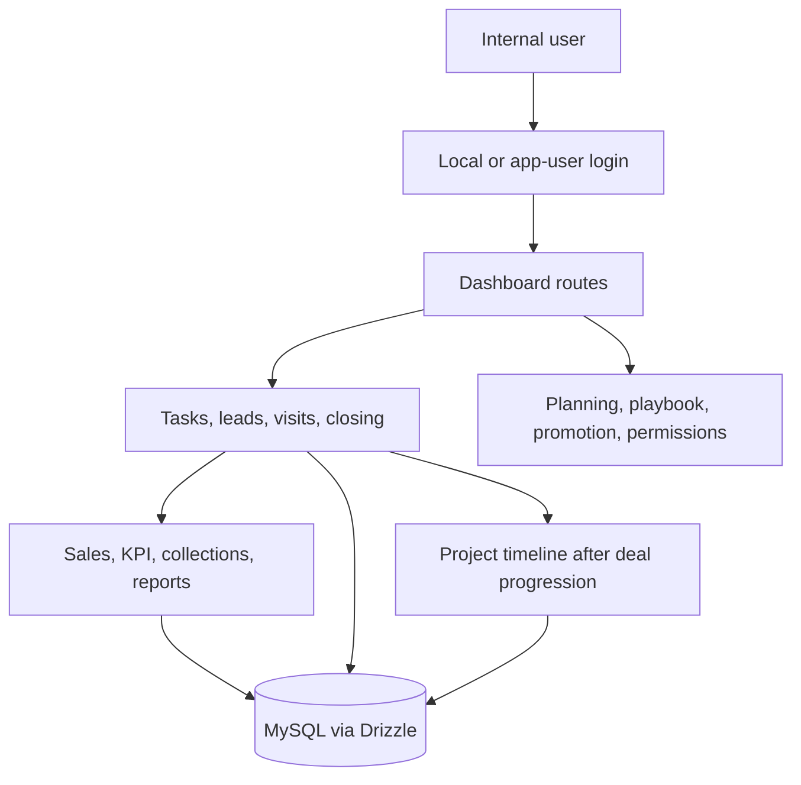
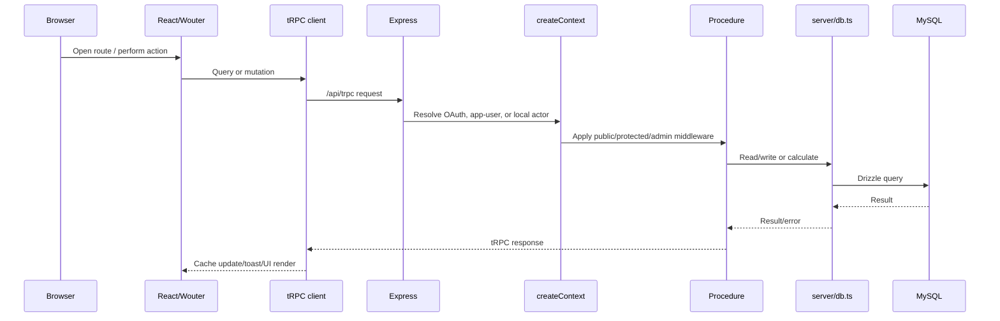
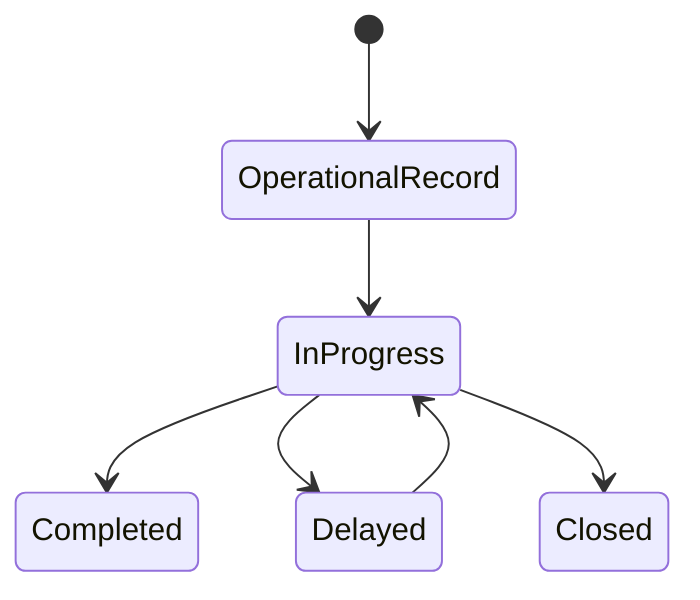
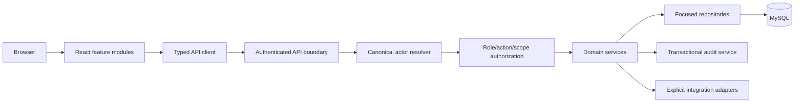
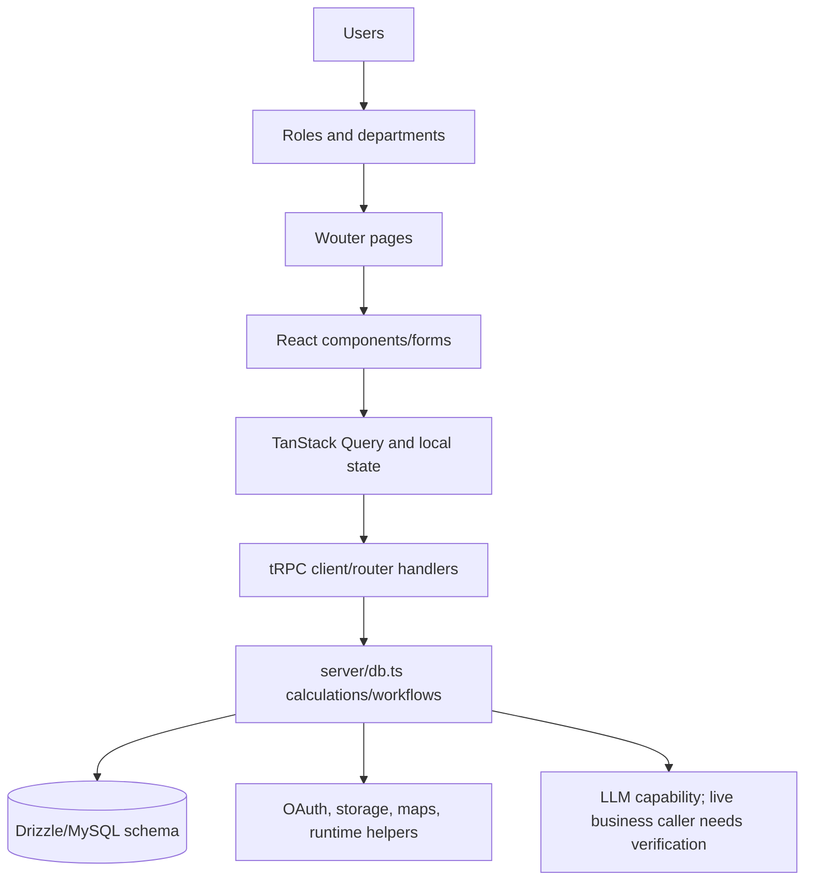

# PROJECT EXECUTIVE SUMMARY

**Repository:** `ProGroup1040/sales-team-platform`  
**Branch/commit audited:** `main` at `d64c319`  
**Audit date:** 2026-08-31  
**Author:** Manus AI

This report documents the implementation that is actually present in the repository. It is a reverse-engineering artifact, not a product-requirements document. Claims are marked **Inferred** when they depend on relationships among multiple files. Requirements or TODO entries are not treated as proof of implementation.

The repository is an internal sales-operations platform. Its implemented surface includes local and app-user authentication, a React/Vite dashboard, task and calendar operations, leads, visits, closing/deals, sales and KPI calculations, collections, planning, reports, sales-execution/playbook workflows, promotion/evaluation, permissions, and post-sale project timelines. The description is **Inferred** from `client/src/App.tsx`, `server/routers.ts`, `drizzle/schema.ts`, and the page/data-access implementations.

The most important audit conclusion is that the code is substantial and currently type-checks and builds, but production readiness is not established. The principal risks are authorization consistency, multiple identity sources, deployment/readiness validation, incomplete or unverified relational coverage, broad backend modules, and business-rule duplication. The current commit does contain improvements: the request context now resolves `app_user`, local, and OAuth actors, token verification reloads app-user status, and the local-session cookie duration is explicitly one year.

## Audit validation snapshot

| Check | Result | Evidence/interpretation |
|---|---:|---|
| TypeScript | Passed | `pnpm check` completed successfully. |
| Production build | Passed | `pnpm build` completed; output contains large reporting/timeline bundles. |
| Tests | 390 passed, 1 failed | The failing runtime-readiness test expects a 96-character session secret and `DATABASE_URL`, neither present in this audit environment. |
| Source inventory | 283 files under `client`, `server`, `shared`, and `drizzle` | Generated build output and dependencies excluded. |
| tRPC procedure classification | 11 public, 280 protected, 3 admin occurrences | Classification is based on `server/routers.ts`; public procedures are principally authentication/session metadata. |
| Database migration state | Requires verification | The current checked-in tree has sequential migrations through `0057`; migration naming/history must be validated against a clean MySQL instance. |

# 1. PROJECT OVERVIEW

The system is a sales-team control panel that connects operational work with sales-performance and post-sale execution. The business purpose is **Inferred**: provide one internal workspace for managing sales activity, leads, visits, deals, collection outcomes, staff performance, permissions, and project delivery follow-up.

The principal users visible in code are engineers/sales users, admin-sales users, managers, administrators, and internal app users. Exact real-world role policy is not defined in one authoritative document; role values appear in `shared/authorization.ts`, the database schema, local authentication, app-user authentication, and page access helpers.

The overall implemented workflow is approximately:



# 2. COMPLETE PROJECT STRUCTURE

```text
sales-team-platform/
├── client/                 React/Vite frontend and public assets
│   ├── src/App.tsx         Wouter route registration and layout boundary
│   ├── src/pages/          Domain pages and user workflows
│   ├── src/components/     Shared, layout, calendar, map, AI, and UI components
│   ├── src/_core/          Client auth/query/runtime helpers
│   ├── src/contexts/       Theme and other React contexts
│   └── public/              Static assets and debug collector
├── server/                 Express/tRPC backend and tests
│   ├── _core/              HTTP entrypoint, context, tRPC guards, SDK, storage, LLM
│   ├── routers.ts          tRPC contract and procedure handlers
│   ├── db.ts               Drizzle queries, data access, and domain calculations
│   ├── localAuth.ts        Local engineer login/session implementation
│   ├── storage.ts           Object-storage helper
│   └── *.test.ts            Unit and integration-style tests
├── shared/                 Client/server constants and authorization definitions
├── drizzle/                MySQL schema, SQL migrations, snapshots, relations placeholder
├── scripts/                Account and migration utilities
├── docs/                   Existing design, operations, and reverse-engineering notes
├── review_artifacts/       Existing inventories and review evidence
├── package.json             Commands and dependency manifest
├── pnpm-lock.yaml           Locked dependency graph
├── tsconfig.json            Strict TypeScript configuration
├── vite.config.ts           Frontend build, aliases, Tailwind, runtime, debug collector
├── drizzle.config.ts       Drizzle Kit MySQL configuration
├── vitest.config.ts        Test configuration
├── todo.md                 Chronological implementation/backlog notes
└── components.json         UI generator configuration
```

`server/db.ts` and `server/routers.ts` are the dominant coupling points. `db.ts` is approximately 13,811 lines and `routers.ts` approximately 2,671 lines at audit time; both combine many domains that would be easier to reason about as separate modules.

# 3. TECHNOLOGY STACK

| Layer | Technology | Actual use |
|---|---|---|
| Frontend | React 19, TypeScript, Vite 7 | Pages, components, client build. |
| Routing | Wouter | Routes registered in `client/src/App.tsx`. |
| Client data | tRPC 11, TanStack Query 5, SuperJSON | Typed queries/mutations and cache handling. |
| Server | Express 4, tRPC 11 | HTTP hosting and RPC procedures. |
| Persistence | MySQL-compatible database, Drizzle ORM, `mysql2` | Schema in `drizzle/schema.ts`; queries in `server/db.ts`. |
| Validation | Zod 4 | Procedure input schemas in `server/routers.ts`. |
| Authentication | Manus OAuth, local engineer JWT, app-user JWT | Three identity sources resolved in `server/_core/context.ts`. |
| Password/token security | `bcryptjs`, `jose` | Password hashing and signed JWT sessions. |
| UI | Tailwind CSS 4, Radix primitives, Lucide | Styling and reusable controls. |
| Reporting | Recharts, `xlsx`, `jspdf`, `html2canvas` | Charts, spreadsheet actions, client-side PDF/export behavior. |
| Interaction | dnd-kit, Framer Motion, date-fns | Drag/drop, animation, date operations. |
| Integrations | S3 SDK, built-in Manus helpers, map/runtime helpers | Infrastructure capability; each business caller must be verified separately. |

# 4. APPLICATION ARCHITECTURE

The current request path is:



Confirmed implementation boundaries are `server/_core/index.ts`, `server/_core/context.ts`, `server/_core/trpc.ts`, and `server/routers.ts`. The current actor shape is `{ id, source, role, name, engineerId }`. The actor is resolved in order of app-user token, local session, then OAuth identity.

# 5. COMPLETE ROUTING MAP

| Path | Page/component | Purpose | Current access behavior |
|---|---|---|---|
| `/` | `Home` | Entry page | Public route. |
| `/login` | `LoginPage` | Local username/password login and forced password change | Public route. |
| `/overview` | `Overview` | Management overview and alerts | Dashboard layout. |
| `/dashboard` | `Overview` | Legacy overview alias | Dashboard layout. |
| `/tasks` | `TasksModule` | Tasks, calendar, recordings, distribution | Dashboard layout. |
| `/leads` | `LeadsModule` | Lead records and follow-up statistics | Dashboard layout. |
| `/visits` | `VisitsModule` | Booking, execution, quality, uploads, financial tracking | Dashboard layout. |
| `/closing` | `ClosingModule` | Deals, closing, discounts, lost-deal analysis | Dashboard layout. |
| `/sales-module` | `SalesModule` | Sales totals, targets, tiers, performance | Dashboard layout. |
| `/kpi` | `KPIModule` | KPI, commissions, incentives, rankings | Dashboard layout. |
| `/collections` | `CollectionsModule` | Contracts, payments, promises, commissions | Dashboard layout. |
| `/planning` | `PlanningModule` | Company, engineer, operational, personal goals | Dashboard layout. |
| `/reports` | `ReportsModule` | Weekly, monthly, quarterly reports | Dashboard layout. |
| `/sales-execution` | `SalesExecutionSystem` | Playbook, sessions, reviews, coaching | Dashboard layout. |
| `/promotion-system` | `PromotionSystem` | Evaluation and career progression | Dashboard layout. |
| `/project-timeline` | `ProjectTimelineModule` | Post-sale stages, SLA, holds, delays, closure | Dashboard layout. |
| `/user-management` | `UserManagement` | Internal accounts, passwords, status, permissions | Dashboard layout; sensitive operations also inspect roles. |
| `/permissions` | `PermissionsPanel` | Role/section permission matrix | Dashboard layout; sensitive operations inspect roles. |
| `/404` | `NotFound` | Not-found page | Public fallback. |

Route visibility is not equivalent to API authorization. The definitive route map is `client/src/App.tsx`; the definitive server procedure contract is `server/routers.ts`.

# 6. PAGE-BY-PAGE ANALYSIS

| Page | Main data/services | Main actions | Navigation/notes |
|---|---|---|---|
| Home/Login | Auth queries and mutations | Login, logout, password change | Entry to dashboard. |
| Overview | Management/control-panel queries | Review alerts, KPIs, summaries | Reads multiple domains. |
| Tasks | Task, calendar, work-distribution procedures | Create, edit, assign, complete, record, filter | High data volume and date logic. |
| Leads | Lead and follow-up procedures | Create/update/search, follow up, status changes | Lead ownership and daily statistics. |
| Visits | Visit, engineer, quality, upload procedures | Book, confirm, execute, upload, score, update finance | Mixes operational and financial state. |
| Closing | Deal, discount, timeline/task procedures | Progress, close, lose, discount, next steps | Important transaction boundary. |
| Sales/KPI | Sales, targets, performance and commission procedures | View calculations, targets, ranking, reports | Period/value definitions must remain consistent. |
| Collections | Collection/payment/promise procedures | Record payments, promises, follow-up, commissions | Multi-table financial workflows. |
| Planning | Goal and distribution procedures | Define targets and assign work | Role and date scope matter. |
| Reports | Report query and client export libraries | Filter and export | Large client-side bundles. |
| Sales execution | Playbook/session/review procedures | Start sessions, record actions, review/coaching | Recording/error behavior needs operational verification. |
| Promotion | Evaluation/career procedures | Evaluate, level, promote/readiness actions | Sensitive personnel data. |
| Project timeline | Project/stage/movement/delay procedures | Import, move, hold, update, close | Uses state transitions and audit records. |
| User/permissions | App-user, role/section permission procedures | Create/update/disable accounts and permissions | Must be server-enforced, not merely menu-filtered. |

On entry, each page mounts its React queries and local state; the actual query list differs by selected tab/date/filter. Mutation success generally invalidates or refetches related queries and displays a toast. Exact calls are indexed in `review_artifacts/reverse_engineering_inventory.json` and source files.

# 7. COMPONENT ARCHITECTURE

The component hierarchy is organized into layout, domain, and primitive UI layers. `DashboardLayout` is the primary shared shell. Domain components live beside pages or in `client/src/components`; reusable primitives live under `client/src/components/ui`.

Important shared components include `DashboardLayout`, `InteractiveCalendar`, `DailyTimeline`, `TaskCalendarView`, `Map`, `AIChatBox`, form wrappers, dialogs, tables, cards, charts, date pickers, and sidebar/navigation components. Components with context guards such as `useCarousel`, `useChart`, `useFormField`, `useSidebar`, and `useTheme` intentionally throw when mounted outside their provider; this is a developer-contract failure, not a production business error.

The major dependency relationship is `page -> domain/shared component -> generated tRPC hook -> server procedure -> db helper`. UI primitives should not directly own database concerns.

# 8. DATA FLOW

A representative mutation flow is:

```text
User action
→ page/component handler
→ Zod-shaped tRPC input
→ procedure middleware
→ router handler
→ server/db.ts helper and business calculation
→ Drizzle/MySQL
→ response
→ React Query invalidation/refetch
→ toast and rendered state
```

Important actual flows include lead follow-up, visit booking/execution, deal progression/closure, payment recording, KPI calculation, playbook session recording, project-stage movement, permission updates, and client-side report export. The most sensitive flows cross multiple tables and should be transactionally atomic.

# 9. DATABASE / DATA MODEL

The schema is a wide relational model. Migration `0057_enforce_core_relationships.sql` adds foreign keys for a core subset of operational and financial relationships; `drizzle/relations.ts` remains an empty Drizzle relation declaration. Main domains and entities are:

| Domain | Entities visible in schema | Relationships represented by IDs |
|---|---|---|
| Identity | `users`, `engineers`, `app_users` | User/app-user/engineer linkage. |
| Operations | `daily_tasks`, `work_logs`, `admin_sales_tasks` | Engineer/task/work-log linkage. |
| CRM | `leads`, `visits`, `deals`, `deal_tasks`, `deal_timeline` | Lead→visit→deal and deal follow-up records. |
| Finance | `collections`, `payments`, `payment_promises`, `commission_payments` | Collection/payment/commission chains. |
| Targets/KPI | monthly/engineer targets, goals, evaluations | Engineer and period-based aggregation. |
| Discounts | tiers, allocations, bonus caps | Deal/tier/actor allocation. |
| Execution | playbook items/quotations, meetings, actions, reviews | Session/action/review graph. |
| People | evaluations, career levels | Engineer performance progression. |
| Permissions/audit | user/role/section permissions, activity/audit logs | Account, role, entity audit records. |
| Projects | stages, projects, movements, delays, updates, audit logs, reasons | Project stage/history/delay graph. |
| Legacy sales | `customers`, `products`, `sales`, `sale_items` | Separate catalog/invoice model; connection to newer deal flow is not established. |

The database relationship map is **Inferred** from column names and query predicates. `drizzle/relations.ts` is not a complete relation declaration. Application-level IDs outside the migration’s covered subset must not be mistaken for database-enforced foreign keys. The migration’s `RESTRICT`/`SET NULL` choices, explicit uniqueness, indexing, compatibility with existing data, and replay from a clean database require verification.

# 10. API DOCUMENTATION

The API is primarily tRPC under `/api/trpc`, with compatibility REST endpoints under `/api/summary`, `/api/list`, and `/api/kpi` in the Express entrypoint. `server/routers.ts` contains the tRPC namespaces and procedures. Current static classification found 11 `publicProcedure`, 280 `protectedProcedure`, and 3 `adminProcedure` occurrences.

Public procedures are concentrated in authentication/session operations (`auth.me`, logout, `localAuth.login/me/logout/myPermissions`, `appUsers.login/logout/me`, and `appUsers.defaultPermissions`). Operational procedures are predominantly protected. The remaining audit requirement is to verify every procedure’s actor, role, ownership/data scope, and mutation authorization rather than treating the procedure count as proof of complete policy enforcement.

| API family | Evidence | Typical responsibility |
|---|---|---|
| Auth/localAuth/appUsers | `server/routers.ts`, `server/localAuth.ts` | Login, session, logout, account metadata. |
| Tasks/leads/visits/deals | `server/routers.ts`, `server/db.ts` | Operational CRM and work flows. |
| Sales/KPI/collections | Same | Financial and performance calculations. |
| Permissions/users | Same | Account and permission administration. |
| Project timeline | Same | Stages, movements, delays, imports, closure. |
| REST compatibility | `server/_core/index.ts` | Summary/list/KPI responses; consumer contract needs verification. |

# 11. AUTHENTICATION & AUTHORIZATION

There are three identity sources. OAuth is loaded through `sdk.authenticateRequest`. App-user JWTs are read from `app_user_token` and verified through `verifyAppUserToken`. Local engineer sessions are read from the local-session cookie and verified through `getLocalSessionFromRequest`. The context prioritizes app-user, then local, then OAuth.

`protectedProcedure` requires an actor. `adminProcedure` accepts actor roles `admin` or `manager`. This is a coarse role gate, not a replacement for the stored module/action/data-scope permission matrix. Login procedures are intentionally public. The current code also reloads the app-user record during token verification; local-session status and role freshness must be checked in the same way and should be explicitly regression-tested.

# 12. USER ROLES

Observed role vocabulary includes `admin`, `manager`, `admin_sales`, and engineering/sales role values, with department values such as `site`. The exact role-to-page/action matrix is distributed among `shared/authorization.ts`, frontend access helpers, router checks, and schema fields. It is therefore unsafe to claim a single complete policy without consolidating these sources.

| Role class | Observed capabilities | Verification status |
|---|---|---|
| Admin/manager | Admin-procedure access and management workflows | Implemented in coarse guards; exact scope requires matrix verification. |
| Admin sales | Admin-sales operational workflows and KPI/task structures | Present; exact action scope is distributed. |
| Engineer/sales | Task, lead, visit, deal and performance workflows | Present; ownership/data scope must be checked per procedure. |
| App user | Internal account identity linked optionally to engineer | Present; role/active status must remain server-authoritative. |

# 13. BUSINESS LOGIC

Observed business rules include task scoring and delay status, lead follow-up statistics, visit status/quality/financial calculations, deal stage and closure logic, accounting-month/closing-month period attribution, tiered/performance discounts, commission calculations, collections and payment promises, KPI aggregation, evaluation/career levels, and project SLA/delay/hold workflows.

The principal correctness risk is duplicated policy. Deal value fields include multiple financial representations and period fields. Several functions prioritize accounting month, while other statistics use direct closing dates. This can make sales, KPI, commission, discount, and reporting outputs disagree for the same deal. A single tested period/value policy is required.

# 14. STATE MANAGEMENT

Local component state handles tabs, dialogs, filters, selected dates, form fields, upload state, and transient UI. Server state is handled through tRPC/TanStack Query. React contexts include theme and shared UI provider contexts. Cached server data is invalidated/refetched by mutation flows; a complete cache policy is not centralized.

There is no evidence of one domain-wide global store controlling all business state. The distributed model is workable, but duplicated query keys, date filters, and mutation invalidation paths are a maintainability risk.

# 15. SERVICES & UTILITIES

The practical service/data layer is concentrated in `server/db.ts`, with authentication in `server/localAuth.ts`, storage in `server/storage.ts`, runtime/context helpers in `server/_core`, and transport handlers in `server/routers.ts`. Client hooks and utility modules support auth, dates, API calls, charts, export, maps, and permissions.

`server/db.ts` is both repository and domain-service code. This is the dominant architectural anti-pattern: persistence, calculations, workflow side effects, and reporting queries are difficult to isolate and test independently.

# 16. EXTERNAL INTEGRATIONS

Confirmed capability dependencies include S3 client/presigner packages, Manus runtime/Forge helpers, OAuth SDK usage, and Google Maps types/script loading in the map component. The repository includes integration infrastructure, but an installed dependency is not evidence of a live business integration. For each integration, deployment credentials, data sent/received, failure behavior, and production consumer remain configuration-dependent and must be verified in deployment.

No unsupported claim is made here that Firebase, Supabase, WhatsApp, payment gateways, analytics, or Gemini are active production integrations merely because names appear in requirements, dependencies, or helper code.

# 17. AI / GEMINI ARCHITECTURE

The repository contains an LLM helper reference and an `AIChatBox` component. Source inspection must distinguish capability from a live business process: a production Gemini workflow is not established unless a route/component calls the helper, defines a prompt, validates output, and handles failure. The current evidence is sufficient to document AI infrastructure as **present but needs caller/prompt/data-governance verification**. Do not claim structured output, persistence, fallback, or a business dependency without a concrete call chain.

# 18. FORMS & USER ACTIONS

Implemented action classes include login/logout, create/update/delete or soft-delete records, search/filter/date-range selection, task assignment/completion, visit booking/execution, deal progression/closure, payment/promise recording, permission/account updates, project movement/hold/update, and report export. Each action follows the page→handler→tRPC→router→db→response path, with exact procedures determined by the page implementation.

High-risk actions are account/permission changes, financial writes, deal closure, discount approval/allocation, destructive deletes, project transitions, imports, and seed/reset operations. They require authorization, validation, auditability, transactions, and idempotency.

# 19. STATUS & WORKFLOW SYSTEM

Statuses are distributed across schema enums/string fields and domain functions. Confirmed workflow families include lead/visit/deal stages, task completion/delay states, collection/payment promise states, evaluation/career states, and project stage/movement/hold/delay states.



This diagram is a conceptual grouping, not a claim that all entities share these exact enum values. The authoritative transition map must be generated per entity from schema values and update predicates. Cross-table side effects on deal closure and project movement require transaction tests.

# 20. CRM STRUCTURE

CRM functionality is implemented across leads, visits, deals, deal tasks, deal timeline, follow-up logs, and activity records. Customers and legacy sales entities also exist, but their connection to the newer lead/deal/collection flow is not established. Leads→visits→deals is a supported **Inferred** relationship from IDs and queries; confirm orphan behavior and ownership rules in production data.

| Area | Current state |
|---|---|
| Leads, visits, deals | Implemented in frontend/router/data layer. |
| Follow-ups/tasks/timeline | Implemented in multiple tables and procedures. |
| Customer history/communication | Partially represented; exact completeness needs verification. |
| Legacy customer/product/sale model | Present; lifecycle and retirement status unclear. |

# 21. SALES / PRICING SYSTEM

Pricing-related implementation includes products/sales legacy entities, deal financial fields, discount tiers/allocations/bonus caps, targets, commission, and collections. The current source supports calculations, but the authoritative definitions of gross, net, discount, collected cash, recognized revenue, and commissionable value are distributed.

The code does not justify a single universal answer to “who approves price” across every flow. The answer must be documented per procedure and role after tracing the relevant router and data helper. This is a critical audit gap, not an invented business rule.

# 22. DEPENDENCY MAP

```text
App.tsx
→ DashboardLayout / page modules
→ generated tRPC client
→ /api/trpc
→ server/_core/context.ts and trpc.ts
→ server/routers.ts
→ server/db.ts
→ drizzle/schema.ts / MySQL
```

Shared dependencies are React Query, tRPC contracts, authorization constants, date utilities, UI primitives, and schema-derived types. High coupling is concentrated in `server/routers.ts`, `server/db.ts`, `shared/authorization.ts`, and the main dashboard layout. Circular imports were not proven by the static inspection; run a dedicated module graph in CI to keep this assertion current.

# 23. WHO CALLS WHO

| Callee | Called by | Calls |
|---|---|---|
| `createContext` | tRPC/Express adapter | OAuth SDK, app-user token verification, local-session parser. |
| `protectedProcedure` | protected router procedures | Actor resolver and request continuation. |
| `adminProcedure` | admin router procedures | Actor resolver and role gate. |
| `server/routers.ts` handlers | tRPC client/pages | `server/db.ts`, auth helpers, permission helpers. |
| `server/db.ts` helpers | router handlers/tests | Drizzle/MySQL, calculations, audit/activity writes. |
| React pages | Wouter/App | tRPC hooks, shared components, local state. |
| Dashboard layout | App and routes | Auth/permission queries and navigation rendering. |

# 24. COMPLETE USER JOURNEYS

The principal inferred journey is `login → dashboard → tasks/leads/visits → closing/deal → KPI/collections → project timeline`. An engineer journey emphasizes assigned work, visits, deal activity, and performance. An admin-sales journey emphasizes task distribution and operational KPI. A manager/admin journey emphasizes users, permissions, targets, reports, and oversight. These are implementation journeys, not confirmed business policy.

# 25. COMPLETE SYSTEM FLOWS

## Deal-to-collection

1. A user enters or updates lead/visit/deal data.
2. A router validates input and invokes a data helper.
3. Deal status, dates, values, discounts, and timeline records may be updated.
4. A collection/payment workflow records financial events and may affect commission/follow-up.
5. KPI/report queries aggregate the resulting records.

## Project execution

1. A project/stage record is created or loaded.
2. Stage movement or update is submitted.
3. SLA, delay, hold, audit, and history records are evaluated.
4. The new state is persisted and returned to the UI.
5. Analytics and timeline views re-query the project data.

Atomicity of each multi-write flow must be verified; source review identified several workflows where partial failure would be harmful.

# 26. ENVIRONMENT VARIABLES & CONFIGURATION

| Variable | Purpose | Required/usage |
|---|---|---|
| `DATABASE_URL` | Drizzle/MySQL connection | Required for database commands and database-backed operation. |
| `JWT_SECRET` | App-user JWT signing/verification | Required; current code path must not fall back to a known literal. |
| Session secret used by runtime SDK | OAuth/session signing/readiness | Required in deployment; runtime test expects length 96. |
| Built-in Forge/runtime variables | Manus platform integrations | Deployment-dependent; exact names are read from `_core` helpers/config. |
| Google Maps key/config | Map script loading | Optional/feature-dependent; verify deployment injection. |
| Analytics placeholders | Build-time analytics configuration | Build currently warns when placeholders are absent; verify whether analytics is enabled. |

Secrets are intentionally not reproduced. A clean deployment should fail readiness when required secrets or database configuration are missing.

# 27. SECURITY ANALYSIS

## Verified or strongly indicated risks

| ID | Severity | Finding | Location/evidence | Impact |
|---|---|---|---|---|
| SEC-01 | Critical | Authorization must be verified per protected procedure; coarse actor/role middleware is not the stored permission matrix. | `server/_core/trpc.ts`, `server/routers.ts`, `shared/authorization.ts` | Direct procedure calls may bypass UI assumptions or data-scope rules if a handler lacks an explicit check. |
| SEC-02 | High | Multiple identity sources have different semantics and actor linkage. | `server/_core/context.ts`, `server/localAuth.ts`, app-user helpers | Stale role/status, wrong engineer scope, or inconsistent authorization. |
| SEC-03 | High | Required JWT/session/database configuration is deployment-dependent and must fail readiness when absent. | `server/db.ts`, runtime readiness test | Misconfiguration can prevent secure startup or create inconsistent environments. |
| SEC-04 | Medium | REST compatibility endpoints are guarded by `getAdminCallerFromRequest` and an exact `CORS_ORIGIN` match, but consumer scope and rate limiting are not established by source inspection. | `server/_core/index.ts` | Review required for least privilege, abuse resistance, and contract ownership. |
| SEC-05 | High | Sensitive multi-table workflows require transactions/idempotency. | Deal, collection, permission, project update flows | Partial writes and replay/concurrency inconsistencies. |
| SEC-06 | Medium | Input validation exists in many tRPC inputs, but ownership, cross-field invariants, upload constraints, and mutation-specific authorization need complete coverage. | Router inputs and page handlers | Malformed or over-broad updates. |
| SEC-07 | Medium | Debug collector writes browser console/network/session data to local files in development. | `vite.config.ts`, `client/public/__manus__/debug-collector.js` | Sensitive request data may be retained in logs; ensure development-only behavior and safe cleanup. |

No claim is made that SQL injection, XSS, CSRF, or upload compromise is present without a concrete vulnerable path. These categories require endpoint-specific tests and deployment configuration review.

# 28. ERROR HANDLING

Frontend errors are surfaced through query/mutation error state, toasts, console logging, and an error boundary. Backend handlers use tRPC errors and helper-level return values. Authentication failures generally return unauthorized/forbidden outcomes. Some catch blocks intentionally ignore secondary task creation or logging failures; this can hide incomplete side effects.

The principal reliability issue is inconsistent missing-database behavior. `getDb()`-dependent paths may return empty arrays, undefined, or success-like values rather than a uniform service-unavailable error. Writes must never appear successful when persistence is unavailable.

# 29. PERFORMANCE

The production build completed but includes large client assets, including approximately 462 KB for the project timeline chunk, 390 KB for jsPDF, 359 KB for chart code, and a main chunk near 499 KB in the audited build output. Reports/export libraries should be lazy-loaded.

Other risks are broad page query fan-out, duplicated date calculations, repeated aggregation in `server/db.ts`, absence of a documented cache policy, and potentially unbounded list/export operations. Database indexes and query plans require verification against real data; no latency claim is made from source inspection alone.

# 30. CURRENT STATE OF THE PROJECT

| Classification | Assessment |
|---|---|
| Fully implemented at source level | Route shell, major pages, tRPC contract, schema/migrations, local/app-user auth paths, many calculation modules, tests, build scripts. |
| Partially implemented or production-unverified | Permission enforcement consistency, role normalization, AI business integration, REST consumers/security, legacy sales lifecycle, transaction guarantees, period/value policy. |
| Missing or not evidenced | A single canonical authorization policy, reproducible database test environment, complete production integration configuration, guaranteed referential-integrity policy. |
| Unknown/needs verification | Production database state, real consumers, deployment secret values, data volumes, runtime rate limits, all external integration behavior. |

# 31. CRITICAL ARCHITECTURE RISKS

| Priority | Risk | Why it matters | Recommendation |
|---|---|---|---|
| Critical | Inconsistent authorization/data scope | Sales and personnel data are sensitive. | Default-deny server policy with canonical actor and permission checks. |
| Critical | Token/account lifecycle divergence | Disabled or role-changed accounts can retain inconsistent access if checks differ. | Load current account/status or implement revocation/versioning for every session source. |
| High | Financial/workflow partial writes | Deal, payment, commission, and project state can diverge. | Transactions, idempotency keys, concurrency tests. |
| High | Environment-dependent tests | One failing readiness test means release health is not reproducible locally. | Disposable MySQL-compatible CI setup and fail-fast DB checks. |
| High | Migration/schema integrity uncertainty | Fresh installs may differ from long-lived environments. | Replay all migrations on empty and cloned databases; enforce FK/index policy. |
| Medium | Monolithic backend | Changes have a wide blast radius. | Split domain services/repositories and router namespaces. |
| Medium | Bundle/query growth | Slower first load and expensive dashboard requests. | Lazy-load exports, paginate lists, add measured query/cache policy. |

# 32. RECOMMENDED FUTURE ARCHITECTURE

## CURRENT ARCHITECTURE

React/Wouter pages call tRPC through TanStack Query. Express hosts tRPC, OAuth, REST compatibility, and static assets. Context resolves several identity sources. Routers call a large combined data/business layer, which calls Drizzle/MySQL and integration helpers.

## RECOMMENDED ARCHITECTURE



Use one business identity model, secure HttpOnly sessions, canonical permission checks, focused domain services (`deal`, `collections`, `KPI`, `projectTimeline`, `permissions`), transactional workflows, structured errors, readiness checks, and role/action/scope integration tests.

# 33. MASTER SYSTEM MAP



# 34. MASTER PROJECT TABLE

| Module | Purpose | Main files | Depends on | Used by | APIs | Database |
|---|---|---|---|---|---|---|
| Auth/identity | Login and actor resolution | `context.ts`, `localAuth.ts`, `routers.ts` | JWT, bcrypt, OAuth SDK | All protected modules | auth/localAuth/appUsers | `users`, `engineers`, `app_users` |
| Tasks | Daily work/calendar | `TasksModule.tsx`, `db.ts` | tRPC, dates, calendar components | Engineers/admin-sales | task procedures | task/work-log tables |
| CRM | Leads/visits/deals | CRM pages, `routers.ts`, `db.ts` | Auth, dates, permissions | Sales roles | lead/visit/deal procedures | CRM tables |
| Finance/KPI | Sales, collections, commissions | sales/KPI/collections pages, `db.ts` | Period/value rules | Managers and sales roles | finance/KPI procedures | financial/target tables |
| Permissions | Accounts and access matrix | user/permission pages, auth helpers | Actor resolver | Admin/manager | user/permission procedures | permission/audit tables |
| Project timeline | Post-sale execution | `ProjectTimelineModule.tsx`, `db.ts` | Deal/project data | Operational roles | project procedures | project tables |
| Reports | Dashboard/export | `ReportsModule.tsx` | Query data, charts, PDF/XLSX | Management users | report queries | Aggregated domain tables |

# 35. FILE-BY-FILE INDEX

| File/path | Responsibility | Depends on | Criticality |
|---|---|---|---|
| `client/src/App.tsx` | Route/layout composition | Wouter, pages | Critical |
| `client/src/components/DashboardLayout.tsx` | Navigation and access presentation | auth/permissions | Critical |
| `server/_core/index.ts` | Express server, endpoints, hosting | Express, tRPC | Critical |
| `server/_core/context.ts` | Request identity resolution | OAuth, JWT, local auth | Critical |
| `server/_core/trpc.ts` | Public/protected/admin guards | context | Critical |
| `server/routers.ts` | API contract and handlers | db/auth/permissions | Critical |
| `server/db.ts` | Persistence and business logic | Drizzle/schema | Critical |
| `server/localAuth.ts` | Local sessions/passwords | bcrypt/jose/engineers | Critical |
| `drizzle/schema.ts` | Relational schema/types | Drizzle | Critical |
| `drizzle/*.sql` | Migration history | MySQL | Critical |
| `shared/authorization.ts` | Shared roles/modules/predicates | client/server | High |
| `vite.config.ts` | Build/runtime/debug collector | Vite/plugins | High |
| `package.json` | Scripts/dependencies | pnpm | High |
| `docs/reverse_engineering.md` | Existing reverse-engineering notes | Repository source | Medium |

# 36. FINAL NEW DEVELOPER GUIDE

## If you are new to this project

### Read these files first

1. `client/src/App.tsx`
2. `server/_core/index.ts`
3. `server/_core/context.ts`
4. `server/_core/trpc.ts`
5. `server/routers.ts`
6. `server/db.ts`
7. `drizzle/schema.ts`
8. `shared/authorization.ts`

### Understand these modules first

Start with identity/authorization, then tasks/CRM, then financial/KPI/collections, and finally project timeline and permissions. Trace one complete mutation from page handler to router to `db.ts` to schema before changing a domain.

### Main business flow

Login → dashboard → assigned operational work → leads/visits → deal/closing → KPI/collections → project timeline. This is an inferred implementation flow and must not replace confirmed business policy.

### Most important APIs

Authentication/session procedures, lead/visit/deal procedures, collections/payment procedures, KPI/commission queries, permission/account procedures, and project transition procedures.

### Most important database entities

`engineers`, `app_users`, `leads`, `visits`, `deals`, `collections`, `payments`, target/KPI tables, permission tables, and project/timeline tables.

### Most dangerous areas to modify

Authorization middleware, token/session verification, deal closure, discounts, payment/commission writes, period attribution, project transitions, imports, destructive account operations, and migration files.

### Things you must NOT break

Never rely on hidden navigation as security. Never accept client-provided role or ownership as authoritative. Never make a multi-table financial/workflow mutation without transaction and retry analysis. Never add a migration without replaying from an empty database. Never treat missing database configuration as an empty successful result.

# AUDIT FINDINGS REGISTER

The following register consolidates all issues evidenced during this repository audit. “Needs verification” means the source establishes a risk or uncertainty, not that a vulnerability was proven in every deployment.

| ID | Severity | Category | Finding |
|---|---|---|---|
| AUD-01 | Critical | Authorization | Stored role/module/action/data-scope permissions are not proven to be enforced uniformly by every procedure. |
| AUD-02 | High | Identity | OAuth, local engineer, and app-user identities have different storage and linkage semantics. |
| AUD-03 | High | Security configuration | Required secret/database readiness is environment-dependent; the runtime readiness test fails without deployment configuration. |
| AUD-04 | High | Reliability | Multi-table deal, collection, permission, and project workflows require explicit transaction/idempotency guarantees. |
| AUD-05 | High | Data integrity | `0057_enforce_core_relationships.sql` adds core foreign keys, but `drizzle/relations.ts` is empty and full-table coverage/replay against existing data is unverified. |
| AUD-06 | High | Correctness | Period attribution and financial-value semantics are distributed and can disagree across reports/KPI/commission paths. |
| AUD-07 | Medium | API governance | REST compatibility endpoints are authenticated and origin-restricted in the current code, but rate limiting, consumer ownership, versioning, and least-privilege scope need verification. |
| AUD-08 | Medium | Error handling | Missing-database branches may return empty/no-op/success-like results instead of service-unavailable errors. |
| AUD-09 | Medium | Maintainability | `server/db.ts` and `server/routers.ts` are monolithic coupling points. |
| AUD-10 | Medium | Performance | Large export/chart/timeline bundles should be lazy-loaded; broad list/query paths need pagination and measurement. |
| AUD-11 | Medium | Lifecycle | Legacy sales entities and AI/integration capability are present but their active business ownership is unclear. |
| AUD-12 | Medium | Observability/privacy | Development debug collection can retain browser/network/session information in local logs. |
| AUD-13 | Low | Documentation | `todo.md`, existing documentation, and implementation state should be maintained as versioned, current acceptance evidence rather than historical assumptions. |

# UNKNOWN / NEEDS VERIFICATION

The following cannot be established solely from the checked-in source: production database contents and migration history, actual deployed environment variables, real OAuth/app-user consumers, production REST consumers, production CORS policy, runtime rate limiting, observed query latency, complete foreign-key/index state after migration, exact business approval policy, data retention requirements, and whether AI/storage/map helpers are used in production.

A clean MySQL migration replay, role-by-role authorization test matrix, endpoint security test, production configuration review, and representative data/query-plan benchmark are required before declaring the platform production-ready.

# REFERENCES

[1]: https://github.com/ProGroup1040/sales-team-platform "sales-team-platform repository"
[2]: https://github.com/ProGroup1040/sales-team-platform/blob/main/client/src/App.tsx "Route registration"
[3]: https://github.com/ProGroup1040/sales-team-platform/blob/main/server/routers.ts "tRPC router contract"
[4]: https://github.com/ProGroup1040/sales-team-platform/blob/main/server/_core/context.ts "Request context and actor resolution"
[5]: https://github.com/ProGroup1040/sales-team-platform/blob/main/server/_core/trpc.ts "Procedure guards"
[6]: https://github.com/ProGroup1040/sales-team-platform/blob/main/server/_core/index.ts "Express entrypoint and HTTP endpoints"
[7]: https://github.com/ProGroup1040/sales-team-platform/blob/main/drizzle/schema.ts "Database schema"
[8]: https://github.com/ProGroup1040/sales-team-platform/blob/main/server/db.ts "Database access and domain calculations"
[9]: https://github.com/ProGroup1040/sales-team-platform/blob/main/shared/authorization.ts "Shared authorization definitions"
[10]: https://github.com/ProGroup1040/sales-team-platform/blob/main/vite.config.ts "Vite/build/debug configuration"
[11]: https://github.com/ProGroup1040/sales-team-platform/blob/main/server/_core/env.runtime.test.ts "Runtime readiness test"
[12]: https://github.com/ProGroup1040/sales-team-platform/blob/main/docs/reverse_engineering.md "Existing reverse-engineering notes"
[13]: https://github.com/ProGroup1040/sales-team-platform/blob/main/review_artifacts/reverse_engineering_inventory.json "Generated inventory artifact"
