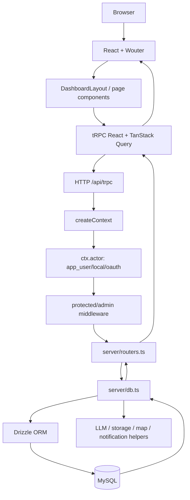
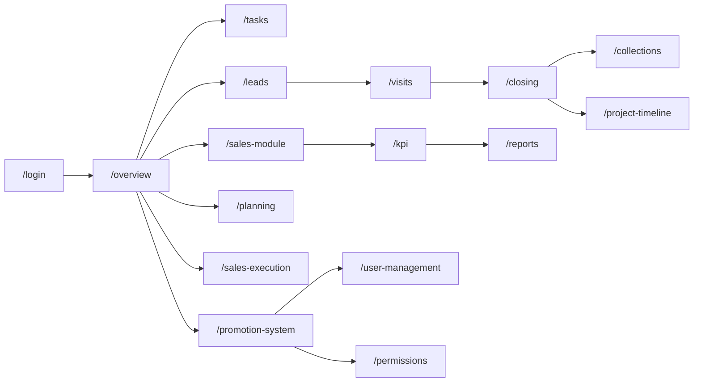
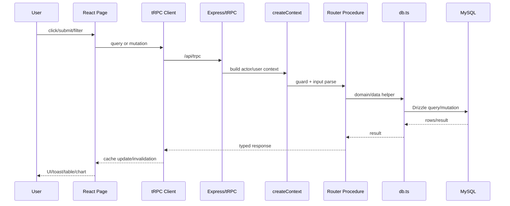
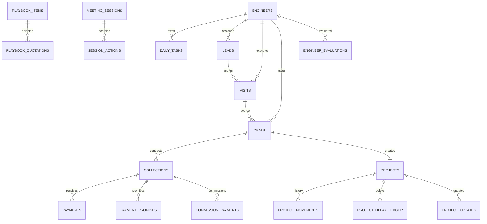
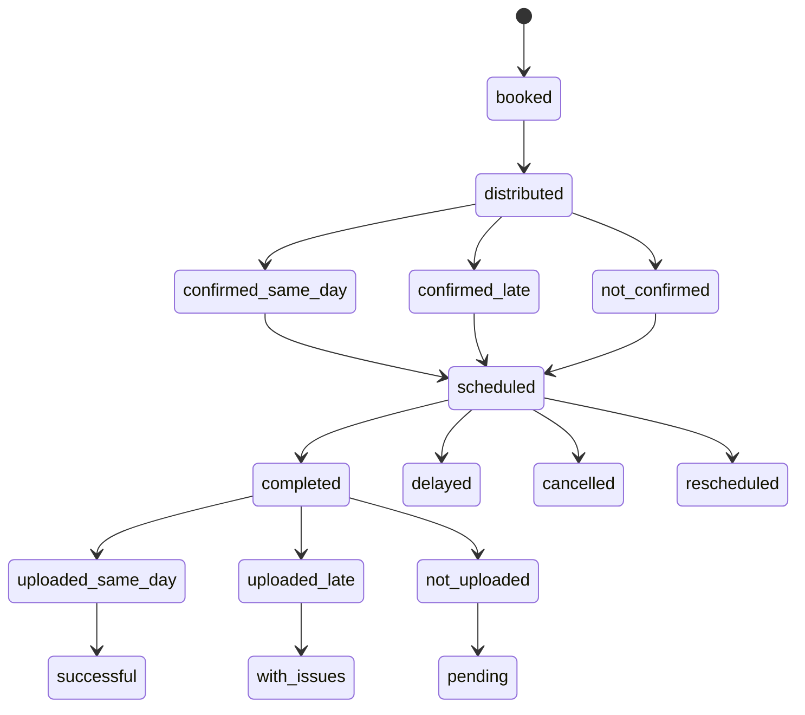
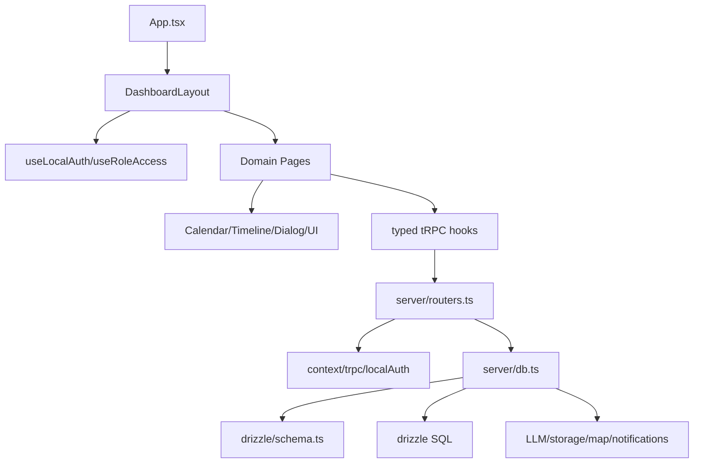
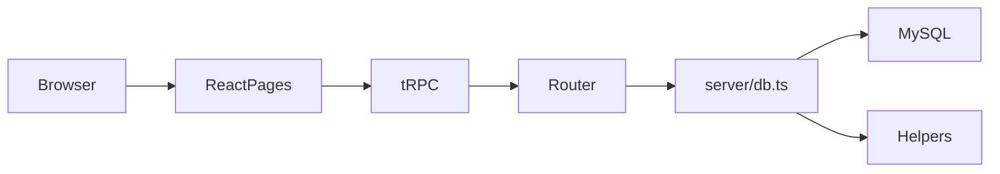
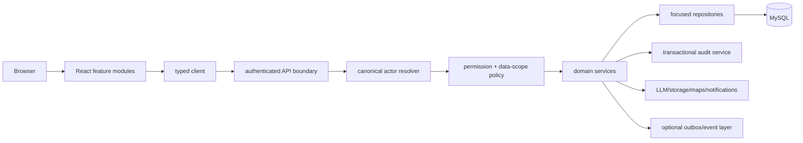
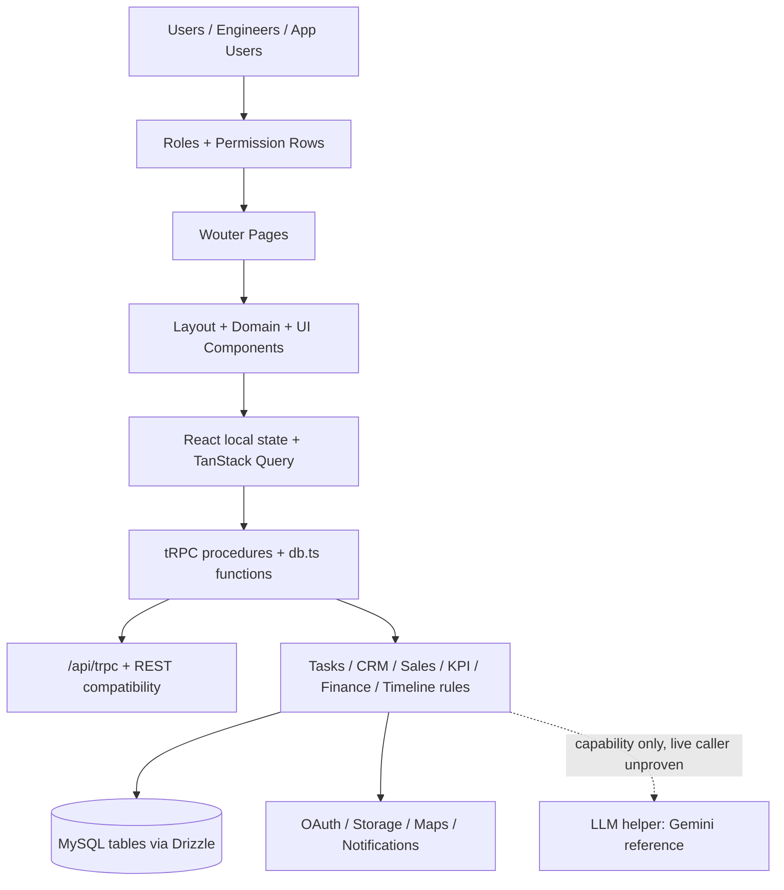

# PROJECT EXECUTIVE SUMMARY

## نطاق الوثيقة ومنهجيتها

هذه الوثيقة هي **Reverse Engineering موثق** للنسخة الحالية من مستودع `sales-team-platform` على فرع `main`. تم فحص ملفات المصدر، مخطط Drizzle، ملفات الهجرة، تعريفات tRPC، صفحات React، المكونات المشتركة، إعدادات التشغيل، الاختبارات، ونتائج التحقق المحلي. كل عبارة تصف تنفيذًا مؤكدًا مرتبطة بمسار ملف؛ أما العبارات التي تربط أكثر من ملف فهي موسومة بوضوح بأنها **Inferred**. لا تُعد هذه الوثيقة إثباتًا لمطابقة بيئة الإنتاج أو قاعدة بيانات الإنتاج.

> **قاعدة القراءة:** وجود اسم في `todo.md` أو تعليق في الكود لا يساوي اكتمال الميزة. المصدر الحاكم هو مسار التنفيذ الفعلي من الصفحة إلى الإجراء إلى طبقة البيانات.

## النتيجة التنفيذية

المشروع عبارة عن **منصة تشغيل ومراقبة لفريق مبيعات** تجمع بين إدارة المهام اليومية، العملاء المحتملين، المعاينات، الصفقات، التحصيل، مؤشرات الأداء، التقييم والترقية، تنفيذ المبيعات المعتمد على Playbook، ومراقبة Timeline المشاريع بعد إغلاق الصفقة. هذا الوصف **Inferred** من تركيب الصفحات والـ routers والجداول، وليس من وثيقة متطلبات واحدة. المصادر الأساسية هي [`client/src/App.tsx`](../client/src/App.tsx)، [`server/routers.ts`](../server/routers.ts)، و[`drizzle/schema.ts`](../drizzle/schema.ts).

البنية الحالية عبارة عن تطبيق React/Vite في الواجهة، Express في الخادم، وtRPC كعقد API typed، مع Drizzle ORM على MySQL عبر `mysql2`. توجد طبقة تشغيل واحدة تقريبًا، لكن `server/db.ts` كبير جدًا ويجمع الوصول إلى البيانات مع قدر مهم من قواعد الأعمال. التخزين الأساسي relational، وتوجد 51 table معرفة في schema الحالي، مع migrations متسلسلة حتى `0057_enforce_core_relationships.sql`.

نقطة القوة الرئيسية هي اتساع نطاق الأعمال ووجود اختبارات كثيرة وحواجز تحقق في عدة إجراءات. أهم نقاط الخطر ليست غياب الميزات، بل **تعدد نماذج الهوية، التوزيع اليدوي لفحوص الصلاحيات داخل routers، الاعتماد على `any` في بعض المسارات، وفجوة التحقق البيئي عندما لا تتوفر أسرار التشغيل وقاعدة البيانات**. لا ينبغي تفسير ذلك بأن كل API مكشوف؛ معظم واجهات الأعمال الحالية تستخدم `protectedProcedure`، لكن الاتساق بين الحارس العام، فحص الدور اليدوي، ومصفوفة الصلاحيات المخزنة يحتاج تدقيقًا.

## الحالة التي تم التحقق منها محليًا

| الفحص | النتيجة الحالية | التفسير |
|---|---:|---|
| `pnpm check` | ناجح | TypeScript يمر دون أخطاء معلنة. |
| `pnpm build` | ناجح | تم بناء Vite والـ server bundle مع تحذيرات بناء يجب مراجعتها. |
| `pnpm test` | 388 ناجحًا و1 فاشل | الفشل في `server/_core/env.runtime.test.ts` لأن بيئة الفحص الحالية لا تحتوي session secret بطول 96 ولا `DATABASE_URL`. |
| قاعدة البيانات | غير قابلة للإثبات من sandbox | لا توجد قيم أسرار أو اتصال إنتاجية ضمن هذه الوثيقة. |

هذه النتائج محفوظة أيضًا في [`review_artifacts/validation_summary.md`](../review_artifacts/validation_summary.md).

# PROJECT STRUCTURE

## Root structure

```text
sales-team-platform/
├── client/                 # React/Vite frontend
├── server/                 # Express + tRPC + data-access/business logic
├── shared/                 # Contracts/constants shared by client and server
├── drizzle/                # MySQL schema, migrations, snapshots, relation placeholder
├── docs/                   # Project documentation
├── scripts/                # Operational migration/account scripts and analysis scripts
├── review_artifacts/       # Generated review evidence and inventories
├── .manus/                 # Project/runtime metadata supplied by the environment
├── package.json            # Scripts and dependencies
├── pnpm-lock.yaml          # Locked dependency graph
├── pnpm-workspace.yaml     # Workspace declaration
├── tsconfig.json           # TypeScript configuration
├── vite.config.ts          # Vite, aliases, Tailwind, Manus runtime/debug collector
├── drizzle.config.ts       # Drizzle Kit MySQL configuration
├── vitest.config.ts        # Test configuration
├── todo.md                 # Chronological backlog/implementation notes
└── components.json         # UI component generator configuration
```

عدد الملفات النصية/البرمجية التي شملها الفهرس الآلي هو 314 ملفًا بعد إضافة ملفات أدلة المراجعة المحلية. الفهرس التفصيلي هو [`review_artifacts/reverse_engineering_inventory.json`](../review_artifacts/reverse_engineering_inventory.json).

## وظيفة الأدلة الرئيسية

| المسار | المسؤولية الفعلية | العلاقات المهمة |
|---|---|---|
| `client/src/App.tsx` | تسجيل Wouter routes، lazy loading، `DashboardLayout`، وErrorBoundary. | يربط كل route بصفحة، ويحدد alias `/dashboard`. |
| `client/src/pages/` | صفحات المجالات: tasks, leads, visits, closing, sales, KPI, finance, planning, reports, sales execution, promotion, project timeline, user management. | تستدعي typed tRPC وتدير local UI state. |
| `client/src/components/` | مكونات مشتركة كبيرة مثل `DashboardLayout`, `InteractiveCalendar`, `DailyTimeline`, `TaskCalendarView`, `AIChatBox`، ومكتبة `ui/`. | تستخدمها الصفحات أو تغلفها طبقة layout. |
| `server/_core/index.ts` | إنشاء Express server، health/readiness، REST compatibility، OAuth، tRPC، Vite/static. | نقطة دخول كل HTTP request. |
| `server/_core/context.ts` | يبني `ctx.user` من OAuth و`ctx.actor` من app-user/local/OAuth. | يستهلكه middleware وrouters. |
| `server/_core/trpc.ts` | `publicProcedure`, `protectedProcedure`, `adminProcedure`. | يقرر هل يوجد actor وهل الدور admin/manager. |
| `server/routers.ts` | العقد الكامل لـ tRPC، 33 namespace و291 procedure وفق الفهرس الآلي. | يستدعي `server/db.ts`، auth helpers، وخدمات المشروع. |
| `server/db.ts` | MySQL/Drizzle access ومعظم الحسابات والقواعد والمصالحات. | يعتمد على `drizzle/schema.ts` و`getDb()`. |
| `server/localAuth.ts` | Login للمهندس، JWT محلي، bcrypt، والتحقق من status/isDeleted. | يتكامل مع `engineers` وcookie محلي. |
| `drizzle/schema.ts` | النموذج relational والـ enum والقيم الافتراضية. | مصدر أنواع Insert/Select. |
| `drizzle/*.sql` | تاريخ schema migrations حتى migration رقم 0057. | يطبّق على MySQL عبر Drizzle Kit. |
| `shared/authorization.ts` | APP_ROLES، SYSTEM_MODULES، SYSTEM_ROLES، دوال role predicates. | يستخدمه UI وبعض الخادم. |

# TECHNOLOGY STACK

| الطبقة | التقنية | الاستخدام في المستودع | المصدر |
|---|---|---|---|
| UI | React 19 + TypeScript | صفحات ومكونات functional. | `package.json`, `client/src/` |
| Build | Vite 7 + esbuild | بناء client وserver. | `package.json`, `vite.config.ts` |
| Routing | Wouter | route matching في `App.tsx`. | `client/src/App.tsx` |
| Data fetching | tRPC 11 + TanStack React Query 5 + SuperJSON | typed queries/mutations/cache invalidation. | `package.json`, `client/src/lib/trpc.ts` |
| Server | Express 4 | HTTP entrypoint وREST/OAuth/static. | `server/_core/index.ts` |
| ORM/DB | Drizzle ORM + MySQL + `mysql2` | schema وqueries. | `drizzle/schema.ts`, `server/db.ts` |
| Validation | Zod 4 | inputs لمعظم procedures. | `server/routers.ts` |
| Auth | Manus OAuth + local engineer JWT + app-user JWT | ثلاثة مصادر هوية normalized جزئيًا في `ctx.actor`. | `server/_core/context.ts`, `server/localAuth.ts`, `server/db.ts` |
| Passwords | `bcryptjs` | hash/compare لكلمات مرور engineer/app user. | `server/localAuth.ts`, `server/db.ts` |
| Tokens | `jose` | JWT HS256 والتحقق. | `server/localAuth.ts`, `server/db.ts` |
| Styling/UI | Tailwind CSS 4، Radix primitives، Lucide، shadcn-like wrappers | visual system وdialogs/forms/tables. | `vite.config.ts`, `client/src/components/ui/` |
| Charts/reports | Recharts، `xlsx`، `jspdf`، `html2canvas` | dashboards/export/print/PDF client behavior. | `package.json`, pages |
| Calendar/interactions | `@dnd-kit/*`, `date-fns`, Framer Motion | drag/drop calendar وmotion/date controls. | `package.json`, calendar components |
| Storage/integrations | S3 SDK، built-in Forge helpers، map/notification/image/voice modules | infrastructure helpers؛ الاستخدام التجاري يجب تتبعه حسب caller. | `server/_core/`, `server/storage.ts` |
| AI | `invokeLLM` helper referencing `gemini-2.5-flash` | capability infrastructure؛ لم يثبت وجود live business route في source search الحالي. | `server/_core/llm.ts` |

# APPLICATION ARCHITECTURE

## Current architecture



يبدأ الطلب في browser من route/page أو shared component. الـ component يستعمل hook مولدًا من `trpc`، وينشئ HTTP request إلى `/api/trpc`. Express يمرر الطلب إلى `createExpressMiddleware`; `createContext` يحاول OAuth ثم cookie `app_user_token` ثم cookie الجلسة المحلية، ويضع actor. بعد ذلك يطبق procedure guard، ثم ينفذ handler في `server/routers.ts`، الذي يستدعي وظيفة في `server/db.ts` أو helper داخل router، ثم Drizzle/MySQL. هذه السلسلة مؤكدة من [`server/_core/index.ts`](../server/_core/index.ts)، [`server/_core/context.ts`](../server/_core/context.ts)، [`server/_core/trpc.ts`](../server/_core/trpc.ts)، و[`server/routers.ts`](../server/routers.ts).

## Request lifecycle

| المرحلة | نقطة التنفيذ | القرار/البيانات |
|---|---|---|
| 1 | Wouter route | اختيار page أو NotFound. |
| 2 | Page/component | بناء query/mutation inputs وإدارة local state. |
| 3 | tRPC client | تحويل الاستدعاء إلى request typed. |
| 4 | Express | body parsing، HTTP endpoint matching، ثم tRPC adapter. |
| 5 | `createContext` | تحميل `ctx.user` و`ctx.actor` من مصادر الهوية. |
| 6 | middleware | public لا يتطلب actor، protected يتطلب actor، admin يقبل `admin` أو `manager`. |
| 7 | router handler | Zod input ثم فحص دور يدوي في بعض المسارات. |
| 8 | data/business layer | query، mutation، حسابات، triggers تطبيقية، audit/timeline. |
| 9 | response | tRPC/REST JSON يعود إلى React Query. |
| 10 | cache/UI | invalidation/refetch، toast، تحديث العرض. |

# COMPLETE ROUTING MAP

كل routes المسجلة صراحة في `client/src/App.tsx` هي:

| Path | Page/component | الغرض | سلوك الوصول الحالي |
|---|---|---|---|
| `/` | `Home` | صفحة الدخول/الترحيب العامة بحسب مكوّن الصفحة. | لا يوجد حارس مسار خاص في App.tsx |
| `/login` | `LoginPage` | تسجيل الدخول المحلي وتغيير كلمة المرور الإجباري عند الحاجة. | عامة؛ المصادقة تتم داخل الإجراء |
| `/overview` | `Overview` | نظرة عامة وتشغيل لوحة التحكم. | داخل DashboardLayout؛ session مطلوبة عمليًا |
| `/tasks` | `TasksModule` | المهام اليومية، التقويم، التسجيلات، التوزيع، والمتابعة. | داخل DashboardLayout |
| `/leads` | `LeadsModule` | قائمة العملاء المحتملين وإحصاءات المتابعة. | داخل DashboardLayout |
| `/visits` | `VisitsModule` | المعاينات من الحجز حتى التنفيذ والرفع والجودة والتحصيل. | داخل DashboardLayout |
| `/closing` | `ClosingModule` | الصفقات ومراحل الإغلاق والخصومات والصفقات المفقودة. | داخل DashboardLayout |
| `/sales-module` | `SalesModule` | المبيعات والأهداف وشرائح العمولة والأداء. | داخل DashboardLayout |
| `/kpi` | `KPIModule` | KPI والعمولات والمكافآت وتصنيفات الأداء. | داخل DashboardLayout |
| `/collections` | `CollectionsModule` | العقود والمدفوعات ووعود الدفع والعمولات. | داخل DashboardLayout |
| `/planning` | `PlanningModule` | أهداف الشركة والمهندسين والأهداف الشخصية والتوزيع. | داخل DashboardLayout |
| `/promotion-system` | `PromotionSystem` | التقييم الشهري، الترقية، ومسار التطور. | داخل DashboardLayout |
| `/reports` | `ReportsModule` | التقارير الأسبوعية والشهرية والربع سنوية. | داخل DashboardLayout |
| `/sales-execution` | `SalesExecutionSystem` | Playbook، عروض الأسعار، جلسات الاجتماعات، المراجعات، والتدريب. | داخل DashboardLayout |
| `/project-timeline` | `ProjectTimelineModule` | متابعة تنفيذ المشاريع بعد إغلاق الصفقة، SLA والتأخيرات والتوقفات. | داخل DashboardLayout؛ نطاق البيانات يفرضه الخادم |
| `/user-management` | `UserManagement` | حسابات المستخدمين، كلمات المرور، الحالة، وربط المهندس. | داخل DashboardLayout؛ العمليات الحساسة تفحص الدور يدويًا |
| `/permissions` | `PermissionsPanel` | مصفوفة صلاحيات الأدوار والأقسام. | داخل DashboardLayout؛ العمليات الحساسة تفحص الدور يدويًا |
| `/dashboard` | `Overview` | اسم قديم/alias لنظرة عامة. | داخل DashboardLayout |
| `/404` | `NotFound` | صفحة غير موجودة؛ وSwitch يحتوي أيضًا fallback عام. | عامة |

المسارات التشغيلية كلها تقريبًا children لـ `DashboardLayout`. الـ layout يعيد التوجيه إلى `/login` عندما تنتهي عملية `useLocalAuth` دون session، ويصفّي عناصر sidebar عبر `useRoleAccess`. هذا **UI gate** وليس بديلًا عن authorization الخادمي. توجد أيضًا `/dashboard` كاسم بديل لنفس `Overview`، و`/404` بالإضافة إلى fallback عام في `Switch`.

## Navigation map



الروابط المرئية في sidebar معرفة في `DashboardLayout.tsx`. روابط الأعمال بين الصفحات ليست كلها route-to-route links؛ جزء مهم منها يتم عبر tabs/dialogs داخل الصفحة واستدعاءات tRPC، خصوصًا داخل Tasks وVisits وClosing وProjectTimeline.

# PAGE-BY-PAGE ANALYSIS

## Home و Login

`Home` هي الصفحة المرتبطة بـ `/`، بينما `LoginPage` هي `/login`. صفحة Login تستدعي `trpc.localAuth.login`; عند إرجاع `forcePasswordChange` تعرض فرعًا لتغيير كلمة المرور باستدعاء `trpc.appUsers.changePassword`, ثم تنتقل إلى `/overview`. مسار session المحلي يستعمل cookie ولا يعتمد على تخزين token في localStorage بحسب التنفيذ المقروء في [`LoginPage.tsx`](../client/src/pages/LoginPage.tsx) و[`server/localAuth.ts`](../server/localAuth.ts).

## Overview

`Overview` هي لوحة ملخص، وتستخدمها `/overview` و`/dashboard`. مسؤوليتها عرض ملخصات التشغيل والتنبيهات والأداء؛ الواجهة تغلفها `DashboardLayout`. الـ APIs التفصيلية التي تظهر في الصفحة يجب الرجوع إلى calls الفعلية في الملف لأنها قد تتغير، بينما النمط العام هو query إلى namespaces `tasks`, `leads`, `visits`, `closing`, `kpi`, و`management`.

## TasksModule

المسار `/tasks`. الصفحة تجمع قائمة المهام، التقويم التفاعلي، Timeline اليومي، الفلاتر الزمنية، التوزيع، critical insights، review recordings، Admin Sales tasks وLead follow-up. أهم child components هي `InteractiveCalendar`, `DailyTimeline`, `TaskCalendarView`, `TimeFilterBar`, وdialogs داخل الصفحة.

عند الدخول، تُقرأ engineers والمهام والإحصاءات حسب التاريخ/الفلاتر. إنشاء المهمة يمر عبر Zod ثم يطبق server-side department enforcement عندما يكون `taskType` غير `other`. تحديث الحالة يحترم قاعدة أن task من نوع meeting/closing لا يكتمل بلا recording link؛ حالة `client_delay` تنشئ مهمة لليوم التالي مع `rescheduledFromId`. التقويم يدعم move/update/delete وتحديثات Admin Sales. هذه القواعد مؤكدة في [`TasksModule.tsx`](../client/src/pages/TasksModule.tsx) و[`server/db.ts`](../server/db.ts).

## LeadsModule

المسار `/leads`. يعرض list/stats ويدعم الإنشاء وتغيير status. الـ lead يملك `source`, `assignedEngineerId`, `status`, `firstContactAt`, و`responseTimeMinutes`. status enum الحالي هو `new`, `contacted`, `qualified`, `unqualified`, `converted`. follow-up اليومي المنفصل يستعمل `leadDailyStats` و`leadFollowup` procedures.

## VisitsModule

المسار `/visits`. الصفحة مقسمة إلى tabs: daily, booking, confirmation, execution, upload, quality, financial, alerts. عند الدخول تستدعي `visits.stats`, `visits.list` بنوع filter يختلف حسب tab، `visits.alerts`, `visits.debt`, `visits.dailyTracking`, `visits.adminSalesKPI`, `visits.needingAction`, و`engineers.list`.

إنشاء المعاينة يتطلب engineer/client/date. التحديث الكامل يسمح بتعديل booking/confirmation/execution/upload/delivery/quality/financial. الواجهة تعرض تنبيهات عندما لا يوجد confirmation أو upload أو collection. قاعدة مهمة: رسم المعاينة المحصل يحتاج screenshot URL في dialog، لكن يجب اعتبار enforcement الكامل server-side **Needs Verification** إذا لم يثبت في كل mutation paths.

## ClosingModule

المسار `/closing`. الصفحة تستدعي إحصاءات الصفقات وقائمتها والمهندسين والخصومات والتحليل والمهام والتايم لاين. الإنشاء يمر إلى `createDealWithDiscount`; تحديث stage يمر إلى `updateDealFull`; يوجد update stage بديل، reopen، update engineer، accounting month، auto-create from task، soft delete وdeal tasks.

Stages الفعلية: `proposal`, `negotiation`, `contract_sent`, `closed_won`, `closed_lost`. تغيير المرحلة إلى closed قد يضع `closedAt`، وقد يؤدي إلى إنشاء follow-up task أو مشروع عبر مسارات أخرى. يجب اعتبار transactional atomicity بين deal/project/collection **Needs Verification** لأن المصادر الحالية لا تثبت transaction واحدة لكل workflow.

## SalesModule و KPIModule

`SalesModule` في `/sales-module` يعرض monthly sales, trend, engineer performance, targets, commission tiers وdiscount tiers/control stats. `KPIModule` في `/kpi` يستدعي engineers/trend/operational/ranking/tele-sales/site/company-closing/reward/lost-impact/discount distribution/earnings/bonus/follow-up queries. هذه الصفحات تعتمد على حسابات مركزية في `server/db.ts`، لكن توجد أكثر من دالة period attribution؛ لذلك يجب عدم افتراض أن كل report يطبق نفس تعريف الشهر دون اختبار.

## CollectionsModule

المسار `/collections`. يعرض العقود، المتابعة اليومية، commission per engineer، dashboard، alerts، contracts with commission وperiod analysis. يدعم إضافة عقد، auto-create contract من deal، إضافة payment، إضافة promise، وتحديث promise. الجداول الأساسية هي `collections`, `payments`, `payment_promises`, `commission_payments`.

## PlanningModule

المسار `/planning`. يحتوي Company Goals وIndividual Goals وPersonal Goals. يقرأ/يكتب `companyGoals`, `engineerTargets`, `engineerPersonalGoals`، ويعرض preview/apply auto-distribution مع manual override. بعض sections gated عبر `useSectionPermission`, لكن enforcement النهائي يجب أن يبقى في الخادم.

## ReportsModule

المسار `/reports`. يوفر weekly full، monthly KPI، quarterly comparison عبر procedures `reports.weeklyFull`, `reports.monthlyKPI`, و`reports.quarterly`. quarterly يحسب الأشهر الثلاثة ويستدعي monthly KPI لكل شهر.

## SalesExecutionSystem

المسار `/sales-execution`. الصفحة مقسمة إلى Playbook، Meeting Review، Funnel Analysis، Coaching Dashboard. Playbook يدعم list/categories/import، quotations وpresentation tracking. Meeting Review يستخدم `promotion.createMeetingReview`; Funnel يستعمل `funnel.full` و`funnel.comparison`; Coaching يستعمل `playbook.weeklyCoaching`. الجداول: `playbook_items`, `playbook_quotations`, `meeting_sessions`, `session_actions`, `meeting_reviews`.

## PromotionSystem

المسار `/promotion-system`. يقرأ review summaries، evaluation dashboard، career level، promotion progress، وmanagement decision dashboard. يدعم create monthly evaluation، promote engineer، وmeeting review. البيانات موزعة بين `engineer_evaluations` و`engineer_career_levels`.

## ProjectTimelineModule

المسار `/project-timeline`. الصفحة تملك config/list/dashboard/analytics/detail، وتدعم sync من closed deals، import historical spreadsheet، transition stage، delay ledger، hold، update، pre-execution، start execution وclose. غير المديرين يفرض الخادم عليهم `engineerId = caller.id` في list/dashboard؛ وهذا مثال واضح على data-scope server-side داخل namespace.

## UserManagement و PermissionsPanel

`UserManagement` في `/user-management` يدير app users وحسابات engineers وتغيير/إعادة تعيين كلمة المرور وحالة الحساب. `PermissionsPanel` في `/permissions` يدير role permissions وsection permissions. الوصول إلى هذه العمليات يعتمد غالبًا على `protectedProcedure` مع فحص يدوي لأدوار `manager`, `admin_sales`, `admin`، أو `manager`, `admin`. يجب توحيد ذلك في policy service مستقبلًا.

# COMPONENT ARCHITECTURE

## الطبقات

| الفئة | أمثلة | المسؤولية |
|---|---|---|
| Layout | `DashboardLayout`, `DashboardLayoutSkeleton` | shell، sidebar، session redirect، menu filtering. |
| Domain components | `InteractiveCalendar`, `DailyTimeline`, `TaskCalendarView`, `DateRangePicker`, `TimeFilterBar` | UX متخصص للمهام والتاريخ. |
| Cross-cutting | `ErrorBoundary`, `DeleteConfirmDialog`, `ManusDialog`, `Map` | أخطاء، حذف، dialog، map. |
| AI/UI shell | `AIChatBox` | chat presentation/callback contract؛ لا يثبت live AI route. |
| Primitive UI | `client/src/components/ui/*` | wrappers فوق Radix/Tailwind: button, dialog, form, table, tabs, chart وغيرها. |
| Pages | كل `client/src/pages/*.tsx` | composition للـ domain queries والـ UI state. |

أهم علاقة dependency هي: `App` → page → domain components → `trpc` hooks → tRPC router → `db.ts`. معظم الصفحات ليست مجرد presentational components؛ فهي تحتوي handlers، query invalidation، filter state، dialog state، وvalidation أولي. لذلك coupling مرتفع خصوصًا في `TasksModule`, `ClosingModule`, `VisitsModule`, `KPIModule`, و`ProjectTimelineModule`.

## أهم المكونات القابلة لإعادة الاستخدام

| Component | Props/State الأساسية | مستخدم من | ملاحظة |
|---|---|---|---|
| `DashboardLayout` | children، local sidebar width، session، role access | كل dashboard routes | أهم UI auth boundary. |
| `InteractiveCalendar` | engineer/date/task mode، drag/drop state | Tasks | ينفذ create/update/move/delete. |
| `DailyTimeline` | date، engineer، viewMode | Tasks | يستعمل tasks timeline وcreateWithTime. |
| `TaskCalendarView` | filter engineer/date | Tasks | query calendarView. |
| `DateRangePicker` | range mode/date state | Visits, Closing, KPI, Planning | يؤثر على query params. |
| `TimeFilterBar` | dateRange/custom dates | Tasks | يغير filtered/timeSummary. |
| `DeleteConfirmDialog` | target/reason/confirm | pages with soft delete | يعرض أسباب الحذف. |
| `ErrorBoundary` | child tree | App | يمنع crash كامل للـ UI. |
| `AIChatBox` | messages، onSend، loading | ComponentShowcase | live product wiring غير مثبت. |

الفهرس الكامل للملفات والم symbols موجود في `reverse_engineering_inventory.json`; لم يُعتبر كل ملف UI primitive business component.

# DATA FLOW

## Flow عام



## أهم العمليات الفعلية

| العملية | المسار الفعلي المختصر |
|---|---|
| Login المحلي | LoginPage → `localAuth.login` → `localLogin` → `engineers` + bcrypt → local JWT cookie → `localAuth.me` → DashboardLayout. |
| إنشاء مهمة | Tasks/Calendar → `tasks.create` أو `tasks.createWithTime` → department check/time overlap → `createTask` → `daily_tasks` → invalidate/refetch. |
| إكمال meeting task | UpdateStatusDialog → optional `meetingReview.submitLink` → `tasks.updateStatus` → recording rule → update task؛ `client_delay` ينشئ task لاحقة. |
| إنشاء lead | Leads page → `leads.create` → `createLead` → `leads`. |
| إنشاء زيارة | Visits page → `visits.create` → `createVisit` → `visits`؛ التحديث يمر `updateVisitFull` أو `updateVisitWithAdminTracking`. |
| إنشاء/إغلاق صفقة | Closing → `closing.create`/`updateStage` → discount validation/full update → `deals`, timeline/tasks وربما project effects. |
| تحصيل دفعة | Collections → `financial.addPayment` أو `addPaymentWithFollowUp` → payment record، collection aggregate/follow-up/commission effects. |
| KPI | KPI page → `kpi.*` → functions في db.ts → engineer targets + deals/visits/tasks/collections → calculated result. |
| Project transition | Project Timeline → `projectTimeline.transition` → authorization/data scope → `projects` + movement/delay/audit records. |

# DATABASE / DATA MODEL

## قواعد عامة

المصدر الحالي هو `drizzle/schema.ts`، حيث كل table تعرّف integer auto-increment primary key غالبًا، مع enums وdefaults وحقول timestamps. توجد علاقات صريحة مهمة في migration `0057_enforce_core_relationships.sql`، بينما ملف `drizzle/relations.ts` لا يحتوي تعريفات relations typed؛ لذلك يوجد فرق بين database FK integrity وبين Drizzle relation helpers.

## Database Relationship Map



العلاقات في الرسم تجمع declared FK من migration مع ID conventions وتعليقات schema؛ أي علاقة موسومة بأنها inferred يجب تأكيدها عبر production schema أو business owner.

## فهرس كامل للجداول والحقول

الجدول التالي مولد من `drizzle/schema.ts` ويعرض أسماء الحقول وتعريفها النصي؛ وهو أوسع من قائمة domain المختصرة.

| Table | Symbol | Fields / declared types | Source |
|---|---|---|---|
| `users` | `users` | id — int("id").autoincrement().primaryKey(); openId — varchar("openId", { length: 64 }).notNull().unique(); name — text("name"); email — varchar("email", { length: 320 }); loginMethod — varchar("loginMethod", { length: 64 }); role — mysqlEnum("role", ["user", "admin"]).default("user").notNull(); createdAt — timestamp("createdAt").defaultNow().notNull(); updatedAt — timestamp("updatedAt").defaultNow().onUpdateNow().notNull(); lastSignedIn — timestamp("lastSignedIn").defaultNow().notNull() | [`drizzle/schema.ts`](../drizzle/schema.ts) |
| `engineers` | `engineers` | id — int("id").autoincrement().primaryKey(); name — varchar("name", { length: 120 }).notNull(); email — varchar("email", { length: 320 }); phone — varchar("phone", { length: 30 }); department — mysqlEnum("department", ["sales_engineer", "sales_specialist", "interior_designer", "tele_sales", "site", "admin_sales", "manager"]).default("sales_engineer"); role — mysqlEnum("role", ["admin", "engineer", "admin_sales", "sales_engineer", "tele_sales", "site_engineer", "system_user", "sales_specialist", "interior_designer", "manager"]).default("sales_engineer").notNull(); status — mysqlEnum("status", ["active", "inactive"]).default("active").notNull(); username — varchar("username", { length: 64 }).unique(); passwordHash — varchar("passwordHash", { length: 255 }); createdAt — timestamp("createdAt").defaultNow().notNull(), // مستوى الخبرة - ينطبق فقط على sales_engineer; seniority — mysqlEnum("seniority", ["senior", "junior"]).default("junior"), // ─── Soft Delete ───────────────────────────────────────────────────────────────────────────────────; isDeleted — int("isDeleted").default(0).notNull(); deletedAt — timestamp("deletedAt"); deleteReason — mysqlEnum("deleteReason", ["data_entry_error", "duplicate", "client_cancelled", "other"]); deleteReasonCustom — varchar("deleteReasonCustom", { length: 255 }); deletedBy — varchar("deletedBy", { length: 120 }), // إجبار تغيير كلمة المرور عند أول دخول; forcePasswordChange — int("forcePasswordChange").default(0).notNull() | [`drizzle/schema.ts`](../drizzle/schema.ts) |
| `daily_tasks` | `dailyTasks` | id — int("id").autoincrement().primaryKey(); engineerId — int("engineerId").notNull(); taskDate — date("taskDate").notNull(); title — varchar("title", { length: 255 }).notNull(); description — text("description"); plannedHours — float("plannedHours").default(1); status — mysqlEnum("status", ["planned", "completed", "delayed", "not_done", "client_delay"]).default("planned").notNull(); priority — mysqlEnum("priority", ["low", "medium", "high", "urgent"]).default("medium").notNull(); delayDays — int("delayDays").default(0).notNull(); isClientDelay — int("isClientDelay").default(0).notNull(); rescheduledFromId — int("rescheduledFromId"); isRescheduled — int("isRescheduled").default(0).notNull(); isCritical — int("isCritical").default(0).notNull(); completedAt — timestamp("completedAt"); notes — text("notes"), // ─── Soft Delete ──────────────────────────────────────────────────────────; isDeleted — int("isDeleted").default(0).notNull(); deletedAt — timestamp("deletedAt"); deleteReason — mysqlEnum("deleteReason", ["data_entry_error", "duplicate", "client_cancelled", "other"]); deleteReasonCustom — varchar("deleteReasonCustom", { length: 255 }); deletedBy — varchar("deletedBy", { length: 120 }), // ─── Time-based Calendar ─────────────────────────────────────────────────────; startTime — varchar("startTime", { length: 5 }),  // HH:MM e.g. '09:00'; endTime — varchar("endTime", { length: 5 }),      // HH:MM e.g. '10:30'; taskType — mysqlEnum("taskType", [ // 7 Standard Task Types "design_2d",             // 2D Design "design_3d",             // 3D Modeling "render",                // Render "quotation",             // Quotation "meeting_modeling",      // Meeting Modeling "meeting_presentation",  // Meeting Presentation "meeting_closing",       // Meeting Closing // New Task Types "contract",              // Contract Preparation (إعداد العقد) "work_order",            // Work Order Preparation (إعداد أمر الشغل) // Legacy (keep for backward compat) "meeting_2d", "meeting_3d", "meeting_quotation", // Legacy "closing", "negotiation", "other" ]).default("other"), // ─── Goal Linking ─────────────────────────────────────────────────────────; goalType — mysqlEnum("goalType", [ "design_2d", "design_3d", "render", "quotation", "meeting", "closing", "contract", "work_order" ]), // ─── Actual vs Planned ────────────────────────────────────────────────────; actualHours — float("actualHours"); completionDate — date("completionDate"), // ─── Client / Deal Linking ────────────────────────────────────────────────; clientName — varchar("clientName", { length: 120 }); dealId — int("dealId"), // ─── Meeting Recording ─────────────────────────────────────────────────────; category — varchar("category", { length: 80 }), // e.g. 'closing', 'meeting', 'general'; meetingRecordingLink — varchar("meetingRecordingLink", { length: 500 }); recordingSubmittedAt — timestamp("recordingSubmittedAt"), // ─── Reminder ─────────────────────────────────────────────────────────────; reminderMinutes — int("reminderMinutes").default(0), // 0=none, 15, 30, 60; createdAt — timestamp("createdAt").defaultNow().notNull() | [`drizzle/schema.ts`](../drizzle/schema.ts) |
| `leads` | `leads` | id — int("id").autoincrement().primaryKey(); name — varchar("name", { length: 120 }).notNull(); phone — varchar("phone", { length: 30 }); email — varchar("email", { length: 320 }); source — mysqlEnum("source", ["website", "referral", "social_media", "call", "walk_in", "other"]).default("other").notNull(); assignedEngineerId — int("assignedEngineerId"); status — mysqlEnum("status", ["new", "contacted", "qualified", "unqualified", "converted"]).default("new").notNull(); firstContactAt — timestamp("firstContactAt"); responseTimeMinutes — int("responseTimeMinutes"); notes — text("notes"); createdAt — timestamp("createdAt").defaultNow().notNull(); updatedAt — timestamp("updatedAt").defaultNow().onUpdateNow().notNull(), // ─── Soft Delete ──────────────────────────────────────────────────────────; isDeleted — int("isDeleted").default(0).notNull(); deletedAt — timestamp("deletedAt"); deleteReason — mysqlEnum("deleteReason", ["data_entry_error", "duplicate", "client_cancelled", "other"]); deleteReasonCustom — varchar("deleteReasonCustom", { length: 255 }); deletedBy — varchar("deletedBy", { length: 120 }) | [`drizzle/schema.ts`](../drizzle/schema.ts) |
| `visits` | `visits` | id — int("id").autoincrement().primaryKey(); leadId — int("leadId"); engineerId — int("engineerId").notNull(); clientName — varchar("clientName", { length: 120 }).notNull(); clientPhone — varchar("clientPhone", { length: 30 }); address — text("address"); scheduledAt — timestamp("scheduledAt").notNull(); bookingMonth — int("bookingMonth"),                                 // شهر الحجز (1-12); bookingYear — int("bookingYear"),                                   // سنة الحجز; actualAt — timestamp("actualAt"),  // ── Admin Sales Tracking ────────────────────────────────────────────────────────────────────────────────; adminSalesId — int("adminSalesId"); lastUpdatedByAdminAt — timestamp("lastUpdatedByAdminAt"),  // ── 1. Booking & Assignment ────────────────────────────────────────────────────────────────────────────────; bookingStatus — mysqlEnum("bookingStatus", ["booked", "distributed", "distribution_delayed"]).default("booked").notNull(); assignedDelay — int("assignedDelay").default(0).notNull(),  // ── 2. Confirmation ────────────────────────────────────────────────────────────────────────────────; confirmationStatus — mysqlEnum("confirmationStatus", ["confirmed_same_day", "confirmed_late", "not_confirmed"]).default("not_confirmed").notNull(); confirmedAt — timestamp("confirmedAt"); confirmationDelayHours — int("confirmationDelayHours").default(0).notNull(),  // ── 3. Execution ─────────────────────────────────────────────────────────────; status — mysqlEnum("status", ["scheduled", "completed", "delayed", "cancelled", "rescheduled"]).default("scheduled").notNull(); executedAt — timestamp("executedAt"),                              // تاريخ التنفيذ الفعلي; executionMonth — int("executionMonth"),                             // شهر التنفيذ (1-12); executionYear — int("executionYear"),                               // سنة التنفيذ; delayMinutes — int("delayMinutes").default(0); rescheduledFromId — int("rescheduledFromId"),  // ── 4. Upload & Delivery ─────────────────────────────────────────────────────; uploadStatus — mysqlEnum("uploadStatus", ["uploaded_same_day", "uploaded_late", "not_uploaded"]).default("not_uploaded").notNull(); uploadedAt — timestamp("uploadedAt"); uploadMonth — int("uploadMonth"),                                   // شهر الرفع (1-12); uploadYear — int("uploadYear"),                                     // سنة الرفع; deliveredToAdmin — int("deliveredToAdmin").default(0).notNull(),  // 1 = نعم; deliveryDelayHours — int("deliveryDelayHours").default(0).notNull(),  // ── 5. Quality ───────────────────────────────────────────────────────────────; quality — mysqlEnum("quality", ["successful", "with_issues", "design_rejected", "repeated", "pending"]).default("pending").notNull(),  // ── 6. Admin Handling ────────────────────────────────────────────────────────; groupStatus — mysqlEnum("groupStatus", ["created_on_time", "created_late", "not_created"]).default("not_created").notNull(); assignedToDesigner — int("assignedToDesigner").default(0).notNull(),  // ── 7. Financial ────────────────────────────────────────────────────────────────────────────────; feeAmount — decimal("feeAmount", { precision: 10, scale: 2 }).default("0").notNull(); feeCollected — int("feeCollected").default(0).notNull(); paymentScreenshotUrl — varchar("paymentScreenshotUrl", { length: 500 }); paymentDate — timestamp("paymentDate"); collectedAt — timestamp("collectedAt"),                             // تاريخ التحصيل الفعلي; collectionMonth — int("collectionMonth"),                           // شهر التحصيل (1-12); collectionYear — int("collectionYear"),                             // سنة التحصيل; debtFollowedUp — int("debtFollowedUp").default(0).notNull(),       // 1 = تمت متابعة المديونية  // ── 8. Soft Delete ────────────────────────────────────────────────────────────────────────────────; isDeleted — int("isDeleted").default(0).notNull(),                 // 1 = محذوف; deleteReason — mysqlEnum("deleteReason", ["client_cancelled", "postponed", "data_entry_error", "other"]); deleteReasonCustom — varchar("deleteReasonCustom", { length: 255 }); deletedBy — varchar("deletedBy", { length: 120 }); deletedAt — timestamp("deletedAt"), ; notes — text("notes"); createdAt — timestamp("createdAt").defaultNow().notNull() | [`drizzle/schema.ts`](../drizzle/schema.ts) |
| `deals` | `deals` | id — int("id").autoincrement().primaryKey(); visitId — int("visitId"); leadId — int("leadId"); engineerId — int("engineerId").notNull(); clientName — varchar("clientName", { length: 120 }).notNull(); value — decimal("value", { precision: 14, scale: 2 }).notNull(), // ─── Gross / Net Value (CRITICAL: Revenue = netValue only) ─────────────────; grossValue — decimal("grossValue", { precision: 14, scale: 2 }).default("0").notNull(); netValue — decimal("netValue", { precision: 14, scale: 2 }).default("0").notNull(), // ─── Source Task (Auto-created from Task) ─────────────────────────────────; sourceTaskId — int("sourceTaskId"); isAutoCreated — int("isAutoCreated").default(0).notNull(), // 1 = created from Task; isLocked — int("isLocked").default(0).notNull(),           // 1 = locked after closed; stage — mysqlEnum("stage", ["proposal", "negotiation", "contract_sent", "closed_won", "closed_lost"]).default("proposal").notNull(); nextAction — text("nextAction"); nextActionDate — date("nextActionDate"); closedAt — timestamp("closedAt"); notes — text("notes"), // ─── Discount Fields ──────────────────────────────────────────────────────; discountPercent — decimal("discountPercent", { precision: 5, scale: 2 }).default("0").notNull(); discountValue — decimal("discountValue", { precision: 14, scale: 2 }).default("0").notNull(); discountNote — text("discountNote"), // ─── Advanced Discount Fields ─────────────────────────────────────────────; maxDiscountPct — decimal("maxDiscountPct", { precision: 5, scale: 2 }).default("0").notNull(); savedDiscountBonus — decimal("savedDiscountBonus", { precision: 14, scale: 2 }).default("0").notNull(); discountApprovalStatus — mysqlEnum("discountApprovalStatus", ["none", "pending", "approved", "rejected"]).default("none").notNull(); discountApprovedBy — varchar("discountApprovedBy", { length: 120 }), // ─── Closing Month Attribution (CRITICAL: deals attributed by closedAt month) ──; closingMonth — int("closingMonth"),   // 1-12: month of closing (set when stage → closed_won/lost); closingYear — int("closingYear"),    // e.g. 2026 // ─── Accounting Month Attribution (CRITICAL: financial accounting month, can differ from closing month) ──; accountingMonth — int("accountingMonth"),  // 1-12: month for financial accounting (admin/manager only); accountingYear — int("accountingYear"),   // e.g. 2026; accountingMonthSetBy — varchar("accountingMonthSetBy", { length: 120 }), // who set it; accountingMonthSetAt — timestamp("accountingMonthSetAt"), // when it was set // ─── Lost Deal Analysis ─────────────────────────────────────────────────────; lostReason — mysqlEnum("lostReason", ["price_high", "competitor", "slow_response", "wrong_product", "not_serious", "budget_cut", "other"]); lostReasonNote — varchar("lostReasonNote", { length: 255 }); createdAt — timestamp("createdAt").defaultNow().notNull(); updatedAt — timestamp("updatedAt").defaultNow().onUpdateNow().notNull(), // ─── Soft Delete ──────────────────────────────────────────────────────────; isDeleted — int("isDeleted").default(0).notNull(); deletedAt — timestamp("deletedAt"); deleteReason — mysqlEnum("deleteReason", ["data_entry_error", "duplicate", "client_cancelled", "other"]); deleteReasonCustom — varchar("deleteReasonCustom", { length: 255 }); deletedBy — varchar("deletedBy", { length: 120 }) | [`drizzle/schema.ts`](../drizzle/schema.ts) |
| `monthly_targets` | `monthlyTargets` | id — int("id").autoincrement().primaryKey(); year — int("year").notNull(); month — int("month").notNull(); targetAmount — decimal("targetAmount", { precision: 14, scale: 2 }).notNull(); avgDealValue — decimal("avgDealValue", { precision: 14, scale: 2 }).default("50000"); closingRate — float("closingRate").default(0.3); visitToClosingRate — float("visitToClosingRate").default(0.4); notes — text("notes"); createdAt — timestamp("createdAt").defaultNow().notNull() | [`drizzle/schema.ts`](../drizzle/schema.ts) |
| `collections` | `collections` | id — int("id").autoincrement().primaryKey(); dealId — int("dealId"); engineerId — int("engineerId"),                          // المهندس المسؤول عن العقد; clientName — varchar("clientName", { length: 120 }).notNull(); contractAmount — decimal("contractAmount", { precision: 14, scale: 2 }).notNull(); collectedAmount — decimal("collectedAmount", { precision: 14, scale: 2 }).default("0"); dueDate — date("dueDate"); status — mysqlEnum("status", ["on_track", "due_soon", "overdue", "completed"]).default("on_track").notNull(); lastPaymentAt — timestamp("lastPaymentAt"); notes — text("notes"); createdAt — timestamp("createdAt").defaultNow().notNull(); updatedAt — timestamp("updatedAt").defaultNow().onUpdateNow().notNull() | [`drizzle/schema.ts`](../drizzle/schema.ts) |
| `engineer_targets` | `engineerTargets` | id — int("id").autoincrement().primaryKey(); engineerId — int("engineerId").notNull(); year — int("year").notNull(); month — int("month").notNull(); targetAmount — decimal("targetAmount", { precision: 14, scale: 2 }).notNull(); manpower — float("manpower").default(1).notNull(), // ─── Operational Targets (الطلب الجديد) ─────────────────────────────────────────────────────; targetDeals — int("targetDeals").default(0),        // هدف عدد الصفقات; targetMeetings — int("targetMeetings").default(0),   // هدف عدد الميتينجات; targetDesigns — int("targetDesigns").default(0),     // هدف عدد التصاميم (2D+3D+Render); targetClosings — int("targetClosings").default(0),   // هدف عدد الإغلاقات; targetQuotations — int("targetQuotations").default(0), // هدف عروض السعر; targetPresentations — int("targetPresentations").default(0), // هدف عدد العروض التقديمية; target2D — int("target2D").default(0),          // هدف 2D Design; target3D — int("target3D").default(0),          // هدف 3D Modeling; targetRender — int("targetRender").default(0),  // هدف Render; targetContract — int("targetContract").default(0),   // هدف إعداد العقود; targetWorkOrder — int("targetWorkOrder").default(0), // هدف أوامر الشغل // ─── Auto Distribution Fields ─────────────────────────────────────────────; isAutoDistributed — tinyint("isAutoDistributed").default(0), // 1 = auto, 0 = manual override; distributionWeight — decimal("distributionWeight", { precision: 5, scale: 4 }).default("1.0000"), // وزن التوزيع; targetLeads — int("targetLeads").default(0),          // هدف عدد العملاء المحتملين; notes — text("notes"); createdAt — timestamp("createdAt").defaultNow().notNull() | [`drizzle/schema.ts`](../drizzle/schema.ts) |
| `discount_tiers` | `discountTiers` | id — int("id").autoincrement().primaryKey(); minSales — decimal("minSales", { precision: 14, scale: 2 }).notNull(); maxSales — decimal("maxSales", { precision: 14, scale: 2 }),  // null = no upper limit; maxDiscountPct — float("maxDiscountPct").notNull(); label — varchar("label", { length: 120 }); createdAt — timestamp("createdAt").defaultNow().notNull() | [`drizzle/schema.ts`](../drizzle/schema.ts) |
| `commission_tiers` | `commissionTiers` | id — int("id").autoincrement().primaryKey(); minAchievementPct — float("minAchievementPct").notNull(),  // نسبة تحقيق الهدف الدنيا; maxAchievementPct — float("maxAchievementPct"),             // null = no upper limit; commissionPct — float("commissionPct").notNull(),           // نسبة الكوميشن; label — varchar("label", { length: 120 }); createdAt — timestamp("createdAt").defaultNow().notNull() | [`drizzle/schema.ts`](../drizzle/schema.ts) |
| `design_reviews` | `designReviews` | id — int("id").autoincrement().primaryKey(); engineerId — int("engineerId").notNull(); weekStart — date("weekStart").notNull(),          // بداية الأسبوع; designQuality — float("designQuality").default(0).notNull(),   // 0-100; revisionCount — int("revisionCount").default(0).notNull(),     // عدد التعديلات; executionSpeed — float("executionSpeed").default(0).notNull(), // 0-100; meetingNotes — text("meetingNotes"); reviewedBy — varchar("reviewedBy", { length: 120 }); createdAt — timestamp("createdAt").defaultNow().notNull() | [`drizzle/schema.ts`](../drizzle/schema.ts) |
| `incentive_tiers` | `incentiveTiers` | id — int("id").autoincrement().primaryKey(); minKpiPct — float("minKpiPct").notNull(),          // الحد الأدنى لـ KPI; maxKpiPct — float("maxKpiPct"),                    // null = no upper limit; incentiveAmount — decimal("incentiveAmount", { precision: 14, scale: 2 }).notNull(); label — varchar("label", { length: 120 }); createdAt — timestamp("createdAt").defaultNow().notNull() | [`drizzle/schema.ts`](../drizzle/schema.ts) |
| `customers` | `customers` | id — int("id").autoincrement().primaryKey(); name — varchar("name", { length: 120 }).notNull(); email — varchar("email", { length: 320 }); phone — varchar("phone", { length: 30 }); company — varchar("company", { length: 120 }); status — mysqlEnum("status", ["active", "inactive", "prospect"]).default("active").notNull(); notes — text("notes"); createdAt — timestamp("createdAt").defaultNow().notNull(); updatedAt — timestamp("updatedAt").defaultNow().onUpdateNow().notNull() | [`drizzle/schema.ts`](../drizzle/schema.ts) |
| `products` | `products` | id — int("id").autoincrement().primaryKey(); name — varchar("name", { length: 255 }).notNull(); sku — varchar("sku", { length: 80 }); category — varchar("category", { length: 80 }); price — decimal("price", { precision: 12, scale: 2 }).notNull(); cost — decimal("cost", { precision: 12, scale: 2 }); stock — int("stock").default(0); minStock — int("minStock").default(10); unit — varchar("unit", { length: 30 }).default("قطعة"); description — text("description"); status — mysqlEnum("status", ["active", "inactive", "out_of_stock"]).default("active").notNull(); createdAt — timestamp("createdAt").defaultNow().notNull(); updatedAt — timestamp("updatedAt").defaultNow().onUpdateNow().notNull() | [`drizzle/schema.ts`](../drizzle/schema.ts) |
| `sales` | `sales` | id — int("id").autoincrement().primaryKey(); invoiceNumber — varchar("invoiceNumber", { length: 50 }).notNull().unique(); customerId — int("customerId").notNull(); totalAmount — decimal("totalAmount", { precision: 12, scale: 2 }).notNull(); discount — decimal("discount", { precision: 12, scale: 2 }).default("0"); tax — decimal("tax", { precision: 12, scale: 2 }).default("0"); finalAmount — decimal("finalAmount", { precision: 12, scale: 2 }).notNull(); status — mysqlEnum("status", ["pending", "processing", "delivered", "cancelled", "returned"]).default("pending").notNull(); paymentStatus — mysqlEnum("paymentStatus", ["unpaid", "partial", "paid"]).default("unpaid").notNull(); notes — text("notes"); createdAt — timestamp("createdAt").defaultNow().notNull(); updatedAt — timestamp("updatedAt").defaultNow().onUpdateNow().notNull() | [`drizzle/schema.ts`](../drizzle/schema.ts) |
| `payments` | `payments` | id — int("id").autoincrement().primaryKey(); collectionId — int("collectionId").notNull(),   // ربط بالعقد; engineerId — int("engineerId"),                  // المهندس المسؤول; clientName — varchar("clientName", { length: 120 }).notNull(); amount — decimal("amount", { precision: 14, scale: 2 }).notNull(); paymentDate — date("paymentDate").notNull(); paymentType — mysqlEnum("paymentType", ["initial", "installment", "final", "visit_fee"]).default("installment").notNull(); addedBy — mysqlEnum("addedBy", ["engineer", "admin"]).default("admin").notNull(); receiptNumber — varchar("receiptNumber", { length: 80 }); receiptUrl — text("receiptUrl"),                          // رابط إيصال الدفع; nextPaymentDate — date("nextPaymentDate"),               // تاريخ الدفعة القادمة; notes — text("notes"); createdAt — timestamp("createdAt").defaultNow().notNull() | [`drizzle/schema.ts`](../drizzle/schema.ts) |
| `payment_promises` | `paymentPromises` | id — int("id").autoincrement().primaryKey(); collectionId — int("collectionId").notNull(); engineerId — int("engineerId"); clientName — varchar("clientName", { length: 120 }).notNull(); promiseAmount — decimal("promiseAmount", { precision: 14, scale: 2 }).notNull(); promiseDate — date("promiseDate").notNull(); status — mysqlEnum("status", ["pending", "paid", "overdue"]).default("pending").notNull(); paidAt — timestamp("paidAt"); notes — text("notes"); createdAt — timestamp("createdAt").defaultNow().notNull(); updatedAt — timestamp("updatedAt").defaultNow().onUpdateNow().notNull() | [`drizzle/schema.ts`](../drizzle/schema.ts) |
| `commission_payments` | `commissionPayments` | id — int("id").autoincrement().primaryKey(); collectionId — int("collectionId").notNull(); engineerId — int("engineerId").notNull(); stage — mysqlEnum("stage", ["stage1", "stage2"]).notNull(),  // stage1=50% عند 75% تحصيل, stage2=50% عند الاستلام; commissionAmount — decimal("commissionAmount", { precision: 14, scale: 2 }).notNull(); status — mysqlEnum("status", ["pending", "paid"]).default("pending").notNull(); paidAt — timestamp("paidAt"); triggerCondition — text("triggerCondition"),  // وصف الشرط الذي أطلق الصرف; notes — text("notes"); createdAt — timestamp("createdAt").defaultNow().notNull() | [`drizzle/schema.ts`](../drizzle/schema.ts) |
| `admin_sales_tasks` | `adminSalesTasks` | id — int("id").autoincrement().primaryKey(); engineerId — int("engineerId").notNull(); taskType — mysqlEnum("taskType", ["daily", "weekly", "monthly", "meeting"]).notNull(); taskKey — varchar("taskKey", { length: 80 }).notNull(),  // unique key like 'crm_update', 'lead_quality_mon_thu'; taskTitle — varchar("taskTitle", { length: 255 }).notNull(), // Admin Sales Category System; category — mysqlEnum("category", ["crm_data", "financial_collection", "operations", "reporting", "coordination", "meetings"]); kpiWeight — int("kpiWeight").default(0),  // weight percentage (0-100); kpiImpact — varchar("kpiImpact", { length: 100 }),  // e.g. 'Pipeline Accuracy', 'Cash Flow'; taskDate — date("taskDate").notNull(); dayOfWeek — int("dayOfWeek"),  // 0=Sun, 1=Mon, ... 6=Sat (for weekly); dayOfMonth — int("dayOfMonth"),  // 15, 22, 28 (for monthly); status — mysqlEnum("status", ["pending", "done", "delayed", "not_done"]).default("pending").notNull(); completedAt — timestamp("completedAt"); notes — text("notes"); createdAt — timestamp("createdAt").defaultNow().notNull(); updatedAt — timestamp("updatedAt").defaultNow().onUpdateNow().notNull() | [`drizzle/schema.ts`](../drizzle/schema.ts) |
| `admin_sales_meetings` | `adminSalesMeetings` | id — int("id").autoincrement().primaryKey(); engineerId — int("engineerId").notNull(); weekStartDate — date("weekStartDate").notNull(); weeklyTeamMeeting — mysqlEnum("weeklyTeamMeeting", ["done", "not_done", "pending"]).default("pending").notNull(); managementMeeting — mysqlEnum("managementMeeting", ["done", "not_done", "pending"]).default("pending").notNull(); reportSubmitted — mysqlEnum("reportSubmitted", ["yes", "no", "pending"]).default("pending").notNull(); meetingNotes — text("meetingNotes"); createdAt — timestamp("createdAt").defaultNow().notNull(); updatedAt — timestamp("updatedAt").defaultNow().onUpdateNow().notNull() | [`drizzle/schema.ts`](../drizzle/schema.ts) |
| `meeting_reviews` | `meetingReviews` | id — int("id").autoincrement().primaryKey(); taskId — int("taskId").notNull(),          // FK → daily_tasks.id; engineerId — int("engineerId").notNull(),  // المهندس صاحب المهمة; reviewedBy — int("reviewedBy"),             // Admin Sales user id // ─── 4 عناصر التقييم الجديدة (كل عنصر من 10) ────────────────────────────────────────────────────; playbookUsageScore — int("playbookUsageScore").default(0).notNull(),         // Playbook Usage (من 10); presentationQualityScore — int("presentationQualityScore").default(0).notNull(), // Presentation Quality (من 10); controlScore — int("controlScore").default(0).notNull(),                    // Control of Meeting (من 10); closingAttemptScore — int("closingAttemptScore").default(0).notNull(),       // Closing Attempt (من 10); totalScore — int("totalScore").default(0).notNull(),                        // مجموع من 40 → يتحول % // ─── Decision Tag ────────────────────────────────────────────────────────────────────────────────; decisionTag — mysqlEnum("decisionTag", ["strong", "needs_improvement", "weak"]).notNull().default("needs_improvement"), // ─── Mandatory Feedback ──────────────────────────────────────────────────────────────────────────; strengthPoint — text("strengthPoint"),     // نقطة قوة واحدة (إجبارية); improvementPoint — text("improvementPoint"), // نقطة تحسين واحدة (إجبارية); comments — text("comments"),               // ملاحظات إضافية اختيارية // ─── Legacy fields (kept for backward compat) ────────────────────────────────────────────────────; openingScore — int("openingScore").default(0).notNull(); understandingScore — int("understandingScore").default(0).notNull(); presentationScore — int("presentationScore").default(0).notNull(); objectionScore — int("objectionScore").default(0).notNull(); closingScore — int("closingScore").default(0).notNull(); createdAt — timestamp("createdAt").defaultNow().notNull(); updatedAt — timestamp("updatedAt").defaultNow().onUpdateNow().notNull() | [`drizzle/schema.ts`](../drizzle/schema.ts) |
| `lead_followup_logs` | `leadFollowupLogs` | id — int("id").autoincrement().primaryKey(); logDate — date("logDate").notNull(),                    // تاريخ المتابعة; adminSalesId — int("adminSalesId").notNull(),           // FK → engineers.id (الذي سجّل); telesalesId — int("telesalesId").notNull(),             // FK → engineers.id (الذي يتابع الـ Lead) // ─── حالة المتابعة ────────────────────────────────────────────────────────────────────────────────; followupStatus — mysqlEnum("followupStatus", ["followed_up", "delayed", "no_response"]).notNull(), // ─── تفاصيل التأخير ────────────────────────────────────────────────────────────────────────────────; responseDelayHours — int("responseDelayHours"),         // عدد ساعات التأخير (إن وجد); followupQuality — mysqlEnum("followupQuality", ["excellent", "good", "poor"]),  // جودة المتابعة // ─── ملاحظات ────────────────────────────────────────────────────────────────────────────────; notes — text("notes"); createdAt — timestamp("createdAt").defaultNow().notNull(); updatedAt — timestamp("updatedAt").defaultNow().onUpdateNow().notNull() | [`drizzle/schema.ts`](../drizzle/schema.ts) |
| `sale_items` | `saleItems` | id — int("id").autoincrement().primaryKey(); saleId — int("saleId").notNull(); productId — int("productId").notNull(); quantity — int("quantity").notNull(); unitPrice — decimal("unitPrice", { precision: 12, scale: 2 }).notNull(); totalPrice — decimal("totalPrice", { precision: 12, scale: 2 }).notNull() | [`drizzle/schema.ts`](../drizzle/schema.ts) |
| `audit_logs` | `auditLogs` | id — int("id").autoincrement().primaryKey(); entityType — mysqlEnum("entityType", ["engineer", "task", "lead", "visit", "deal"]).notNull(); entityId — int("entityId").notNull(); entityName — varchar("entityName", { length: 255 }),         // اسم العنصر المحذوف; action — mysqlEnum("action", ["soft_delete", "restore"]).notNull(); reason — mysqlEnum("reason", ["data_entry_error", "duplicate", "client_cancelled", "other"]).notNull(); reasonCustom — varchar("reasonCustom", { length: 255 }),     // سبب مخصص عند اختيار "other"; performedBy — varchar("performedBy", { length: 120 }),       // اسم المستخدم الذي نفّذ العملية; performedAt — timestamp("performedAt").defaultNow().notNull(); notes — text("notes") | [`drizzle/schema.ts`](../drizzle/schema.ts) |
| `lead_daily_stats` | `leadDailyStats` | id — int("id").autoincrement().primaryKey(); date — date("date").notNull(),                                // تاريخ اليوم; totalLeads — int("totalLeads").notNull().default(0),          // إجمالي الـ Leads الواردة; contacted — int("contacted").notNull().default(0),            // تم التواصل; delayed — int("delayed").notNull().default(0),                // تأخير في الرد; notContacted — int("notContacted").notNull().default(0),      // لم يتم التواصل; qualified — int("qualified").notNull().default(0),            // مؤهلة (Qualified); converted — int("converted").notNull().default(0),            // تحولت لصفقة; source — varchar("source", { length: 100 }),                  // مصدر الـ Leads (Facebook / Instagram / إلخ); notes — text("notes"),                                        // ملاحظات; enteredBy — varchar("enteredBy", { length: 120 }),            // من أدخل البيانات; createdAt — timestamp("createdAt").defaultNow().notNull(); updatedAt — timestamp("updatedAt").defaultNow().onUpdateNow().notNull() | [`drizzle/schema.ts`](../drizzle/schema.ts) |
| `work_logs` | `workLogs` | id — int("id").autoincrement().primaryKey(); engineerId — int("engineerId").notNull(); logDate — date("logDate").notNull(), // نوع النشاط - 8 أنواع تُصنَّف في 4 فئات; activityType — mysqlEnum("activityType", [ "meeting_2d",         // Meeting 2D       → Meetings (50%) "meeting_quotation",  // Meeting Quotation → Meetings (50%) "meeting_3d",         // Meeting 3D        → Meetings (50%) "meeting_closing",    // Meeting Closing   → Meetings (50%) "design_3d",          // 3D Design         → 3D Design (30%) "render",             // Render            → 3D + Render (30%) "design_2d",          // 2D Design         → 2D Design (10%) "quotation",          // Quotation         → Quotations (10%) ]).notNull(); durationMinutes — int("durationMinutes").notNull().default(60), // مدة النشاط بالدقائق; clientName — varchar("clientName", { length: 255 }),            // اسم العميل (اختياري); notes — text("notes"); weekNumber — int("weekNumber").notNull(),  // رقم الأسبوع في السنة; month — int("month").notNull(); year — int("year").notNull(); createdAt — timestamp("createdAt").defaultNow().notNull(); updatedAt — timestamp("updatedAt").defaultNow().onUpdateNow().notNull() | [`drizzle/schema.ts`](../drizzle/schema.ts) |
| `playbook_items` | `playbookItems` | id — int("id").autoincrement().primaryKey(); name — varchar("name", { length: 255 }).notNull(); category — varchar("category", { length: 100 }),          // تصنيف العنصر; code — varchar("code", { length: 100 }),                   // كود المنتج; price — decimal("price", { precision: 14, scale: 2 }).default("0"); unit — varchar("unit", { length: 50 }).default("وحدة"),    // وحدة القياس; description — text("description"),                         // وصف العنصر; script — text("script"),                                   // Script جاهز للمهندس; keyPoints — text("keyPoints"),                             // أهم نقاط البيع (JSON array); usageLocations — text("usageLocations"),                   // أماكن الاستخدام; alternatives — text("alternatives"),                       // البدائل (JSON array); specData — text("specData"),                               // بيانات المواصفات (JSON object); imageUrls — text("imageUrls"),                             // روابط الصور (JSON array); videoUrl — varchar("videoUrl", { length: 500 }),           // رابط الفيديو; renderUrl — varchar("renderUrl", { length: 500 }),         // رابط صورة الـ Render; isActive — int("isActive").default(1).notNull(); sortOrder — int("sortOrder").default(0); createdAt — timestamp("createdAt").defaultNow().notNull(); updatedAt — timestamp("updatedAt").defaultNow().onUpdateNow().notNull() | [`drizzle/schema.ts`](../drizzle/schema.ts) |
| `playbook_quotations` | `playbookQuotations` | id — int("id").autoincrement().primaryKey(); dealId — int("dealId"),                                    // FK → deals.id (اختياري); engineerId — int("engineerId").notNull(); clientName — varchar("clientName", { length: 255 }); itemsJson — text("itemsJson").notNull(),                   // JSON array of { itemId, qty, price, notes }; totalValue — decimal("totalValue", { precision: 14, scale: 2 }).default("0"); recordingLink — varchar("recordingLink", { length: 500 }), // رابط تسجيل الاجتماع; presentationStartedAt — timestamp("presentationStartedAt"); presentationEndedAt — timestamp("presentationEndedAt"); status — mysqlEnum("status", ["draft", "presented", "accepted", "rejected"]).default("draft"); notes — text("notes"); createdAt — timestamp("createdAt").defaultNow().notNull(); updatedAt — timestamp("updatedAt").defaultNow().onUpdateNow().notNull() | [`drizzle/schema.ts`](../drizzle/schema.ts) |
| `meeting_sessions` | `meetingSessions` | id — int("id").autoincrement().primaryKey(); engineerId — int("engineerId").notNull(); quotationId — int("quotationId"),                          // FK → playbook_quotations.id (اختياري); dealId — int("dealId"),                                    // FK → deals.id (اختياري); clientName — varchar("clientName", { length: 255 }); sessionType — mysqlEnum("sessionType", ["presentation", "closing", "follow_up"]).default("presentation"); startTime — timestamp("startTime").defaultNow().notNull(); endTime — timestamp("endTime"); durationMinutes — int("durationMinutes"),                  // يُحسب عند الإنهاء; recordingLink — varchar("recordingLink", { length: 500 }), // Scoring; totalScore — int("totalScore").default(0),                 // 0-100; itemsViewed — int("itemsViewed").default(0),               // عدد Items تم عرضها بالكامل; itemsTotal — int("itemsTotal").default(0),                 // إجمالي Items في العرض; videosPlayed — int("videosPlayed").default(0); scriptsUsed — int("scriptsUsed").default(0); rendersViewed — int("rendersViewed").default(0); pricesViewed — int("pricesViewed").default(0), // Status; status — mysqlEnum("status", ["active", "completed", "abandoned"]).default("active"); notes — text("notes"); createdAt — timestamp("createdAt").defaultNow().notNull(); updatedAt — timestamp("updatedAt").defaultNow().onUpdateNow().notNull() | [`drizzle/schema.ts`](../drizzle/schema.ts) |
| `session_actions` | `sessionActions` | id — int("id").autoincrement().primaryKey(); sessionId — int("sessionId").notNull(),                    // FK → meeting_sessions.id; itemId — int("itemId"),                                    // FK → playbook_items.id (اختياري); actionType — mysqlEnum("actionType", [ "item_opened",        // فتح العنصر "video_started",      // بدء تشغيل الفيديو "video_completed",    // إكمال الفيديو "render_viewed",      // مشاهدة الـ Render "script_opened",      // فتح الـ Script "script_read",        // قراءة الـ Script (بعد 10 ثواني) "price_viewed",       // فتح تفاصيل السعر "quotation_opened",   // فتح عرض السعر الكامل "item_completed",     // إكمال عرض العنصر بالكامل "item_skipped",       // تخطي العنصر ]).notNull(); durationSeconds — int("durationSeconds").default(0),       // مدة التفاعل بالثواني; metadata — text("metadata"),                               // JSON بيانات إضافية; timestamp — timestamp("timestamp").defaultNow().notNull() | [`drizzle/schema.ts`](../drizzle/schema.ts) |
| `engineer_evaluations` | `engineerEvaluations` | id — int("id").autoincrement().primaryKey(); engineerId — int("engineerId").notNull(), // ─── الفترة الزمنية ────────────────────────────────────────────────────────; evaluationMonth — int("evaluationMonth").notNull(),   // 1-12; evaluationYear — int("evaluationYear").notNull(),     // e.g. 2026 // ─── 5 عناصر التقييم (كل عنصر من 100) ────────────────────────────────────; salesAchievementScore — int("salesAchievementScore").default(0).notNull(),  // نسبة تحقيق الهدف %; closingRateScore — int("closingRateScore").default(0).notNull(),            // Closing Rate %; meetingScore — int("meetingScore").default(0).notNull(),                    // متوسط Meeting Reviews %; playbookUsageScore — int("playbookUsageScore").default(0).notNull(),        // Playbook Usage %; taskDisciplineScore — int("taskDisciplineScore").default(0).notNull(),      // Task Discipline % (Meeting + Recording 100%) // ─── الدرجة الإجمالية والمستوى ────────────────────────────────────────────; overallScore — int("overallScore").default(0).notNull(),                    // متوسط الـ 5 عناصر; performanceLevel — mysqlEnum("performanceLevel", ["a_player", "b_player", "c_player"]).notNull().default("b_player"), // ─── Career Path Level ────────────────────────────────────────────────────; careerLevel — mysqlEnum("careerLevel", [ "sales_engineer",       // المستوى الأول "senior_sales_engineer",// المستوى الثاني "sales_consultant",     // المستوى الثالث ]).notNull().default("sales_engineer"), // ─── Promotion Eligibility ────────────────────────────────────────────────; promotionEligible — boolean("promotionEligible").default(false).notNull(); promotionReadinessScore — int("promotionReadinessScore").default(0).notNull(), // % من متطلبات الترقية; consecutiveMonthsMeetingTarget — int("consecutiveMonthsMeetingTarget").default(0).notNull(), // أشهر متتالية تحقق الهدف // ─── القرار الإداري ────────────────────────────────────────────────────────; decisionAction — mysqlEnum("decisionAction", [ "promote",          // A Player → ترقية "bonus",            // A Player → Bonus "coaching",         // B Player → Coaching إجباري "warning",          // C Player → Warning "improvement_plan", // C Player → Plan 30 يوم "firing_risk",      // شهرين C Player → قرار إداري "none", ]).notNull().default("none"), // ─── Firing Logic ─────────────────────────────────────────────────────────; consecutiveCMonths — int("consecutiveCMonths").default(0).notNull(),        // عدد أشهر C Player متتالية; firingDecisionTriggered — boolean("firingDecisionTriggered").default(false).notNull(), // ─── ملاحظات ──────────────────────────────────────────────────────────────; coachingNotes — text("coachingNotes"); improvementPlan — text("improvementPlan"); reviewedBy — int("reviewedBy"); createdAt — timestamp("createdAt").defaultNow().notNull(); updatedAt — timestamp("updatedAt").defaultNow().onUpdateNow().notNull() | [`drizzle/schema.ts`](../drizzle/schema.ts) |
| `engineer_career_levels` | `engineerCareerLevels` | id — int("id").autoincrement().primaryKey(); engineerId — int("engineerId").notNull().unique(); currentLevel — mysqlEnum("currentLevel", [ "sales_engineer", "senior_sales_engineer", "sales_consultant", ]).notNull().default("sales_engineer"); levelStartDate — timestamp("levelStartDate").defaultNow().notNull(), // ─── Benefits per Level ───────────────────────────────────────────────────; commissionMultiplier — decimal("commissionMultiplier", { precision: 4, scale: 2 }).default("1.00").notNull(), // 1.00 / 1.15 / 1.30; maxDiscountPct — decimal("maxDiscountPct", { precision: 5, scale: 2 }).default("5.00").notNull(),  // 5% / 10% / 15%; leadsAccessLevel — mysqlEnum("leadsAccessLevel", ["standard", "premium", "vip"]).notNull().default("standard"), // ─── Promotion History ────────────────────────────────────────────────────; promotionHistory — text("promotionHistory"),  // JSON array of promotion events; createdAt — timestamp("createdAt").defaultNow().notNull(); updatedAt — timestamp("updatedAt").defaultNow().onUpdateNow().notNull() | [`drizzle/schema.ts`](../drizzle/schema.ts) |
| `deal_timeline` | `dealTimeline` | id — int("id").autoincrement().primaryKey(); dealId — int("dealId").notNull(); taskId — int("taskId"); engineerId — int("engineerId").notNull(); activityType — mysqlEnum("activityType", [ "deal_created",     // صفقة جديدة "quotation",        // عرض سعر "meeting_modeling", // ميتينج نمذجة "meeting_presentation", // ميتينج عرض "meeting_closing",  // ميتينج إغلاق "stage_changed",    // تغيير المرحلة "note_added",       // ملاحظة "won",              // صفقة ناجحة "lost",             // صفقة خسارة ]).notNull(); description — text("description"); stageFrom — varchar("stageFrom", { length: 50 }); stageTo — varchar("stageTo", { length: 50 }); grossValue — decimal("grossValue", { precision: 14, scale: 2 }); netValue — decimal("netValue", { precision: 14, scale: 2 }); createdAt — timestamp("createdAt").defaultNow().notNull() | [`drizzle/schema.ts`](../drizzle/schema.ts) |
| `deal_discount_allocations` | `dealDiscountAllocations` | id — int("id").autoincrement().primaryKey(); dealId — int("dealId").notNull(); engineerId — int("engineerId").notNull(), // قيمة الصفقة وقت التخصيص; dealValue — decimal("dealValue", { precision: 14, scale: 2 }).notNull(), // الحد الأقصى المخصص لهذه الصفقة (نسبي من إجمالي الخصم المتاح); allocatedDiscountMax — decimal("allocatedDiscountMax", { precision: 14, scale: 2 }).notNull(), // نسبة هذه الصفقة من إجمالي الصفقات (0-100); allocationPct — decimal("allocationPct", { precision: 5, scale: 2 }).notNull(), // الخصم الفعلي المستخدم في هذه الصفقة; usedDiscount — decimal("usedDiscount", { precision: 14, scale: 2 }).default("0").notNull(), // نوع الصفقة: pipeline أو closed; dealType — mysqlEnum("dealType", ["pipeline", "closed"]).notNull().default("pipeline"), // هل تم إغلاق الصفقة بسبب السعر (يمنع المكافأة); lostDueToPricing — int("lostDueToPricing").default(0).notNull(); createdAt — timestamp("createdAt").defaultNow().notNull(); updatedAt — timestamp("updatedAt").defaultNow().onUpdateNow().notNull() | [`drizzle/schema.ts`](../drizzle/schema.ts) |
| `discount_bonus_caps` | `discountBonusCaps` | id — int("id").autoincrement().primaryKey(); engineerId — int("engineerId").notNull(); year — int("year").notNull(); month — int("month").notNull(), // الحد الأقصى للمكافأة الشهرية (يمكن تعديله من الإدارة); monthlyCap — decimal("monthlyCap", { precision: 14, scale: 2 }).default("15000").notNull(), // المكافأة المحتسبة هذا الشهر; earnedBonus — decimal("earnedBonus", { precision: 14, scale: 2 }).default("0").notNull(), // هل تم دفع المكافأة; isPaid — int("isPaid").default(0).notNull(); paidAt — timestamp("paidAt"); notes — text("notes"); createdAt — timestamp("createdAt").defaultNow().notNull(); updatedAt — timestamp("updatedAt").defaultNow().onUpdateNow().notNull() | [`drizzle/schema.ts`](../drizzle/schema.ts) |
| `company_goals` | `companyGoals` | id — int("id").autoincrement().primaryKey(); year — int("year").notNull(); month — int("month").notNull(), // الهدف المالي الشهري; revenueTarget — decimal("revenueTarget", { precision: 14, scale: 2 }).notNull(), // متوسط قيمة الصفقة المتوقعة; avgDealValue — decimal("avgDealValue", { precision: 14, scale: 2 }).notNull(), // نسبة الإغلاق المستهدفة (0-100); closingRateTarget — decimal("closingRateTarget", { precision: 5, scale: 2 }).notNull().default("60"), // فترة الهدف; periodFrom — date("periodFrom"); periodTo — date("periodTo"), // أهداف محسوبة تلقائياً (يمكن override يدوي); requiredDeals — int("requiredDeals"),        // عدد الصفقات المطلوبة; requiredVisits — int("requiredVisits"),      // عدد المعاينات المطلوبة; requiredPipelineValue — decimal("requiredPipelineValue", { precision: 14, scale: 2 }), // حجم Pipeline المطلوب; notes — text("notes"); createdAt — timestamp("createdAt").defaultNow().notNull(); updatedAt — timestamp("updatedAt").defaultNow().onUpdateNow().notNull() | [`drizzle/schema.ts`](../drizzle/schema.ts) |
| `engineer_personal_goals` | `engineerPersonalGoals` | id — int("id").autoincrement().primaryKey(); engineerId — int("engineerId").notNull(); year — int("year").notNull(); month — int("month").notNull(), // الهدف الشخصي التطويري; objective — varchar("objective", { length: 255 }).notNull(), // مجال التطوير; developmentArea — mysqlEnum("developmentArea", [ "closing", "negotiation", "render_quality", "presentation", "design_quality", "client_communication", "time_management", "other" ]).notNull().default("other"), // طريقة التقييم; evaluationMethod — mysqlEnum("evaluationMethod", [ "meeting_review", "design_review", "render_review", "manager_review", "self_review" ]).notNull().default("manager_review"), // المراجع; reviewerRole — mysqlEnum("reviewerRole", ["admin", "manager"]).notNull().default("manager"), // الدرجة (0-100); score — int("score"), // ملاحظات المراجع; reviewNotes — text("reviewNotes"), // تاريخ التقييم; reviewedAt — timestamp("reviewedAt"); createdAt — timestamp("createdAt").defaultNow().notNull(); updatedAt — timestamp("updatedAt").defaultNow().onUpdateNow().notNull() | [`drizzle/schema.ts`](../drizzle/schema.ts) |
| `app_users` | `appUsers` | id — int("id").autoincrement().primaryKey(); name — varchar("name", { length: 120 }).notNull(); username — varchar("username", { length: 64 }).notNull().unique(); passwordHash — varchar("passwordHash", { length: 255 }).notNull(); role — mysqlEnum("role", [ "sales_engineer",    // مهندس مبيعات "sales_specialist",  // أخصائي مبيعات "admin_sales",       // مدير مبيعات إداري "manager",           // مدير / CEO ]).notNull().default("sales_engineer"), // ربط بجدول engineers (اختياري - لربط المستخدم بمهندس موجود); engineerId — int("engineerId"); email — varchar("email", { length: 320 }); status — mysqlEnum("status", ["active", "inactive"]).notNull().default("active"), // آخر دخول; lastLoginAt — timestamp("lastLoginAt"), // رمز إعادة تعيين كلمة المرور; resetToken — varchar("resetToken", { length: 255 }); resetTokenExpiresAt — timestamp("resetTokenExpiresAt"); createdAt — timestamp("createdAt").defaultNow().notNull(); updatedAt — timestamp("updatedAt").defaultNow().onUpdateNow().notNull() | [`drizzle/schema.ts`](../drizzle/schema.ts) |
| `user_permissions` | `userPermissions` | id — int("id").autoincrement().primaryKey(); userId — int("userId").notNull(), // اسم الـ Module; module — mysqlEnum("module", [ "crm",        // العملاء المحتملون (CRM / Leads) "visits",     // المعاينات "deals",      // الإغلاق والتفاوض "kpi",        // مؤشرات الأداء "planning",   // تخطيط الأهداف "discounts",  // الخصومات "reports",    // التقارير "tasks",      // المهام اليومية "collections",// التحصيل المالي "users",      // إدارة المستخدمين (Admin only) ]).notNull(), // صلاحيات CRUD; canView — int("canView").default(1).notNull(),    // 1 = يمكن المشاهدة; canAdd — int("canAdd").default(0).notNull(),      // 1 = يمكن الإضافة; canEdit — int("canEdit").default(0).notNull(),    // 1 = يمكن التعديل; canDelete — int("canDelete").default(0).notNull(),// 1 = يمكن الحذف // نطاق البيانات; dataScope — mysqlEnum("dataScope", [ "own",  // يرى بياناته فقط "all",  // يرى كل البيانات ]).notNull().default("own"); createdAt — timestamp("createdAt").defaultNow().notNull(); updatedAt — timestamp("updatedAt").defaultNow().onUpdateNow().notNull() | [`drizzle/schema.ts`](../drizzle/schema.ts) |
| `activity_logs` | `activityLogs` | id — int("id").autoincrement().primaryKey(); userId — int("userId").notNull(), // نوع العملية; action — mysqlEnum("action", [ "login",        // تسجيل دخول "logout",       // تسجيل خروج "create",       // إنشاء سجل "update",       // تعديل سجل "delete",       // حذف سجل "view",         // مشاهدة "export",       // تصدير "permission_change", // تغيير صلاحية ]).notNull(), // الـ Module المتأثر; module — varchar("module", { length: 50 }), // معرف السجل المتأثر (اختياري); recordId — int("recordId"), // تفاصيل العملية (JSON); details — text("details"), // عنوان IP; ipAddress — varchar("ipAddress", { length: 45 }); createdAt — timestamp("createdAt").defaultNow().notNull() | [`drizzle/schema.ts`](../drizzle/schema.ts) |
| `role_permissions` | `rolePermissions` | id — int("id").autoincrement().primaryKey(), // اسم الـ Role; role — varchar("role", { length: 64 }).notNull(), // اسم الـ Module; module — varchar("module", { length: 64 }).notNull(), // صلاحيات CRUD; canView — int("canView").default(0).notNull(),    // 1 = يمكن المشاهدة; canAdd — int("canAdd").default(0).notNull(),      // 1 = يمكن الإضافة; canEdit — int("canEdit").default(0).notNull(),    // 1 = يمكن التعديل; canDelete — int("canDelete").default(0).notNull(),// 1 = يمكن الحذف // نطاق البيانات; dataScope — mysqlEnum("dataScope", [ "own",   // يرى بياناته فقط "team",  // يرى بيانات فريقه "all",   // يرى كل البيانات ]).notNull().default("own"); createdAt — timestamp("createdAt").defaultNow().notNull(); updatedAt — timestamp("updatedAt").defaultNow().onUpdateNow().notNull() | [`drizzle/schema.ts`](../drizzle/schema.ts) |
| `section_permissions` | `sectionPermissions` | id — int("id").autoincrement().primaryKey(), // اسم الـ Role; role — varchar("role", { length: 64 }).notNull(), // اسم الـ Module; module — varchar("module", { length: 64 }).notNull(), // اسم الـ Section داخل الـ Module; section — varchar("section", { length: 128 }).notNull(), // مستوى الصلاحية // "all"  = يرى كل البيانات // "self" = يرى بياناته فقط // "hidden" = مخفي تماماً; visibility — mysqlEnum("visibility", ["all", "self", "hidden"]).notNull().default("all"), // هل يمكن التعديل على هذا الـ Section; canEdit — int("canEdit").default(0).notNull(); createdAt — timestamp("createdAt").defaultNow().notNull(); updatedAt — timestamp("updatedAt").defaultNow().onUpdateNow().notNull() | [`drizzle/schema.ts`](../drizzle/schema.ts) |
| `deal_tasks` | `dealTasks` | id — int("id").autoincrement().primaryKey(); dealId — int("dealId").notNull(); engineerId — int("engineerId").notNull(), // محتوى المهمة; title — varchar("title", { length: 255 }).notNull(),          // الخطوة التالية; description — text("description"),                             // ملاحظات إضافية // التواريخ; dueDate — date("dueDate").notNull(),                          // تاريخ الاستحقاق; createdAt — timestamp("createdAt").defaultNow().notNull(); completedAt — timestamp("completedAt"), // الحالة // pending = لم تُنفَّذ بعد // done    = تم تنفيذها // overdue = تجاوزت تاريخ الاستحقاق; status — mysqlEnum("status", ["pending", "done", "overdue"]).notNull().default("pending"), // عدد أيام التأخير (يُحسب تلقائياً); delayDays — int("delayDays").default(0).notNull(), // من أنشأ المهمة; createdBy — varchar("createdBy", { length: 128 }), // اسم العميل (للعرض السريع); clientName — varchar("clientName", { length: 255 }), // الصفقة المرتبطة (للعرض السريع); dealStage — varchar("dealStage", { length: 64 }), // هل تم تسجيلها في Activity Timeline; loggedToTimeline — int("loggedToTimeline").default(0).notNull() | [`drizzle/schema.ts`](../drizzle/schema.ts) |
| `project_stages` | `projectStages` | id — int("id").autoincrement().primaryKey(); stageKey — varchar("stageKey", { length: 64 }).notNull().unique(); nameAr — varchar("nameAr", { length: 160 }).notNull(); nameEn — varchar("nameEn", { length: 160 }); department — varchar("department", { length: 120 }).notNull(); sequence — int("sequence").notNull(); defaultSlaDays — int("defaultSlaDays").notNull().default(3); defaultHandoverDays — int("defaultHandoverDays").notNull().default(0); color — varchar("color", { length: 32 }).default("#3B82F6"); isActive — int("isActive").notNull().default(1); createdAt — timestamp("createdAt").defaultNow().notNull(); updatedAt — timestamp("updatedAt").defaultNow().onUpdateNow().notNull() | [`drizzle/schema.ts`](../drizzle/schema.ts) |
| `projects` | `projects` | id — int("id").autoincrement().primaryKey(); projectCode — varchar("projectCode", { length: 64 }).notNull().unique(); dealId — int("dealId").notNull().unique(); clientName — varchar("clientName", { length: 255 }).notNull(); contractNumber — varchar("contractNumber", { length: 120 }); salesEngineerId — int("salesEngineerId").notNull(); contractValue — decimal("contractValue", { precision: 14, scale: 2 }).notNull(); contractDate — date("contractDate").notNull(); agreedDeliveryDate — date("agreedDeliveryDate"), // التعاقد لا يعني بدء التنفيذ. هذه البيانات تحدد متى يبدأ الـ SLA فعلياً.; preExecutionStatus — varchar("preExecutionStatus", { length: 96 }).notNull().default("waiting_site_readiness"); preExecutionWaitingOwnerCode — varchar("preExecutionWaitingOwnerCode", { length: 64 }).default("client"); preExecutionWaitingReasonCode — varchar("preExecutionWaitingReasonCode", { length: 96 }).default("site_not_ready"); preExecutionNotes — text("preExecutionNotes"); expectedSiteReadyDate — date("expectedSiteReadyDate"); siteReadyDate — date("siteReadyDate"); siteReadySource — varchar("siteReadySource", { length: 64 }); siteReadyRecordedBy — varchar("siteReadyRecordedBy", { length: 120 }); siteReadyRecordedAt — timestamp("siteReadyRecordedAt"); siteReadyNotes — text("siteReadyNotes"); executionSurveyRequestedDate — date("executionSurveyRequestedDate"); executionSurveyScheduledDate — date("executionSurveyScheduledDate"); executionSurveyActualDate — date("executionSurveyActualDate"); executionSurveyStatus — varchar("executionSurveyStatus", { length: 64 }).notNull().default("not_requested"); executionSurveyEngineerId — int("executionSurveyEngineerId"); executionSurveyNotes — text("executionSurveyNotes"); executionStartDate — date("executionStartDate"); executionStartApprovedBy — varchar("executionStartApprovedBy", { length: 120 }); executionStartApprovedAt — timestamp("executionStartApprovedAt"); standardExecutionDays — int("standardExecutionDays").notNull().default(45); executionClockStatus — varchar("executionClockStatus", { length: 32 }).notNull().default("not_started"); currentStageKey — varchar("currentStageKey", { length: 64 }).notNull().default("sales"); currentDepartment — varchar("currentDepartment", { length: 120 }).notNull().default("إدارة المبيعات"); currentResponsibleId — int("currentResponsibleId"); currentStageEnteredAt — timestamp("currentStageEnteredAt").defaultNow().notNull(); plannedProjectCompletionDate — date("plannedProjectCompletionDate"); expectedProjectCompletionDate — date("expectedProjectCompletionDate"); actualCompletionDate — date("actualCompletionDate"); closingStatus — varchar("closingStatus", { length: 64 }); closingOtherDescription — text("closingOtherDescription"); closingNotes — text("closingNotes"); closedBy — varchar("closedBy", { length: 120 }); closedAt — timestamp("closedAt"); previousStageBeforeClose — varchar("previousStageBeforeClose", { length: 64 }); previousStatusBeforeClose — varchar("previousStatusBeforeClose", { length: 32 }); projectStatus — mysqlEnum("projectStatus", ["on_time", "at_risk", "delayed", "critical_delay", "on_hold", "completed", "closed"]).notNull().default("on_time"); totalDelayDays — int("totalDelayDays").notNull().default(0); companyDelayDays — int("companyDelayDays").notNull().default(0); clientDelayDays — int("clientDelayDays").notNull().default(0); externalDelayDays — int("externalDelayDays").notNull().default(0); currentStageDelayDays — int("currentStageDelayDays").notNull().default(0); inheritedDelayDays — int("inheritedDelayDays").notNull().default(0); mainDelayOwnerCode — varchar("mainDelayOwnerCode", { length: 64 }); mainDelayReasonCode — varchar("mainDelayReasonCode", { length: 96 }); mainDelayResponsibleId — int("mainDelayResponsibleId"); nextRequiredAction — text("nextRequiredAction"); nextPlannedHandover — date("nextPlannedHandover"); lastUpdatedAt — timestamp("lastUpdatedAt"); lastUpdatedBy — varchar("lastUpdatedBy", { length: 120 }); updateStatus — mysqlEnum("updateStatus", ["up_to_date", "missing", "not_required"]).notNull().default("missing"); isOnHold — int("isOnHold").notNull().default(0); holdStartedAt — timestamp("holdStartedAt"); holdExpectedResumeDate — date("holdExpectedResumeDate"); holdOwnerCode — varchar("holdOwnerCode", { length: 64 }); holdReasonCode — varchar("holdReasonCode", { length: 96 }); holdNotes — text("holdNotes"); createdAt — timestamp("createdAt").defaultNow().notNull(); updatedAt — timestamp("updatedAt").defaultNow().onUpdateNow().notNull() | [`drizzle/schema.ts`](../drizzle/schema.ts) |
| `project_movements` | `projectMovements` | id — int("id").autoincrement().primaryKey(); projectId — int("projectId").notNull(); stageKey — varchar("stageKey", { length: 64 }).notNull(); stageName — varchar("stageName", { length: 160 }).notNull(); department — varchar("department", { length: 120 }).notNull(); previousStageKey — varchar("previousStageKey", { length: 64 }); previousDepartment — varchar("previousDepartment", { length: 120 }); previousResponsibleId — int("previousResponsibleId"); newResponsibleId — int("newResponsibleId"); assignedAt — timestamp("assignedAt"); assignedBy — varchar("assignedBy", { length: 120 }); enteredAt — timestamp("enteredAt").defaultNow().notNull(); plannedCompletionDate — date("plannedCompletionDate"); actualCompletionDate — timestamp("actualCompletionDate"); plannedHandoverDate — date("plannedHandoverDate"); actualHandoverDate — timestamp("actualHandoverDate"); actualReceiptDate — timestamp("actualReceiptDate"); slaDays — int("slaDays").notNull(); actualDurationDays — int("actualDurationDays").notNull().default(0); delayDays — int("delayDays").notNull().default(0); inheritedDelayDays — int("inheritedDelayDays").notNull().default(0); generatedDelayDays — int("generatedDelayDays").notNull().default(0); delayOwnerCode — varchar("delayOwnerCode", { length: 64 }); delayResponsibleId — int("delayResponsibleId"); delayReasonCode — varchar("delayReasonCode", { length: 96 }); notes — text("notes"); status — mysqlEnum("status", ["active", "completed", "on_hold"]).notNull().default("active"); updatedBy — varchar("updatedBy", { length: 120 }); createdAt — timestamp("createdAt").defaultNow().notNull(); updatedAt — timestamp("updatedAt").defaultNow().onUpdateNow().notNull() | [`drizzle/schema.ts`](../drizzle/schema.ts) |
| `project_delay_ledger` | `projectDelayLedger` | id — int("id").autoincrement().primaryKey(); projectId — int("projectId").notNull(); movementId — int("movementId"); delayDate — date("delayDate").notNull(); delayDays — int("delayDays").notNull(); delayCategory — mysqlEnum("delayCategory", ["company", "client", "external"]).notNull(); ownerCode — varchar("ownerCode", { length: 64 }).notNull(); responsibleId — int("responsibleId"); reasonCode — varchar("reasonCode", { length: 96 }).notNull(); notes — text("notes"); isHoldPeriod — int("isHoldPeriod").notNull().default(0); createdBy — varchar("createdBy", { length: 120 }); createdAt — timestamp("createdAt").defaultNow().notNull() | [`drizzle/schema.ts`](../drizzle/schema.ts) |
| `project_updates` | `projectUpdates` | id — int("id").autoincrement().primaryKey(); projectId — int("projectId").notNull(); movementId — int("movementId"); updateType — mysqlEnum("updateType", ["status_update", "monday_review", "wednesday_review", "handover", "hold", "resume"]).notNull().default("status_update"); currentStatus — varchar("currentStatus", { length: 120 }); currentStageKey — varchar("currentStageKey", { length: 64 }); currentStageName — varchar("currentStageName", { length: 120 }); currentDepartment — varchar("currentDepartment", { length: 120 }); currentResponsibleId — int("currentResponsibleId"); currentResponsibleName — varchar("currentResponsibleName", { length: 120 }); salesOwnerId — int("salesOwnerId"); salesOwnerName — varchar("salesOwnerName", { length: 120 }); daysInCurrentStage — int("daysInCurrentStage").notNull().default(0); plannedExitDate — date("plannedExitDate"); stageDelayDays — int("stageDelayDays").notNull().default(0); inheritedDelayDays — int("inheritedDelayDays").notNull().default(0); totalDelayDays — int("totalDelayDays").notNull().default(0); newDelaySinceLastUpdate — int("newDelaySinceLastUpdate").notNull().default(0); nextAction — text("nextAction"); expectedCompletionDate — date("expectedCompletionDate"); hasBlocker — int("hasBlocker").notNull().default(0); blockerDescription — text("blockerDescription"); delayOwnerCode — varchar("delayOwnerCode", { length: 64 }); delayReasonCode — varchar("delayReasonCode", { length: 96 }); notes — text("notes"); updatedBy — varchar("updatedBy", { length: 120 }).notNull(); createdAt — timestamp("createdAt").defaultNow().notNull() | [`drizzle/schema.ts`](../drizzle/schema.ts) |
| `project_audit_logs` | `projectAuditLogs` | id — int("id").autoincrement().primaryKey(); projectId — int("projectId").notNull(); entityType — varchar("entityType", { length: 64 }).notNull(); entityId — int("entityId"); action — varchar("action", { length: 64 }).notNull(); fieldName — varchar("fieldName", { length: 128 }); oldValue — text("oldValue"); newValue — text("newValue"); reason — text("reason"); performedBy — varchar("performedBy", { length: 120 }).notNull(); performedByRole — varchar("performedByRole", { length: 64 }); createdAt — timestamp("createdAt").defaultNow().notNull() | [`drizzle/schema.ts`](../drizzle/schema.ts) |
| `project_delay_reasons` | `projectDelayReasons` | id — int("id").autoincrement().primaryKey(); code — varchar("code", { length: 96 }).notNull().unique(); ownerCode — varchar("ownerCode", { length: 64 }).notNull(); labelAr — varchar("labelAr", { length: 255 }).notNull(); labelEn — varchar("labelEn", { length: 255 }); category — mysqlEnum("category", ["company", "client", "external"]).notNull().default("company"); requiresNotes — int("requiresNotes").notNull().default(0); isActive — int("isActive").notNull().default(1); createdAt — timestamp("createdAt").defaultNow().notNull(); updatedAt — timestamp("updatedAt").defaultNow().onUpdateNow().notNull() | [`drizzle/schema.ts`](../drizzle/schema.ts) |

## تصنيف الكيانات

| Domain | Tables |
|---|---|
| Identity | `users`, `engineers`, `app_users` |
| Daily operations | `daily_tasks`, `work_logs`, `admin_sales_tasks`, `admin_sales_meetings` |
| CRM/funnel | `leads`, `visits`, `deals`, `deal_tasks`, `deal_timeline`, `lead_daily_stats`, `lead_followup_logs` |
| Finance | `collections`, `payments`, `payment_promises`, `commission_payments` |
| Targets/KPI | `monthly_targets`, `engineer_targets`, `company_goals`, `engineer_personal_goals`, `commission_tiers`, `incentive_tiers`, `design_reviews` |
| Discount | `discount_tiers`, `deal_discount_allocations`, `discount_bonus_caps` |
| Execution/coaching | `playbook_items`, `playbook_quotations`, `meeting_sessions`, `session_actions`, `meeting_reviews` |
| Promotion | `engineer_evaluations`, `engineer_career_levels` |
| Permission/audit | `user_permissions`, `role_permissions`, `section_permissions`, `activity_logs`, `audit_logs` |
| Project execution | `project_stages`, `projects`, `project_movements`, `project_delay_ledger`, `project_updates`, `project_audit_logs`, `project_delay_reasons` |
| Legacy sales | `customers`, `products`, `sales`, `sale_items` |

# API DOCUMENTATION

## HTTP endpoints

| Method | Endpoint | Behavior | Auth boundary | Source |
|---|---|---|---|---|
| GET | `/healthz` | liveness JSON `{status: ok}` | public | `server/_core/index.ts` |
| GET | `/readyz` | database readiness via `SELECT 1` | public | `server/_core/index.ts` |
| GET | `/api/summary` | current-month deal summary | `getAdminCallerFromRequest` | `server/_core/index.ts` |
| GET | `/api/list` | paginated deal list with engineer name | `getAdminCallerFromRequest` | `server/_core/index.ts` |
| GET | `/api/kpi` | per-engineer KPI for year/month | `getAdminCallerFromRequest` | `server/_core/index.ts` |
| GET | `/api/oauth/callback` | OAuth callback | OAuth flow | `server/_core/oauth.ts` |

## Complete tRPC procedure index

الجدول التالي يغطي جميع procedures التي استخرجها parser من `server/routers.ts`. `protectedProcedure` يعني actor مطلوب، لكنه لا يعني تلقائيًا أن module/action/data scope من `role_permissions` تم فرضه؛ ذلك قد يكون في handler نفسه أو غير موجود، ويجب التحقق لكل endpoint.

| Procedure | Kind | Guard | Input | Source |
|---|---|---|---|---|
| `auth.me` | mutation | publicProcedure | none shown | [`server/routers.ts`](../server/routers.ts#L388) |
| `auth.logout` | query | publicProcedure | none shown | [`server/routers.ts`](../server/routers.ts#L389) |
| `seed.isSeeded` | mutation | protectedProcedure | none shown | [`server/routers.ts`](../server/routers.ts#L397) |
| `seed.run` | mutation | adminProcedure | none shown | [`server/routers.ts`](../server/routers.ts#L398) |
| `seed.reset` | query | adminProcedure | none shown | [`server/routers.ts`](../server/routers.ts#L402) |
| `engineers.list` | mutation | protectedProcedure | zod input | [`server/routers.ts`](../server/routers.ts#L436) |
| `engineers.create` | mutation | protectedProcedure | zod input | [`server/routers.ts`](../server/routers.ts#L437) |
| `tasks.stats` | query | protectedProcedure | zod input | [`server/routers.ts`](../server/routers.ts#L445) |
| `tasks.list` | query | protectedProcedure | zod input | [`server/routers.ts`](../server/routers.ts#L447) |
| `tasks.create` | mutation | protectedProcedure | none shown | [`server/routers.ts`](../server/routers.ts#L449) |
| `tasks.updateStatus` | mutation | protectedProcedure | zod input | [`server/routers.ts`](../server/routers.ts#L470) |
| `tasks.delete` | mutation | protectedProcedure | zod input | [`server/routers.ts`](../server/routers.ts#L474) |
| `tasks.reschedule` | mutation | protectedProcedure | zod input | [`server/routers.ts`](../server/routers.ts#L476) |
| `tasks.critical` | query | protectedProcedure | zod input | [`server/routers.ts`](../server/routers.ts#L478) |
| `tasks.calendarView` | query | protectedProcedure | zod input | [`server/routers.ts`](../server/routers.ts#L479) |
| `tasks.calendarViewAdmin` | query | protectedProcedure | zod input | [`server/routers.ts`](../server/routers.ts#L482) |
| `tasks.engineers` | mutation | protectedProcedure | zod input | [`server/routers.ts`](../server/routers.ts#L485) |
| `tasks.createEngineer` | mutation | protectedProcedure | zod input | [`server/routers.ts`](../server/routers.ts#L486) |
| `tasks.deleteEngineer` | mutation | protectedProcedure | zod input | [`server/routers.ts`](../server/routers.ts#L491) |
| `tasks.updateEngineerProfile` | mutation | protectedProcedure | zod input | [`server/routers.ts`](../server/routers.ts#L493) |
| `tasks.filtered` | query | protectedProcedure | zod input | [`server/routers.ts`](../server/routers.ts#L507) |
| `tasks.timeSummary` | query | protectedProcedure | zod input | [`server/routers.ts`](../server/routers.ts#L515) |
| `tasks.checkOverlap` | query | protectedProcedure | zod input | [`server/routers.ts`](../server/routers.ts#L520) |
| `tasks.criticalEnhanced` | query | protectedProcedure | zod input | [`server/routers.ts`](../server/routers.ts#L527) |
| `tasks.timeline` | query | protectedProcedure | zod input | [`server/routers.ts`](../server/routers.ts#L528) |
| `tasks.submitRecording` | mutation | protectedProcedure | none shown | [`server/routers.ts`](../server/routers.ts#L533) |
| `tasks.missingRecordings` | query | protectedProcedure | zod input | [`server/routers.ts`](../server/routers.ts#L562) |
| `tasks.pendingReviews` | query | protectedProcedure | zod input | [`server/routers.ts`](../server/routers.ts#L564) |
| `tasks.reviewStats` | mutation | protectedProcedure | zod input | [`server/routers.ts`](../server/routers.ts#L565) |
| `tasks.createWithTime` | mutation | protectedProcedure | none shown | [`server/routers.ts`](../server/routers.ts#L566) |
| `tasks.moveTask` | mutation | protectedProcedure | none shown | [`server/routers.ts`](../server/routers.ts#L591) |
| `tasks.updateFull` | mutation | protectedProcedure | none shown | [`server/routers.ts`](../server/routers.ts#L615) |
| `leads.stats` | query | protectedProcedure | zod input | [`server/routers.ts`](../server/routers.ts#L650) |
| `leads.list` | query | protectedProcedure | zod input | [`server/routers.ts`](../server/routers.ts#L652) |
| `leads.create` | mutation | protectedProcedure | zod input | [`server/routers.ts`](../server/routers.ts#L654) |
| `leads.updateStatus` | mutation | protectedProcedure | zod input | [`server/routers.ts`](../server/routers.ts#L658) |
| `visits.stats` | query | protectedProcedure | zod input | [`server/routers.ts`](../server/routers.ts#L666) |
| `visits.list` | query | protectedProcedure | zod input | [`server/routers.ts`](../server/routers.ts#L668) |
| `visits.create` | mutation | protectedProcedure | zod input | [`server/routers.ts`](../server/routers.ts#L679) |
| `visits.updateStatus` | mutation | protectedProcedure | zod input | [`server/routers.ts`](../server/routers.ts#L687) |
| `visits.updateFull` | mutation | protectedProcedure | none shown | [`server/routers.ts`](../server/routers.ts#L703) |
| `visits.softDelete` | mutation | protectedProcedure | zod input | [`server/routers.ts`](../server/routers.ts#L724) |
| `visits.debt` | query | protectedProcedure | zod input | [`server/routers.ts`](../server/routers.ts#L728) |
| `visits.alerts` | query | protectedProcedure | zod input | [`server/routers.ts`](../server/routers.ts#L730) |
| `visits.dailyTracking` | query | protectedProcedure | zod input | [`server/routers.ts`](../server/routers.ts#L732) |
| `visits.adminSalesKPI` | query | protectedProcedure | zod input | [`server/routers.ts`](../server/routers.ts#L734) |
| `visits.engineerKPI` | query | protectedProcedure | zod input | [`server/routers.ts`](../server/routers.ts#L736) |
| `visits.needingAction` | query | protectedProcedure | zod input | [`server/routers.ts`](../server/routers.ts#L738) |
| `closing.stats` | query | protectedProcedure | zod input | [`server/routers.ts`](../server/routers.ts#L744) |
| `closing.list` | query | protectedProcedure | zod input | [`server/routers.ts`](../server/routers.ts#L746) |
| `closing.create` | mutation | protectedProcedure | zod input | [`server/routers.ts`](../server/routers.ts#L748) |
| `closing.updateStage` | mutation | protectedProcedure | zod input | [`server/routers.ts`](../server/routers.ts#L756) |
| `closing.discountSummary` | query | protectedProcedure | zod input | [`server/routers.ts`](../server/routers.ts#L771) |
| `closing.validateDiscount` | query | protectedProcedure | zod input | [`server/routers.ts`](../server/routers.ts#L781) |
| `closing.engineerDiscountSummary` | query | protectedProcedure | zod input | [`server/routers.ts`](../server/routers.ts#L785) |
| `closing.dealAllocations` | query | protectedProcedure | zod input | [`server/routers.ts`](../server/routers.ts#L796) |
| `closing.discountSummaryForEngineer` | query | protectedProcedure | zod input | [`server/routers.ts`](../server/routers.ts#L798) |
| `closing.discountDashboard` | query | protectedProcedure | zod input | [`server/routers.ts`](../server/routers.ts#L800) |
| `closing.discountBonusSummary` | query | protectedProcedure | zod input | [`server/routers.ts`](../server/routers.ts#L802) |
| `closing.calculateDealBonus` | query | protectedProcedure | zod input | [`server/routers.ts`](../server/routers.ts#L807) |
| `closing.setDiscountCap` | mutation | protectedProcedure | zod input | [`server/routers.ts`](../server/routers.ts#L809) |
| `closing.lostDealsAnalysis` | query | protectedProcedure | zod input | [`server/routers.ts`](../server/routers.ts#L819) |
| `closing.lostReasonLabels` | mutation | protectedProcedure | zod input | [`server/routers.ts`](../server/routers.ts#L820) |
| `closing.updateDealStage` | mutation | protectedProcedure | zod input | [`server/routers.ts`](../server/routers.ts#L822) |
| `closing.salesEngineers` | query | protectedProcedure | zod input | [`server/routers.ts`](../server/routers.ts#L837) |
| `closing.timeline` | query | protectedProcedure | zod input | [`server/routers.ts`](../server/routers.ts#L839) |
| `closing.updateEngineer` | mutation | protectedProcedure | zod input | [`server/routers.ts`](../server/routers.ts#L842) |
| `closing.reopen` | mutation | protectedProcedure | zod input | [`server/routers.ts`](../server/routers.ts#L856) |
| `closing.setAccountingMonth` | mutation | protectedProcedure | zod input | [`server/routers.ts`](../server/routers.ts#L868) |
| `closing.autoCreateFromTask` | mutation | protectedProcedure | none shown | [`server/routers.ts`](../server/routers.ts#L888) |
| `projectTimeline.config` | query | protectedProcedure | zod input | [`server/routers.ts`](../server/routers.ts#L911) |
| `projectTimeline.list` | query | protectedProcedure | none shown | [`server/routers.ts`](../server/routers.ts#L916) |
| `projectTimeline.dashboard` | query | protectedProcedure | zod input | [`server/routers.ts`](../server/routers.ts#L939) |
| `projectTimeline.analytics` | query | protectedProcedure | zod input | [`server/routers.ts`](../server/routers.ts#L954) |
| `projectTimeline.detail` | query | protectedProcedure | zod input | [`server/routers.ts`](../server/routers.ts#L961) |
| `projectTimeline.syncFromDeals` | mutation | protectedProcedure | zod input | [`server/routers.ts`](../server/routers.ts#L966) |
| `projectTimeline.importHistorical` | mutation | protectedProcedure | zod input | [`server/routers.ts`](../server/routers.ts#L971) |
| `projectTimeline.updatePreExecution` | mutation | protectedProcedure | none shown | [`server/routers.ts`](../server/routers.ts#L984) |
| `projectTimeline.startExecution` | mutation | protectedProcedure | zod input | [`server/routers.ts`](../server/routers.ts#L1005) |
| `projectTimeline.transition` | mutation | protectedProcedure | zod input | [`server/routers.ts`](../server/routers.ts#L1015) |
| `projectTimeline.addDelay` | mutation | protectedProcedure | zod input | [`server/routers.ts`](../server/routers.ts#L1028) |
| `projectTimeline.update` | mutation | protectedProcedure | zod input | [`server/routers.ts`](../server/routers.ts#L1043) |
| `projectTimeline.close` | mutation | protectedProcedure | zod input | [`server/routers.ts`](../server/routers.ts#L1059) |
| `projectTimeline.setHold` | mutation | protectedProcedure | zod input | [`server/routers.ts`](../server/routers.ts#L1070) |
| `projectTimeline.updateStageConfig` | mutation | protectedProcedure | none shown | [`server/routers.ts`](../server/routers.ts#L1082) |
| `sales.controlStats` | query | protectedProcedure | zod input | [`server/routers.ts`](../server/routers.ts#L1103) |
| `sales.engineersPerformance` | query | protectedProcedure | zod input | [`server/routers.ts`](../server/routers.ts#L1106) |
| `sales.monthlyStats` | query | protectedProcedure | zod input | [`server/routers.ts`](../server/routers.ts#L1109) |
| `sales.trend` | query | protectedProcedure | zod input | [`server/routers.ts`](../server/routers.ts#L1114) |
| `sales.setEngineerTarget` | mutation | protectedProcedure | zod input | [`server/routers.ts`](../server/routers.ts#L1119) |
| `sales.setOperationalTargets` | mutation | protectedProcedure | zod input | [`server/routers.ts`](../server/routers.ts#L1123) |
| `sales.discountTiers` | mutation | protectedProcedure | zod input | [`server/routers.ts`](../server/routers.ts#L1132) |
| `sales.upsertDiscountTier` | mutation | protectedProcedure | zod input | [`server/routers.ts`](../server/routers.ts#L1133) |
| `sales.deleteDiscountTier` | mutation | protectedProcedure | zod input | [`server/routers.ts`](../server/routers.ts#L1137) |
| `sales.commissionTiers` | mutation | protectedProcedure | zod input | [`server/routers.ts`](../server/routers.ts#L1140) |
| `sales.upsertCommissionTier` | mutation | protectedProcedure | zod input | [`server/routers.ts`](../server/routers.ts#L1141) |
| `sales.deleteCommissionTier` | mutation | protectedProcedure | zod input | [`server/routers.ts`](../server/routers.ts#L1145) |
| `kpi.engineers` | query | protectedProcedure | zod input | [`server/routers.ts`](../server/routers.ts#L1151) |
| `kpi.trend` | query | protectedProcedure | zod input | [`server/routers.ts`](../server/routers.ts#L1153) |
| `kpi.weeklyReport` | query | protectedProcedure | zod input | [`server/routers.ts`](../server/routers.ts#L1155) |
| `kpi.weeklyPerformance` | query | protectedProcedure | zod input | [`server/routers.ts`](../server/routers.ts#L1157) |
| `kpi.engineerPerformance` | query | protectedProcedure | zod input | [`server/routers.ts`](../server/routers.ts#L1158) |
| `kpi.standardDistribution` | query | protectedProcedure | zod input | [`server/routers.ts`](../server/routers.ts#L1161) |
| `kpi.taskTypeLabels` | query | protectedProcedure | zod input | [`server/routers.ts`](../server/routers.ts#L1162) |
| `kpi.operationalPerformance` | query | protectedProcedure | zod input | [`server/routers.ts`](../server/routers.ts#L1164) |
| `kpi.enhancedRanking` | query | protectedProcedure | zod input | [`server/routers.ts`](../server/routers.ts#L1168) |
| `kpi.teleSalesKPI` | query | protectedProcedure | zod input | [`server/routers.ts`](../server/routers.ts#L1172) |
| `kpi.siteEngineersKPI` | query | protectedProcedure | zod input | [`server/routers.ts`](../server/routers.ts#L1175) |
| `kpi.departmentLabels` | query | protectedProcedure | zod input | [`server/routers.ts`](../server/routers.ts#L1179) |
| `kpi.salesDepartments` | query | protectedProcedure | zod input | [`server/routers.ts`](../server/routers.ts#L1180) |
| `kpi.allowedTaskTypes` | query | protectedProcedure | zod input | [`server/routers.ts`](../server/routers.ts#L1181) |
| `kpi.companyClosingKPI` | query | protectedProcedure | zod input | [`server/routers.ts`](../server/routers.ts#L1183) |
| `kpi.teamRewardStatus` | query | protectedProcedure | zod input | [`server/routers.ts`](../server/routers.ts#L1186) |
| `kpi.lostDealsImpact` | query | protectedProcedure | zod input | [`server/routers.ts`](../server/routers.ts#L1190) |
| `kpi.teamCompositeDiscountScore` | query | protectedProcedure | zod input | [`server/routers.ts`](../server/routers.ts#L1195) |
| `kpi.engineerCompositeDiscountScore` | query | protectedProcedure | zod input | [`server/routers.ts`](../server/routers.ts#L1202) |
| `kpi.performanceDiscountTiers` | query | protectedProcedure | zod input | [`server/routers.ts`](../server/routers.ts#L1206) |
| `kpi.scoreBasedDiscountDistribution` | query | protectedProcedure | zod input | [`server/routers.ts`](../server/routers.ts#L1209) |
| `kpi.advancedDiscountDistribution` | query | protectedProcedure | zod input | [`server/routers.ts`](../server/routers.ts#L1213) |
| `kpi.adminSalesKPI` | query | protectedProcedure | zod input | [`server/routers.ts`](../server/routers.ts#L1217) |
| `kpi.adminSalesCategoryAnalysis` | query | protectedProcedure | zod input | [`server/routers.ts`](../server/routers.ts#L1221) |
| `kpi.engineerOperationalTargets` | query | protectedProcedure | zod input | [`server/routers.ts`](../server/routers.ts#L1225) |
| `kpi.teamPerformanceRanking` | query | protectedProcedure | zod input | [`server/routers.ts`](../server/routers.ts#L1229) |
| `kpi.engineerEarnings` | query | protectedProcedure | zod input | [`server/routers.ts`](../server/routers.ts#L1233) |
| `kpi.allEngineersEarnings` | query | protectedProcedure | zod input | [`server/routers.ts`](../server/routers.ts#L1236) |
| `kpi.commissionDetails` | query | protectedProcedure | zod input | [`server/routers.ts`](../server/routers.ts#L1239) |
| `kpi.companyClosingBonus` | query | protectedProcedure | zod input | [`server/routers.ts`](../server/routers.ts#L1245) |
| `kpi.closingBonusTiers` | query | protectedProcedure | zod input | [`server/routers.ts`](../server/routers.ts#L1248) |
| `collections.stats` | query | protectedProcedure | zod input | [`server/routers.ts`](../server/routers.ts#L1255) |
| `collections.list` | query | protectedProcedure | zod input | [`server/routers.ts`](../server/routers.ts#L1256) |
| `collections.create` | mutation | protectedProcedure | zod input | [`server/routers.ts`](../server/routers.ts#L1258) |
| `collections.update` | mutation | protectedProcedure | zod input | [`server/routers.ts`](../server/routers.ts#L1263) |
| `planning.getTarget` | query | protectedProcedure | zod input | [`server/routers.ts`](../server/routers.ts#L1270) |
| `planning.setTarget` | mutation | protectedProcedure | zod input | [`server/routers.ts`](../server/routers.ts#L1272) |
| `planning.calculate` | query | protectedProcedure | zod input | [`server/routers.ts`](../server/routers.ts#L1277) |
| `planning.getCompanyGoal` | query | protectedProcedure | zod input | [`server/routers.ts`](../server/routers.ts#L1287) |
| `planning.setCompanyGoal` | mutation | protectedProcedure | zod input | [`server/routers.ts`](../server/routers.ts#L1290) |
| `planning.getCompanyGoalProgress` | query | protectedProcedure | zod input | [`server/routers.ts`](../server/routers.ts#L1306) |
| `planning.getPersonalGoals` | query | protectedProcedure | zod input | [`server/routers.ts`](../server/routers.ts#L1310) |
| `planning.setPersonalGoal` | mutation | protectedProcedure | zod input | [`server/routers.ts`](../server/routers.ts#L1313) |
| `planning.engineerPerformanceScore` | query | protectedProcedure | zod input | [`server/routers.ts`](../server/routers.ts#L1327) |
| `planning.allEngineersPerformanceScores` | query | protectedProcedure | zod input | [`server/routers.ts`](../server/routers.ts#L1330) |
| `planning.getOperationalBreakdown` | query | protectedProcedure | zod input | [`server/routers.ts`](../server/routers.ts#L1334) |
| `planning.getActivitySummary` | query | protectedProcedure | zod input | [`server/routers.ts`](../server/routers.ts#L1337) |
| `planning.getActivityTypes` | query | protectedProcedure | zod input | [`server/routers.ts`](../server/routers.ts#L1340) |
| `planning.previewDistribution` | query | protectedProcedure | zod input | [`server/routers.ts`](../server/routers.ts#L1351) |
| `planning.applyDistribution` | mutation | protectedProcedure | zod input | [`server/routers.ts`](../server/routers.ts#L1355) |
| `planning.manualOverride` | mutation | protectedProcedure | zod input | [`server/routers.ts`](../server/routers.ts#L1359) |
| `planning.getEngineerFullTarget` | query | protectedProcedure | zod input | [`server/routers.ts`](../server/routers.ts#L1376) |
| `financial.allContracts` | query | protectedProcedure | zod input | [`server/routers.ts`](../server/routers.ts#L1384) |
| `financial.clientProfile` | query | protectedProcedure | zod input | [`server/routers.ts`](../server/routers.ts#L1387) |
| `financial.addContract` | mutation | protectedProcedure | zod input | [`server/routers.ts`](../server/routers.ts#L1390) |
| `financial.addPayment` | mutation | protectedProcedure | zod input | [`server/routers.ts`](../server/routers.ts#L1398) |
| `financial.addPromise` | mutation | protectedProcedure | zod input | [`server/routers.ts`](../server/routers.ts#L1413) |
| `financial.updatePromise` | mutation | protectedProcedure | zod input | [`server/routers.ts`](../server/routers.ts#L1425) |
| `financial.dailyFollowUp` | query | protectedProcedure | zod input | [`server/routers.ts`](../server/routers.ts#L1430) |
| `financial.engineersCommission` | mutation | protectedProcedure | zod input | [`server/routers.ts`](../server/routers.ts#L1432) |
| `financial.markCommissionPaid` | mutation | protectedProcedure | zod input | [`server/routers.ts`](../server/routers.ts#L1434) |
| `financial.updateContractStatus` | mutation | protectedProcedure | zod input | [`server/routers.ts`](../server/routers.ts#L1437) |
| `financial.calcCommission` | query | protectedProcedure | zod input | [`server/routers.ts`](../server/routers.ts#L1442) |
| `financial.autoCreateContract` | mutation | protectedProcedure | zod input | [`server/routers.ts`](../server/routers.ts#L1448) |
| `financial.addPaymentWithFollowUp` | mutation | protectedProcedure | zod input | [`server/routers.ts`](../server/routers.ts#L1451) |
| `financial.collectionCommission` | query | protectedProcedure | zod input | [`server/routers.ts`](../server/routers.ts#L1465) |
| `financial.dashboard` | query | protectedProcedure | zod input | [`server/routers.ts`](../server/routers.ts#L1469) |
| `financial.alerts` | query | protectedProcedure | zod input | [`server/routers.ts`](../server/routers.ts#L1472) |
| `financial.contractsWithCommission` | query | protectedProcedure | zod input | [`server/routers.ts`](../server/routers.ts#L1474) |
| `financial.periodAnalysis` | query | protectedProcedure | zod input | [`server/routers.ts`](../server/routers.ts#L1476) |
| `customers.list` | query | protectedProcedure | zod input | [`server/routers.ts`](../server/routers.ts#L1483) |
| `customers.create` | mutation | protectedProcedure | zod input | [`server/routers.ts`](../server/routers.ts#L1485) |
| `customers.update` | mutation | protectedProcedure | zod input | [`server/routers.ts`](../server/routers.ts#L1487) |
| `customers.delete` | mutation | protectedProcedure | zod input | [`server/routers.ts`](../server/routers.ts#L1489) |
| `products.list` | query | protectedProcedure | zod input | [`server/routers.ts`](../server/routers.ts#L1493) |
| `products.categories` | mutation | protectedProcedure | zod input | [`server/routers.ts`](../server/routers.ts#L1495) |
| `products.create` | mutation | protectedProcedure | zod input | [`server/routers.ts`](../server/routers.ts#L1496) |
| `products.update` | mutation | protectedProcedure | zod input | [`server/routers.ts`](../server/routers.ts#L1498) |
| `products.delete` | mutation | protectedProcedure | zod input | [`server/routers.ts`](../server/routers.ts#L1500) |
| `management.focus` | query | protectedProcedure | zod input | [`server/routers.ts`](../server/routers.ts#L1507) |
| `meetingReview.submitLink` | mutation | protectedProcedure | zod input | [`server/routers.ts`](../server/routers.ts#L1514) |
| `meetingReview.getReview` | query | protectedProcedure | zod input | [`server/routers.ts`](../server/routers.ts#L1522) |
| `meetingReview.upsertReview` | mutation | protectedProcedure | zod input | [`server/routers.ts`](../server/routers.ts#L1526) |
| `meetingReview.getClosingQuality` | query | protectedProcedure | zod input | [`server/routers.ts`](../server/routers.ts#L1543) |
| `adminSalesTasks.getByDate` | query | protectedProcedure | zod input | [`server/routers.ts`](../server/routers.ts#L1549) |
| `adminSalesTasks.updateStatus` | mutation | protectedProcedure | zod input | [`server/routers.ts`](../server/routers.ts#L1553) |
| `adminSalesTasks.getWeekMeeting` | query | protectedProcedure | zod input | [`server/routers.ts`](../server/routers.ts#L1564) |
| `adminSalesTasks.updateWeekMeeting` | mutation | protectedProcedure | zod input | [`server/routers.ts`](../server/routers.ts#L1568) |
| `adminSalesTasks.getStats` | query | protectedProcedure | zod input | [`server/routers.ts`](../server/routers.ts#L1582) |
| `adminSalesTasks.create` | mutation | protectedProcedure | zod input | [`server/routers.ts`](../server/routers.ts#L1586) |
| `adminSalesTasks.updateFull` | mutation | protectedProcedure | zod input | [`server/routers.ts`](../server/routers.ts#L1602) |
| `leadFollowup.log` | mutation | protectedProcedure | zod input | [`server/routers.ts`](../server/routers.ts#L1624) |
| `leadFollowup.getLogs` | query | protectedProcedure | zod input | [`server/routers.ts`](../server/routers.ts#L1637) |
| `leadFollowup.adminSalesKPI` | query | protectedProcedure | zod input | [`server/routers.ts`](../server/routers.ts#L1647) |
| `leadFollowup.telesalesKPI` | query | protectedProcedure | zod input | [`server/routers.ts`](../server/routers.ts#L1652) |
| `leadFollowup.allTelesalesStats` | query | protectedProcedure | zod input | [`server/routers.ts`](../server/routers.ts#L1657) |
| `softDelete.engineer` | mutation | protectedProcedure | zod input | [`server/routers.ts`](../server/routers.ts#L1663) |
| `softDelete.task` | mutation | protectedProcedure | zod input | [`server/routers.ts`](../server/routers.ts#L1673) |
| `softDelete.lead` | mutation | protectedProcedure | zod input | [`server/routers.ts`](../server/routers.ts#L1683) |
| `softDelete.visit` | mutation | protectedProcedure | zod input | [`server/routers.ts`](../server/routers.ts#L1693) |
| `softDelete.deal` | mutation | protectedProcedure | zod input | [`server/routers.ts`](../server/routers.ts#L1703) |
| `softDelete.getAuditLogs` | query | protectedProcedure | zod input | [`server/routers.ts`](../server/routers.ts#L1712) |
| `localAuth.login` | mutation | publicProcedure | zod input | [`server/routers.ts`](../server/routers.ts#L1719) |
| `localAuth.me` | query | publicProcedure | none shown | [`server/routers.ts`](../server/routers.ts#L1741) |
| `localAuth.logout` | mutation | publicProcedure | none shown | [`server/routers.ts`](../server/routers.ts#L1759) |
| `localAuth.myPermissions` | query | publicProcedure | zod input | [`server/routers.ts`](../server/routers.ts#L1766) |
| `leadDailyStats.upsert` | mutation | protectedProcedure | zod input | [`server/routers.ts`](../server/routers.ts#L1779) |
| `leadDailyStats.list` | query | protectedProcedure | zod input | [`server/routers.ts`](../server/routers.ts#L1794) |
| `leadDailyStats.summary` | query | protectedProcedure | zod input | [`server/routers.ts`](../server/routers.ts#L1802) |
| `workDist.log` | mutation | protectedProcedure | zod input | [`server/routers.ts`](../server/routers.ts#L1813) |
| `workDist.myDistribution` | query | protectedProcedure | zod input | [`server/routers.ts`](../server/routers.ts#L1844) |
| `workDist.allEngineers` | query | protectedProcedure | zod input | [`server/routers.ts`](../server/routers.ts#L1853) |
| `workDist.weeklyAnalysis` | query | protectedProcedure | zod input | [`server/routers.ts`](../server/routers.ts#L1858) |
| `workDist.criticalInsights` | query | protectedProcedure | zod input | [`server/routers.ts`](../server/routers.ts#L1867) |
| `workDist.fullRanking` | query | protectedProcedure | zod input | [`server/routers.ts`](../server/routers.ts#L1872) |
| `workDist.config` | query | protectedProcedure | zod input | [`server/routers.ts`](../server/routers.ts#L1877) |
| `reports.weeklyFull` | query | protectedProcedure | zod input | [`server/routers.ts`](../server/routers.ts#L1885) |
| `reports.monthlyKPI` | query | protectedProcedure | zod input | [`server/routers.ts`](../server/routers.ts#L1887) |
| `reports.quarterly` | query | protectedProcedure | zod input | [`server/routers.ts`](../server/routers.ts#L1891) |
| `pipeline.engineerStats` | query | protectedProcedure | zod input | [`server/routers.ts`](../server/routers.ts#L1902) |
| `pipeline.overview` | mutation | protectedProcedure | zod input | [`server/routers.ts`](../server/routers.ts#L1905) |
| `pipeline.approveDiscount` | mutation | protectedProcedure | zod input | [`server/routers.ts`](../server/routers.ts#L1906) |
| `pipeline.computeBonus` | mutation | protectedProcedure | zod input | [`server/routers.ts`](../server/routers.ts#L1909) |
| `pipeline.bonusSummary` | query | protectedProcedure | zod input | [`server/routers.ts`](../server/routers.ts#L1912) |
| `playbook.list` | query | protectedProcedure | zod input | [`server/routers.ts`](../server/routers.ts#L1917) |
| `playbook.getById` | query | protectedProcedure | zod input | [`server/routers.ts`](../server/routers.ts#L1920) |
| `playbook.categories` | mutation | protectedProcedure | zod input | [`server/routers.ts`](../server/routers.ts#L1923) |
| `playbook.create` | mutation | protectedProcedure | zod input | [`server/routers.ts`](../server/routers.ts#L1924) |
| `playbook.update` | mutation | protectedProcedure | zod input | [`server/routers.ts`](../server/routers.ts#L1946) |
| `playbook.delete` | mutation | protectedProcedure | zod input | [`server/routers.ts`](../server/routers.ts#L1970) |
| `playbook.import` | mutation | protectedProcedure | zod input | [`server/routers.ts`](../server/routers.ts#L1973) |
| `playbook.createQuotation` | mutation | protectedProcedure | zod input | [`server/routers.ts`](../server/routers.ts#L1994) |
| `playbook.listQuotations` | query | protectedProcedure | zod input | [`server/routers.ts`](../server/routers.ts#L2004) |
| `playbook.updateRecording` | mutation | protectedProcedure | zod input | [`server/routers.ts`](../server/routers.ts#L2007) |
| `playbook.updateStatus` | mutation | protectedProcedure | zod input | [`server/routers.ts`](../server/routers.ts#L2010) |
| `playbook.funnelAnalysis` | query | protectedProcedure | zod input | [`server/routers.ts`](../server/routers.ts#L2014) |
| `playbook.reviewsList` | query | protectedProcedure | zod input | [`server/routers.ts`](../server/routers.ts#L2018) |
| `playbook.weeklyCoaching` | query | protectedProcedure | zod input | [`server/routers.ts`](../server/routers.ts#L2021) |
| `session.create` | mutation | protectedProcedure | zod input | [`server/routers.ts`](../server/routers.ts#L2027) |
| `session.end` | mutation | protectedProcedure | zod input | [`server/routers.ts`](../server/routers.ts#L2040) |
| `session.logAction` | mutation | protectedProcedure | zod input | [`server/routers.ts`](../server/routers.ts#L2043) |
| `session.details` | query | protectedProcedure | zod input | [`server/routers.ts`](../server/routers.ts#L2053) |
| `session.engineerStats` | query | protectedProcedure | zod input | [`server/routers.ts`](../server/routers.ts#L2056) |
| `session.adminList` | query | protectedProcedure | zod input | [`server/routers.ts`](../server/routers.ts#L2059) |
| `session.updateRecording` | mutation | protectedProcedure | zod input | [`server/routers.ts`](../server/routers.ts#L2062) |
| `session.weeklyCoaching` | query | protectedProcedure | zod input | [`server/routers.ts`](../server/routers.ts#L2065) |
| `promotion.createMeetingReview` | mutation | protectedProcedure | zod input | [`server/routers.ts`](../server/routers.ts#L2072) |
| `promotion.getMeetingReviewByTask` | query | protectedProcedure | zod input | [`server/routers.ts`](../server/routers.ts#L2088) |
| `promotion.getMeetingReviewSummary` | query | protectedProcedure | zod input | [`server/routers.ts`](../server/routers.ts#L2092) |
| `promotion.getMeetingTasksPendingReview` | query | protectedProcedure | zod input | [`server/routers.ts`](../server/routers.ts#L2096) |
| `promotion.createMonthlyEvaluation` | mutation | protectedProcedure | zod input | [`server/routers.ts`](../server/routers.ts#L2100) |
| `promotion.getEvaluationHistory` | query | protectedProcedure | zod input | [`server/routers.ts`](../server/routers.ts#L2116) |
| `promotion.getAllEngineersDashboard` | query | protectedProcedure | zod input | [`server/routers.ts`](../server/routers.ts#L2120) |
| `promotion.promoteEngineer` | mutation | protectedProcedure | zod input | [`server/routers.ts`](../server/routers.ts#L2124) |
| `promotion.getCareerLevel` | query | protectedProcedure | zod input | [`server/routers.ts`](../server/routers.ts#L2128) |
| `promotion.getManagementDashboard` | query | protectedProcedure | zod input | [`server/routers.ts`](../server/routers.ts#L2133) |
| `promotion.getEngineerPromotionProgress` | query | protectedProcedure | zod input | [`server/routers.ts`](../server/routers.ts#L2136) |
| `funnel.full` | query | protectedProcedure | zod input | [`server/routers.ts`](../server/routers.ts#L2143) |
| `funnel.comparison` | query | protectedProcedure | zod input | [`server/routers.ts`](../server/routers.ts#L2149) |
| `funnel.playbookInsights` | query | protectedProcedure | zod input | [`server/routers.ts`](../server/routers.ts#L2151) |
| `appUsers.login` | mutation | publicProcedure | zod input | [`server/routers.ts`](../server/routers.ts#L2159) |
| `appUsers.logout` | mutation | publicProcedure | none shown | [`server/routers.ts`](../server/routers.ts#L2183) |
| `appUsers.me` | query | publicProcedure | none shown | [`server/routers.ts`](../server/routers.ts#L2190) |
| `appUsers.list` | query | protectedProcedure | zod input | [`server/routers.ts`](../server/routers.ts#L2201) |
| `appUsers.create` | mutation | protectedProcedure | zod input | [`server/routers.ts`](../server/routers.ts#L2210) |
| `appUsers.update` | mutation | protectedProcedure | zod input | [`server/routers.ts`](../server/routers.ts#L2240) |
| `appUsers.getPermissions` | query | protectedProcedure | zod input | [`server/routers.ts`](../server/routers.ts#L2260) |
| `appUsers.updatePermissions` | mutation | protectedProcedure | zod input | [`server/routers.ts`](../server/routers.ts#L2270) |
| `appUsers.activityLogs` | query | protectedProcedure | zod input | [`server/routers.ts`](../server/routers.ts#L2292) |
| `appUsers.defaultPermissions` | query | publicProcedure | zod input | [`server/routers.ts`](../server/routers.ts#L2306) |
| `appUsers.listEngineers` | query | protectedProcedure | zod input | [`server/routers.ts`](../server/routers.ts#L2310) |
| `appUsers.bulkCreateAccounts` | mutation | protectedProcedure | zod input | [`server/routers.ts`](../server/routers.ts#L2319) |
| `appUsers.createEngineerAccount` | mutation | protectedProcedure | zod input | [`server/routers.ts`](../server/routers.ts#L2331) |
| `appUsers.resetPassword` | mutation | protectedProcedure | zod input | [`server/routers.ts`](../server/routers.ts#L2349) |
| `appUsers.changePassword` | mutation | protectedProcedure | zod input | [`server/routers.ts`](../server/routers.ts#L2361) |
| `appUsers.toggleStatus` | mutation | protectedProcedure | zod input | [`server/routers.ts`](../server/routers.ts#L2382) |
| `rolePermissions.getAll` | query | protectedProcedure | zod input | [`server/routers.ts`](../server/routers.ts#L2397) |
| `rolePermissions.getByRole` | query | protectedProcedure | zod input | [`server/routers.ts`](../server/routers.ts#L2407) |
| `rolePermissions.update` | mutation | protectedProcedure | zod input | [`server/routers.ts`](../server/routers.ts#L2417) |
| `rolePermissions.updateAll` | mutation | protectedProcedure | zod input | [`server/routers.ts`](../server/routers.ts#L2443) |
| `rolePermissions.meta` | query | protectedProcedure | none shown | [`server/routers.ts`](../server/routers.ts#L2470) |
| `sectionPermissions.myPermissions` | query | protectedProcedure | none shown | [`server/routers.ts`](../server/routers.ts#L2480) |
| `sectionPermissions.getAll` | query | protectedProcedure | none shown | [`server/routers.ts`](../server/routers.ts#L2498) |
| `sectionPermissions.initDefaults` | mutation | protectedProcedure | none shown | [`server/routers.ts`](../server/routers.ts#L2508) |
| `sectionPermissions.getByRole` | query | protectedProcedure | zod input | [`server/routers.ts`](../server/routers.ts#L2555) |
| `sectionPermissions.update` | mutation | protectedProcedure | zod input | [`server/routers.ts`](../server/routers.ts#L2566) |
| `sectionPermissions.bulkUpdate` | mutation | protectedProcedure | zod input | [`server/routers.ts`](../server/routers.ts#L2590) |
| `sectionPermissions.moduleSections` | query | protectedProcedure | zod input | [`server/routers.ts`](../server/routers.ts#L2616) |
| `dealTasks.create` | mutation | protectedProcedure | zod input | [`server/routers.ts`](../server/routers.ts#L2623) |
| `dealTasks.listOverdue` | query | protectedProcedure | zod input | [`server/routers.ts`](../server/routers.ts#L2639) |
| `dealTasks.listPending` | query | protectedProcedure | zod input | [`server/routers.ts`](../server/routers.ts#L2643) |
| `dealTasks.markDone` | mutation | protectedProcedure | zod input | [`server/routers.ts`](../server/routers.ts#L2647) |
| `dealTasks.followupKPI` | query | protectedProcedure | zod input | [`server/routers.ts`](../server/routers.ts#L2654) |
| `dealTasks.complianceReport` | query | protectedProcedure | zod input | [`server/routers.ts`](../server/routers.ts#L2662) |

## Frontend-to-API call map

| الملف المستدعي | tRPC calls المستخرجة |
|---|---|
| [`client/src/_core/hooks/useAuth.ts`](../client/src/_core/hooks/useAuth.ts) | `auth.logout`, `auth.me` |
| [`client/src/components/AIChatBox.tsx`](../client/src/components/AIChatBox.tsx) | `ai.chat` |
| [`client/src/components/DailyTimeline.tsx`](../client/src/components/DailyTimeline.tsx) | `tasks.createWithTime`, `tasks.timeline` |
| [`client/src/components/DashboardLayout.tsx`](../client/src/components/DashboardLayout.tsx) | `localAuth.logout` |
| [`client/src/components/InteractiveCalendar.tsx`](../client/src/components/InteractiveCalendar.tsx) | `adminSalesTasks.create`, `adminSalesTasks.updateFull`, `tasks.calendarViewAdmin`, `tasks.calendarView`, `tasks.createWithTime`, `tasks.delete`, `tasks.moveTask`, `tasks.updateFull` |
| [`client/src/components/TaskCalendarView.tsx`](../client/src/components/TaskCalendarView.tsx) | `tasks.calendarView` |
| [`client/src/hooks/useAppAuth.ts`](../client/src/hooks/useAppAuth.ts) | `appUsers.logout`, `appUsers.me` |
| [`client/src/hooks/useLocalAuth.ts`](../client/src/hooks/useLocalAuth.ts) | `localAuth.logout`, `localAuth.me` |
| [`client/src/hooks/useRoleAccess.ts`](../client/src/hooks/useRoleAccess.ts) | `localAuth.myPermissions` |
| [`client/src/hooks/useSectionPermission.ts`](../client/src/hooks/useSectionPermission.ts) | `sectionPermissions.myPermissions` |
| [`client/src/pages/ClosingModule.tsx`](../client/src/pages/ClosingModule.tsx) | `closing.create`, `closing.discountDashboard`, `closing.discountSummary`, `closing.engineerDiscountSummary`, `closing.list`, `closing.lostDealsAnalysis`, `closing.salesEngineers`, `closing.stats`, `closing.timeline`, `closing.updateDealStage`, `closing.updateEngineer`, `closing.updateStage`, `dealTasks.create`, `dealTasks.listOverdue`, `dealTasks.listPending`, `dealTasks.markDone`, `engineers.list`, `kpi.teamCompositeDiscountScore`, `softDelete.deal` |
| [`client/src/pages/CollectionsModule.tsx`](../client/src/pages/CollectionsModule.tsx) | `engineers.list`, `financial.addContract`, `financial.addPaymentWithFollowUp`, `financial.addPayment`, `financial.addPromise`, `financial.alerts`, `financial.allContracts`, `financial.autoCreateContract`, `financial.contractsWithCommission`, `financial.dailyFollowUp`, `financial.dashboard`, `financial.engineersCommission`, `financial.periodAnalysis`, `financial.updatePromise` |
| [`client/src/pages/ComponentShowcase.tsx`](../client/src/pages/ComponentShowcase.tsx) | `ai.chat` |
| [`client/src/pages/KPIModule.tsx`](../client/src/pages/KPIModule.tsx) | `dealTasks.complianceReport`, `engineers.list`, `kpi.allEngineersEarnings`, `kpi.companyClosingBonus`, `kpi.companyClosingKPI`, `kpi.engineers`, `kpi.enhancedRanking`, `kpi.lostDealsImpact`, `kpi.operationalPerformance`, `kpi.scoreBasedDiscountDistribution`, `kpi.siteEngineersKPI`, `kpi.teamRewardStatus`, `kpi.teleSalesKPI`, `kpi.trend`, `planning.allEngineersPerformanceScores`, `planning.getOperationalBreakdown` |
| [`client/src/pages/LeadsModule.tsx`](../client/src/pages/LeadsModule.tsx) | `leadDailyStats.list`, `leadDailyStats.summary`, `leadDailyStats.upsert` |
| [`client/src/pages/LoginPage.tsx`](../client/src/pages/LoginPage.tsx) | `appUsers.changePassword`, `localAuth.login` |
| [`client/src/pages/Overview.tsx`](../client/src/pages/Overview.tsx) | `closing.list`, `closing.stats`, `collections.stats`, `kpi.engineers`, `leads.stats`, `management.focus`, `promotion.getAllEngineersDashboard`, `sales.monthlyStats`, `sales.trend`, `tasks.critical`, `tasks.missingRecordings`, `tasks.pendingReviews`, `tasks.stats`, `visits.stats`, `workDist.allEngineers` |
| [`client/src/pages/PermissionsPanel.tsx`](../client/src/pages/PermissionsPanel.tsx) | `rolePermissions.getAll`, `rolePermissions.update`, `sectionPermissions.getAll`, `sectionPermissions.initDefaults`, `sectionPermissions.moduleSections`, `sectionPermissions.update` |
| [`client/src/pages/PlanningModule.tsx`](../client/src/pages/PlanningModule.tsx) | `engineers.list`, `kpi.engineerOperationalTargets`, `planning.applyDistribution`, `planning.getCompanyGoalProgress`, `planning.getCompanyGoal`, `planning.getPersonalGoals`, `planning.manualOverride`, `planning.previewDistribution`, `planning.setCompanyGoal`, `planning.setPersonalGoal`, `sales.engineersPerformance`, `sales.setEngineerTarget`, `sales.setOperationalTargets`, `sales.trend` |
| [`client/src/pages/ProjectTimelineModule.tsx`](../client/src/pages/ProjectTimelineModule.tsx) | `engineers.list`, `projectTimeline.addDelay`, `projectTimeline.analytics`, `projectTimeline.close`, `projectTimeline.config`, `projectTimeline.dashboard`, `projectTimeline.detail`, `projectTimeline.importHistorical`, `projectTimeline.list`, `projectTimeline.setHold`, `projectTimeline.startExecution`, `projectTimeline.syncFromDeals`, `projectTimeline.transition`, `projectTimeline.updatePreExecution`, `projectTimeline.updateStageConfig`, `projectTimeline.update` |
| [`client/src/pages/PromotionSystem.tsx`](../client/src/pages/PromotionSystem.tsx) | `promotion.createMonthlyEvaluation`, `promotion.getAllEngineersDashboard`, `promotion.getEngineerPromotionProgress`, `promotion.promoteEngineer` |
| [`client/src/pages/ReportsModule.tsx`](../client/src/pages/ReportsModule.tsx) | `projectTimeline.dashboard`, `reports.monthlyKPI`, `reports.quarterly`, `reports.weeklyFull` |
| [`client/src/pages/SalesExecutionSystem.tsx`](../client/src/pages/SalesExecutionSystem.tsx) | `engineers.list`, `funnel.comparison`, `funnel.full`, `playbook.categories`, `playbook.import`, `playbook.list`, `playbook.weeklyCoaching`, `promotion.createMeetingReview`, `promotion.getMeetingReviewSummary`, `promotion.getMeetingTasksPendingReview` |
| [`client/src/pages/SalesModule.tsx`](../client/src/pages/SalesModule.tsx) | `kpi.engineerOperationalTargets`, `kpi.teamPerformanceRanking`, `sales.commissionTiers`, `sales.controlStats`, `sales.deleteCommissionTier`, `sales.deleteDiscountTier`, `sales.discountTiers`, `sales.engineersPerformance`, `sales.setEngineerTarget`, `sales.trend`, `sales.upsertCommissionTier`, `sales.upsertDiscountTier`, `tasks.engineers` |
| [`client/src/pages/TasksModule.tsx`](../client/src/pages/TasksModule.tsx) | `adminSalesTasks.getByDate`, `adminSalesTasks.getStats`, `adminSalesTasks.getWeekMeeting`, `adminSalesTasks.updateStatus`, `adminSalesTasks.updateWeekMeeting`, `closing.autoCreateFromTask`, `kpi.adminSalesCategoryAnalysis`, `kpi.adminSalesKPI`, `kpi.allowedTaskTypes`, `kpi.operationalPerformance`, `leadFollowup.adminSalesKPI`, `leadFollowup.allTelesalesStats`, `leadFollowup.getLogs`, `leadFollowup.log`, `meetingReview.getReview`, `meetingReview.submitLink`, `meetingReview.upsertReview`, `softDelete.engineer`, `softDelete.task`, `tasks.createEngineer`, `tasks.create`, `tasks.criticalEnhanced`, `tasks.engineers`, `tasks.filtered`, `tasks.list`, `tasks.stats`, `tasks.updateEngineerProfile`, `tasks.updateStatus` |
| [`client/src/pages/UserManagement.tsx`](../client/src/pages/UserManagement.tsx) | `appUsers.activityLogs`, `appUsers.bulkCreateAccounts`, `appUsers.createEngineerAccount`, `appUsers.create`, `appUsers.getPermissions`, `appUsers.listEngineers`, `appUsers.list`, `appUsers.resetPassword`, `appUsers.toggleStatus`, `appUsers.updatePermissions`, `appUsers.update`, `engineers.list` |
| [`client/src/pages/VisitsModule.tsx`](../client/src/pages/VisitsModule.tsx) | `engineers.list`, `softDelete.visit`, `visits.adminSalesKPI`, `visits.alerts`, `visits.create`, `visits.dailyTracking`, `visits.debt`, `visits.list`, `visits.needingAction`, `visits.stats`, `visits.updateFull` |
| [`client/src/pages/WeeklyReport.tsx`](../client/src/pages/WeeklyReport.tsx) | `kpi.engineerPerformance`, `kpi.weeklyPerformance` |
| [`client/src/pages/WorkDistribution.tsx`](../client/src/pages/WorkDistribution.tsx) | `engineers.list`, `workDist.allEngineers`, `workDist.criticalInsights`, `workDist.fullRanking`, `workDist.log`, `workDist.myDistribution` |

# AUTHENTICATION & AUTHORIZATION

## Login/session models

### Local engineer session

`localAuth.login` يستقبل username/password، ويستدعي `localLogin`. المقارنة تتم بـ bcrypt، والحساب يجب أن يكون active وغير محذوف. عند النجاح يُوقّع JWT HS256 باستخدام session secret ويضعه في cookie `LOCAL_AUTH_COOKIE` لمدة سنة. `verifyLocalSession` يعيد تحميل engineer من قاعدة البيانات ويفحص `status=active` و`isDeleted=0`؛ لذلك role/name/session claims لا تُؤخذ من token وحده.

### Internal app-user session

`appUsers.login` يستدعي `loginAppUser` ويضع `app_user_token` في HttpOnly cookie لمدة 7 أيام. `verifyAppUserToken` يعيد actor app_user، و`appUsers.me` يعيد permissions المستخدم. الحسابات في `app_users` منفصلة عن `engineers` مع `engineerId` اختياري.

### Manus OAuth

`createContext` يحاول `sdk.authenticateRequest`. إذا لم يوجد app-user/local actor ووجد OAuth user، ينشئ actor من `ctx.user`; `localAuth.me` يسمح OAuth admin الداخلي عندما يكون `ctx.user.role === "admin"`. هذا مسار platform identity لا ينبغي الخلط بينه وبين business identity.

## Authorization layers

| الطبقة | ما تفعله | حدودها |
|---|---|---|
| `DashboardLayout` | redirect UX وإخفاء sidebar items عبر role access. | لا يمنع direct URL/API. |
| `protectedProcedure` | يرفض غياب actor. | لا يفرض module CRUD/data scope. |
| `adminProcedure` | يقبل roles `admin` أو `manager`. | لا يشمل تلقائيًا `admin_sales`، ولا يطبق matrix. |
| Manual router checks | بعض procedures تفحص roles صراحة. | القواعد موزعة وقد تختلف بين endpoints. |
| Project timeline access helpers | scope manager/non-manager وedit access. | محلي لقطاع المشروع. |
| Stored permission rows | `role_permissions`, `user_permissions`, `section_permissions`. | وجود البيانات لا يثبت أن كل query/mutation يستخدمها. |

## Role → permission → pages/actions

الأدوار المعرّفة في `shared/authorization.ts` تشمل: `admin`, `engineer`, `admin_sales`, `sales_engineer`, `tele_sales`, `site_engineer`, `system_user`, `sales_specialist`, `interior_designer`, `manager`, `group_admin`. الأدوار المعروضة في system permission panel هي `manager`, `admin_sales`, `sales_engineer`, `sales_specialist`. هذا التباين يجب اعتباره **Needs Verification** عند اعتماد matrix رسمية.

| Role family | Pages/modules المرتبطة من الكود | Actions المسموح بها فعليًا |
|---|---|---|
| manager/admin | permissions, users, KPI/planning/project management حسب الفحوص اليدوية | إدارة configuration/users/permissions وبعض الإجراءات الإدارية. |
| admin_sales | Admin Sales tasks, visits tracking, follow-up, بعض user/role operations | تعتمد على check خاص بكل procedure؛ ليست مساوية لـ adminProcedure. |
| sales_engineer / engineer | tasks, leads, visits, closing, KPI own-scope بحسب caller/UI | protected access عام؛ data scope الموحد غير مثبت لكل namespace. |
| sales_specialist | sales/CRM execution بحسب permissions | بعض router input يقبل الدور، لكن policy مركزية غير موجودة. |
| OAuth admin | `localAuth.me` admin-shaped dashboard path | يجب اعتبار mapping إلى business role قرارًا تشغيليًا يحتاج اعتمادًا. |

# USER ROLES

الـ role ليس مجرد label في الواجهة؛ هو موزع بين `engineers.role`, `engineers.department`, `app_users.role`, legacy `users.role`, والـ permission tables. لذلك لا يجوز استنتاج accessible pages من enum واحدة. النتيجة المؤكدة: جميع procedures الحساسة تقريبًا protected، والعديد من procedures الإدارية تضيف check يدويًا. النتيجة غير المؤكدة: هل كل صلاحية CRUD المخزنة تنعكس على كل API.

# BUSINESS LOGIC

## Task scoring

`calcTaskScore` يعيد:

| Status | Score |
|---|---:|
| `completed` | 1 |
| `delayed`, <=1 day | 0.5 |
| `delayed`, 2 days | 0.3 |
| `delayed`, 3 days | 0.1 |
| `delayed`, >3 days | 0 |
| `not_done` | 0 |
| `client_delay` | -1 marker، ويُستبعد من scoring |
| `planned` | -1 marker، ويُستبعد من scoring |

`getDailyTasksStats` يستبعد أدوار Admin Sales/system-like من إحصاءات المهام العادية، ويحوّل نقاط المهام القابلة للتقييم إلى percentage. قواعد التصنيف المرئي: >=90 ممتاز، >=70 جيد، >=50 مقبول، وإلا ضعيف.

## Visit workflow



الرسم يوضح مراحل وenums الموجودة، وليس transition validator موحدًا. actual transition rules موزعة في `VisitsModule` و`db.ts`; لذلك الانتقالات المسموحة بالتفصيل تحتاج اختبارات مباشرة لكل mutation.

## Deal workflow

المراحل الفعلية هي `proposal → negotiation → contract_sent → closed_won/closed_lost`. عند الإغلاق تخزن الحقول `closedAt`, `closingMonth`, `closingYear`; ويمكن تعيين `accountingMonth/accountingYear` للمدير/manager. في عدة دوال performance توجد أولوية: accounting month ثم closing month ثم `closedAt`, بينما يجب اختبار كل report مستقلًا.

## Commission

`calcCommission` يختار tier الأعلى الذي يطابق `achievementPct` ويحسب `salesAmount * commissionPct / 100` مع rounding إلى integer. `calcProgressiveCommission` يستخدم الشرائح المعرفة في `server/db.ts`: أول 1,000,000 بنسبة 1%، ثم 1.25%، 1.5%، 1.75%، 2% على الأجزاء التالية، وبعد 2M يزيد 0.25% لكل 250K على الجزء الزائد. هذه قيم تنفيذية وليست توصية مالية.

## Discount

`getDiscountTier` يختار الشريحة حسب `salesAmount` و`minSales/maxSales`. الصفقات تحمل discount percent/value، max discount، approval status، saved bonus؛ وتوجد جداول allocations وbonus caps. توجد أيضًا functions performance/composite score. لا توجد وثيقة واحدة تثبت أن كل شاشة تعتمد formula واحدًا؛ توحيد authoritative formula مطلوب.

## Promotion/evaluation

التقييم الشهري يخزن خمسة scores: sales achievement, closing rate, meeting, playbook usage, task discipline، ثم overall/performance level `a_player/b_player/c_player`. career levels هي `sales_engineer`, `senior_sales_engineer`, `sales_consultant`، مع promotion eligibility وconsecutive months وfiring decision flags. actual promotion rules موزعة في `db.ts` وrouter ويجب اختبارها كجدول قرارات.

## Project timeline

الـ project لا يبدأ تلقائيًا فقط لأن deal أغلقت؛ schema يملك pre-execution state، site readiness، survey، execution clock، stages، SLA، holds، delay ownership، completion/closure وaudit history. `projectTimeline` يضيف scope checks ثم يستدعي functions التي تحفظ current state وسجل movement/delay/update/audit.

# STATE MANAGEMENT

لا يوجد Redux/Zustand store مثبت في الملفات المفحوصة. الحالة موزعة بين:

| نوع الحالة | مكانها | أمثلة |
|---|---|---|
| Server/cache state | TanStack Query عبر `trpc.*.useQuery` | lists/stats/KPI/data. |
| Local page state | `useState` داخل pages | active tab، dialogs، filters، forms. |
| Layout persistence | `localStorage` في DashboardLayout | `sidebar-width`. |
| Context | `ThemeContext`, React Query provider | theme/client cache. |
| Auth state | `useLocalAuth`, `useAppAuth`, `useRoleAccess` | session/role/permissions. |
| Form state | local state وبعض React Hook Form dependencies | dialogs and field collections. |

بعد mutation، الصفحات غالبًا تستدعي `utils.<namespace>.<procedure>.invalidate()` أو refetch. caching defaults تختلف؛ `useAppAuth` يحدد stale time 5 minutes/no retry، بينما العديد من page queries تعتمد defaults.

# SERVICES & UTILITIES

`server/db.ts` هو service/data-access monolith: يضم CRUD، calculators، KPI، discount، commission، follow-up، project timeline، playbook، auth helpers. `server/localAuth.ts` auth service. `server/_core/llm.ts`, `imageGeneration.ts`, `voiceTranscription.ts`, `map.ts`, `notification.ts`, `storage.ts` integration helpers. shared utilities تشمل `dateUtils.ts`, `money.ts`, `activityTypes.ts`, `authorization.ts`, و`const.ts`.

لا توجد repository classes أو domain service boundaries واضحة مستقلة؛ معظم business modules تستدعي functions exported من `db.ts`. هذا يسهّل البحث عن التنفيذ لكنه يرفع coupling ويصعب الفصل transactional/domain boundaries.

# EXTERNAL INTEGRATIONS

## المثبت في الكود

| Integration | Evidence | الاستخدام المؤكد |
|---|---|---|
| Manus OAuth | `server/_core/oauth.ts`, sdk/context | callback وidentity. |
| Forge-compatible LLM | `_core/llm.ts` | helper يستدعي endpoint خارجي عند توفر credentials. |
| Forge image generation | `_core/imageGeneration.ts` | helper يولد image ويحفظها عبر storage؛ caller التجاري غير مثبت. |
| S3-compatible storage | `server/storage.ts`, AWS SDK | upload/presigned helpers؛ callers يجب تتبعهم per feature. |
| Google Maps-style API | `_core/map.ts`, `@types/google.maps` | geocode/directions/places/static map helpers؛ live usage في business pages غير مثبت بالكامل. |
| Notifications | `_core/notification.ts` | helper/framework capability؛ مسار الإرسال الفعلي لكل event يحتاج verification. |
| Excel/PDF client tooling | `xlsx`, `jspdf`, `html2canvas` | import/export/render behavior في pages. |

لا يوجد دليل مصدر مؤكد على WhatsApp أو Email أو payment gateway أو Firebase في code paths الحالية. يجب تصنيفها **Missing/Needs Verification** بدل افتراض وجودها.

# AI / GEMINI ARCHITECTURE

`server/_core/llm.ts` يعرّف `invokeLLM`; payload يحمل model `gemini-2.5-flash`, messages normalized، optional tools/tool choice، optional response format/output schema، `max_tokens=32768`، وthinking budget 128. الطلب يذهب إلى `ENV.forgeApiUrl` مع Bearer `ENV.forgeApiKey`; failure يرمي error يتضمن HTTP status/text.

لكن البحث الحالي وجد `AIChatBox` و`ComponentShowcase` كواجهة/مثال، ولم يثبت live `ai` namespace في `server/routers.ts` أو business caller يستدعي `invokeLLM`. لذلك:

```text
Implemented: generic LLM transport capability.
Partially Implemented: AIChatBox presentation/example contract.
Not proven: live Gemini feature, prompt ownership, business data passed to AI,
structured-output validation at a product boundary, fallback, persistence, governance.
```

# FORMS & USER ACTIONS

| Action | Page/component | Handler/API | Persistence/effect |
|---|---|---|---|
| Login | LoginPage | `localAuth.login` | local JWT cookie. |
| Logout | DashboardLayout/useAuth | `localAuth.logout` أو `appUsers.logout` | clears cookie/cache. |
| Create task | Tasks/InteractiveCalendar/DailyTimeline | `tasks.create`, `tasks.createWithTime` | `daily_tasks`. |
| Edit/move task | InteractiveCalendar | `tasks.updateFull`, `tasks.moveTask` | task date/time/engineer. |
| Complete/delay task | UpdateStatusDialog | `tasks.updateStatus` | status, score fields, optional rescheduled task. |
| Create lead | Leads | `leads.create` | `leads`. |
| Create/update visit | Visits/FullUpdateDialog | `visits.create`, `visits.updateFull` | stage fields/fee/payment. |
| Create/update deal | Closing | `closing.create`, `closing.updateStage` | `deals`, timeline/tasks effects. |
| Reopen/assign deal | Closing | `closing.reopen`, `closing.updateEngineer` | deal owner/stage/audit behavior. |
| Add payment/promise | Collections | `financial.addPayment*`, `addPromise`, `updatePromise` | collections/payment/promise/commission. |
| Set goals | Planning | `planning.setCompanyGoal`, `setPersonalGoal`, target mutations | goal tables. |
| Import playbook | Sales Execution | `playbook.import` | `playbook_items`. |
| Transition project | Project Timeline | `projectTimeline.transition` | project current state + movement/audit. |
| Manage users/permissions | Admin pages | `appUsers.*`, `rolePermissions.*`, `sectionPermissions.*` | identity/permission/activity rows. |

# STATUS & WORKFLOW SYSTEM

## Status enumerations المؤكدة

| Entity | Statuses |
|---|---|
| Lead | `new`, `contacted`, `qualified`, `unqualified`, `converted` |
| Visit | `scheduled`, `completed`, `delayed`, `cancelled`, `rescheduled` |
| Visit booking | `booked`, `distributed`, `distribution_delayed` |
| Visit confirmation | `confirmed_same_day`, `confirmed_late`, `not_confirmed` |
| Visit upload | `uploaded_same_day`, `uploaded_late`, `not_uploaded` |
| Visit quality | `successful`, `with_issues`, `design_rejected`, `repeated`, `pending` |
| Deal | `proposal`, `negotiation`, `contract_sent`, `closed_won`, `closed_lost` |
| Collection | `on_track`, `due_soon`, `overdue`, `completed` |
| Payment promise | `pending`, `paid`, `overdue` |
| Project | `on_time`, `at_risk`, `delayed`, `critical_delay`, `on_hold`, `completed`, `closed` |
| Meeting session | `active`, `completed`, `abandoned` |
| Evaluation | `a_player`, `b_player`, `c_player` |

المعنى والآثار المباشرة لكل transition موجودة في schema/router/db functions، لكن ليست كل الانتقالات محكومة بآلة حالات منفردة. `projectTimeline` هو الأقرب إلى workflow domain مستقل لأنه يحافظ على movements/delays/audits.

# CRM STRUCTURE

النواة CRM هي `leads → visits → deals → collections/projects` مع أن الربط اختياري في بعض الأعمدة. توجد أيضًا activities على شكل tasks, work logs, lead follow-up, deal timeline, meeting sessions، وdeal tasks. `customers/products/sales/sale_items` نموذج legacy منفصل عن مسار leads/deals الحديث؛ اعتباره active أو transitional يحتاج قرارًا.

| CRM concept | Implementation |
|---|---|
| Leads | `leads`, `leadDailyStats`, `leadFollowupLogs`. |
| Visits | `visits`, visit stage/status/KPI functions. |
| Deals/opportunities | `deals`, `dealTimeline`, `dealTasks`, discount functions. |
| Activities | `dailyTasks`, `workLogs`, meeting/session actions. |
| Follow-ups | deal tasks, payment promises, lead follow-up. |
| Customer history | partial across timeline/audit/payment/project records؛ unified customer profile غير مثبت. |
| Communication | recording links/notes؛ WhatsApp/email integration غير مثبت. |

التصنيف: **Implemented** في leads/visits/deals/tasks/follow-up؛ **Partially Implemented** في unified customer/contact/opportunity model؛ **Needs Verification** في legacy sales model.

# SALES / PRICING SYSTEM

يوجد مساران:

1. **Deal/discount/collection path:** deal value/gross/net/discount/accounting month، discount tiers/allocations/bonus، collections/payments/commission.
2. **Legacy catalog/invoice path:** customers/products/sales/sale_items مع price/cost/stock/tax/discount/finalAmount.

السعر في Playbook quotation يمكن أن يأتي من input العناصر والـ price؛ deal discount يدخل من Closing ويخضع لـ Zod وباقي validation functions؛ commission يقرأ target/achievement tiers. لا توجد بوابة واحدة واضحة لتحديد «من يعتمد السعر» لكل المسارات. هذا **Unknown / Needs Verification**، خاصة إذا كان legacy invoice flow ما زال مستخدمًا.

# DEPENDENCY MAP



## Coupling and circularity

لا توجد circular dependency مثبتة آليًا في الفهرس الحالي، لكن `server/routers.ts` يستورد عددًا ضخمًا من exports من `db.ts`، و`db.ts` يجمع مجالات كثيرة. هذا **high coupling** مؤكد بنيويًا. يجب تشغيل dependency graph متخصص قبل الجزم بعدم وجود cycles runtime.

# WHO CALLS WHO

| Caller | Calls | Called responsibility |
|---|---|---|
| `App.tsx` | Wouter + `DashboardLayout` | route/layout composition. |
| `DashboardLayout` | `useLocalAuth`, `useRoleAccess`, `localAuth.logout` | session/menu/logout. |
| `LoginPage` | `localAuth.login`, `appUsers.changePassword` | login/forced password flow. |
| Tasks pages/components | `tasks.*`, `meetingReview.*`, `adminSalesTasks.*`, `dealTasks.*`, `kpi.*` | task calendar/scoring/review/follow-up. |
| Visits page | `visits.*`, `engineers.list` | stage tracking and KPI. |
| Closing page | `closing.*`, `dealTasks.*`, `kpi.teamCompositeDiscountScore`, `softDelete.deal` | deal/discount/lost/timeline. |
| Collections page | `financial.*`, `engineers.list` | contracts/payments/promises/commission. |
| KPI page | `kpi.*`, `dealTasks.complianceReport` | performance and rewards. |
| Planning page | `planning.*`, target procedures | company/engineer/personal goals. |
| SalesExecution page | `playbook.*`, `promotion.*`, `funnel.*` | playbook/review/funnel/coaching. |
| ProjectTimeline page | `projectTimeline.*` | project state/history/import/analytics. |
| `server/_core/index.ts` | Express/tRPC/OAuth/REST | HTTP boundary. |
| `createContext` | SDK/local/app-user verification | request actor. |
| `server/routers.ts` | `server/db.ts` + auth helpers | API/business orchestration. |
| `server/db.ts` | Drizzle/MySQL + optional helpers | persistence/calculation/integration. |

# COMPLETE USER JOURNEYS

## Sales engineer journey — inferred from implemented paths

```text
Login
  → Overview
  → View/create daily task
  → Schedule or execute visit
  → Confirm/upload/quality tracking
  → Create or update deal
  → Set next action and deal task
  → Close won/lost with discount/accounting fields
  → Collection contract/payments
  → KPI/commission/review visibility
```

## Admin Sales journey — inferred

```text
Login as Admin Sales
  → Admin Sales tasks/meetings
  → Distribute visits and monitor confirmation/upload/debt
  → Log lead follow-up
  → Review meeting recording
  → View Admin Sales KPI and team summaries
```

## Manager/admin journey — inferred

```text
Login
  → KPI/Sales/Planning
  → Configure targets/discount/commission tiers
  → Manage users and role/section permissions
  → Review promotion/evaluation
  → Manage Project Timeline stages/holds/delays/import
```

هذه journeys توحّد عدة source files ولذلك هي **Inferred**, وليست workflow contract مكتوبًا من product owner.

# COMPLETE SYSTEM FLOWS

## Deal-to-collection flow

1. المستخدم ينشئ deal من Closing أو من task auto-create.
2. router يتحقق من input، وقد يمرر discount validation/full update.
3. `deals` يحفظ stage/value/gross/net/discount/period fields.
4. stage closed يضيف closed timestamp/period values في المسار المناسب.
5. collection module ينشئ contract يدويًا أو عبر auto-create من deal.
6. payments وpromises تُحفظ تحت collection.
7. commission functions تحسب progressive/collection-based values.
8. KPI/reports تقرأ deal/collection/target records وتعيد charts/tables.

## Meeting-recording flow

1. task ذات category/type meeting تظهر recording UI.
2. المستخدم يحفظ URL عبر `meetingReview.submitLink` أو task endpoint.
3. الخادم يحدّث `daily_tasks.meetingRecordingLink`.
4. عند status completed يتحقق `updateTaskStatus` من وجود الرابط.
5. يفتح المسار review task عند الحاجة.
6. Admin Sales يسجل meeting review عبر promotion/meetingReview.

## Project execution flow

1. project sync يبحث عن closed deals.
2. project يبدأ في pre-execution state، لا في execution clock بالضرورة.
3. الإدارة تحدّث site readiness/survey/pre-execution.
4. authorized actor يبدأ execution.
5. stage transitions تحفظ current stage وmovement/history.
6. delay/hold تُسجل مع owner/reason/dates.
7. updates/audits ترافق التقدم.
8. close يضع completion/closing fields ويترك التاريخ محفوظًا.

# ENVIRONMENT VARIABLES & CONFIGURATION

| Variable | Purpose | Used in | Required/optional بحسب source |
|---|---|---|---|
| `DATABASE_URL` | MySQL connection and Drizzle commands | `db.ts`, `drizzle.config.ts`, scripts, readiness | Required for database/build operations; production startup validates it. |
| `APP_JWT_SECRET` | application-owned session-secret override | `_core/env.ts` | Optional if `JWT_SECRET` exists; production needs effective secret >=32 chars. |
| `JWT_SECRET` | fallback session/JWT secret source | `_core/env.ts`, `db.ts` | Required effectively when APP_JWT_SECRET absent; actual deployment length test expects 96. |
| `VITE_APP_ID` | app/platform identifier | `_core/env.ts` | Optional/default empty in source. |
| `OAUTH_SERVER_URL` | OAuth server URL | `_core/env.ts` | Optional/default empty in source. |
| `OWNER_OPEN_ID` | owner identity metadata | `_core/env.ts` | Optional/default empty in source. |
| `BUILT_IN_FORGE_API_URL` | LLM/image/voice-compatible API base | `_core/env.ts` and helpers | Required only when integration invoked. |
| `BUILT_IN_FORGE_API_KEY` | Bearer credential for Forge helpers | `_core/env.ts` and helpers | Required only when integration invoked. |
| `CORS_ORIGIN` | allowlisted origin for REST compatibility endpoints | `_core/index.ts` | Optional; behavior depends on origin/config. |
| `PORT` | preferred server port | `_core/index.ts` | Optional; defaults to 3000 and scans upward. |
| `NODE_ENV` | development/production behavior | server/vite/routers | Runtime switch. |

لا توجد قيم فعلية للأسرار في الوثيقة.

# SECURITY ANALYSIS

## Authentication security

الإيجابي: local session يعيد تحميل engineer ويفحص active/isDeleted؛ passwords تستخدم bcrypt؛ cookies المحلية/app-user مضبوطة HttpOnly في مسارات login؛ production startup يرفض غياب `DATABASE_URL` أو session secret قصير. المخاطر: مدة local JWT سنة، app-user token يحتاج سياسة revocation/versioning أوضح، ووجود عدة identity stores يزيد احتمال divergence.

## Authorization/API security

معظم domain procedures protected، وبعض admin operations تضيف role arrays داخل handler. لكن matrix المخزنة في `role_permissions/user_permissions/section_permissions` ليست policy middleware موحدًا لكل procedures. إخفاء sidebar ليس authorization. يجب اختبار direct API calls لكل role/mutation.

## Input/security concerns

Zod حاضر على router inputs، مع min/max وenum وURL validation في مواضع كثيرة. توجد مسارات تقبل `z.string()` عامة أو `any` data في legacy CRUD، لذلك التحقق غير متجانس. SQL injection risk منخفض نسبيًا في Drizzle parameterization، لكن raw `sql` predicates موجودة وتحتاج مراجعة. CSRF/rate limiting ليسا مثبتين بشكل شامل في source. رفع الملفات/روابط receipts يعتمد على URL/storage helpers؛ MIME/size/content validation التفصيلية **Needs Verification**.

## Data exposure

REST compatibility endpoints محمية الآن عبر `getAdminCallerFromRequest` وCORS allowlist behavior، وتعيد deal/KPI data. يجب توثيق consumers قبل تغيير contract. Error messages في بعض router paths عربية عامة، لكن بعض helpers قد تسجل/ترمي raw error؛ audit logging لا يساوي redaction.

# ERROR HANDLING

| Layer | Behavior الحالي |
|---|---|
| Frontend | `toast.error` في mutation callbacks، `ErrorBoundary` حول App. |
| tRPC | `TRPCError` للـ unauthorized/forbidden/conflict/bad request في مواضع مختارة. |
| Local auth | login returns failure/throws generic Arabic message؛ verify catches and returns null. |
| Database | `getDb()` قد يعيد null؛ عدة helpers تعيد []/null/undefined أو success-like false. |
| REST | 401 auth required، 503 DB unavailable، 500 internal server error. |
| LLM | `invokeLLM` يرمي error عند non-2xx؛ لا fallback business route مثبت. |
| Frontend query | pages غالبًا تستخدم defaults وloading/fallback؛ التغطية ليست موحدة. |

الخطر التشغيلي هو أن بعض missing-database branches لا تفشل fail-fast في كل mutation path. ينبغي الفصل بين mock/development behavior وproduction service unavailable.

# PERFORMANCE

المؤشرات الحالية: `server/db.ts` و`routers.ts` كبيران؛ pages مثل InteractiveCalendar وTasksModule وProjectTimeline كبيرة؛ بعض dashboard queries متعددة عند mount؛ React Query يخفف جزءًا من duplicate requests لكن invalidations الواسعة قد تعيد تحميل أكثر من اللازم. build ينجح لكن bundle warnings/large chunks يجب قياسها. MySQL indexes لا يمكن إعلان اكتمالها إلا من migrations/production schema؛ migration 0057 يضيف FKs لكنه لا يثبت كل indexes المطلوبة. AI latency لا تدخل في business path مثبت حاليًا.

# CURRENT STATE OF THE PROJECT

| التصنيف | ما يدخل فيه |
|---|---|
| Fully implemented at source level | route map، React/Vite shell، tRPC contract، local/app auth paths، schema/migrations، tasks/leads/visits/deals/collections/KPI/planning/reports/playbook/promotion/project timeline implementations، automated tests. |
| Partially implemented | unified authorization policy، unified customer model، period/money policy، AI product feature، transactional cross-domain workflows، complete page-level data-scope policy. |
| Missing/not proven | WhatsApp/email/payment gateway live integrations، live AI business route، authoritative production database parity، complete analytics/observability/rate limiting/CSRF policy. |
| Unclear | status of legacy sales model، consumers of REST compatibility endpoints، approved role matrix، production secret/config values، business policy for reopening/reversals. |

# CRITICAL ARCHITECTURE RISKS

| Severity | Problem | Location | Impact | Suggested solution |
|---|---|---|---|---|
| Critical | Multiple auth sources and role vocabularies | `context.ts`, `localAuth.ts`, schema, shared auth | identity/permission divergence. | canonical actor + account resolver + role mapping. |
| Critical | Authorization rules are split across guard and inline arrays | `trpc.ts`, `routers.ts`, UI hooks | inconsistent direct API authorization. | default-deny policy service `requirePermission(module, action, scope)`. |
| High | Monolithic data/business layer | `server/db.ts` | change risk and hidden coupling. | split domain services/repositories. |
| High | Multi-table financial/workflow writes need transaction/idempotency audit | deal/collection/project functions | partial state on failure/retry. | DB transactions, idempotency keys, failure tests. |
| High | Environment-dependent readiness test | `env.runtime.test.ts`, `DATABASE_URL`/secret | false confidence in CI/local validation. | disposable DB + secrets fixture/CI contract; fail fast. |
| Medium | Period attribution and money semantics are distributed | sales/KPI/discount/collections | report/payout disagreement. | one period attribution and money policy. |
| Medium | Large initial client/domain bundles and eager query fan-out | pages/build output | slower initial load and unnecessary queries. | lazy domain chunks, query aggregation/prefetch policy. |
| Low | Legacy/duplicate definitions and broad `any` inputs | legacy CRUD, role enums, old tables | maintenance ambiguity. | deprecation plan and stricter contracts. |

# RECOMMENDED FUTURE ARCHITECTURE

## CURRENT ARCHITECTURE



## RECOMMENDED ARCHITECTURE



التوصية لا تعني أن المشروع الحالي يملك هذه الطبقات؛ هي target architecture منفصلة. ترتيب التنفيذ: توحيد actor والpolicy، تثبيت test DB، معاملات financial/workflow، فصل `db.ts` حسب domains، ثم code-splitting/observability.

# MASTER SYSTEM MAP



# MASTER PROJECT TABLE

| Module | Purpose | Main Files | Depends On | Used By | APIs | Database | Role |
|---|---|---|---|---|---|---|---|
| Auth/Identity | local/OAuth/app-user sessions | `server/localAuth.ts`, `_core/context.ts`, `routers.ts` | cookies, jose, bcrypt, DB | Login/Layout/all protected procedures | `auth.*`, `localAuth.*`, `appUsers.*` | users/engineers/app_users | all |
| Tasks | daily execution/calendar/scoring | `TasksModule.tsx`, calendar components, db.ts | tRPC, date rules | overview/KPI/deal follow-up | `tasks.*`, `adminSalesTasks.*` | daily_tasks/work_logs/admin_sales_tasks | engineer/admin_sales/manager |
| CRM Leads | lead intake/follow-up | `LeadsModule.tsx`, db.ts | engineers | visits/KPI | `leads.*`, `leadDailyStats.*`, `leadFollowup.*` | leads/follow-up tables | sales roles |
| Visits | booking-to-collection workflow | `VisitsModule.tsx` | leads/engineers | closing/KPI | `visits.*` | visits | sales/admin_sales |
| Closing | deal pipeline/discount/lost analysis | `ClosingModule.tsx` | visits/leads/tasks | finance/KPI/project | `closing.*`, `pipeline.*`, `dealTasks.*` | deals/timeline/discount | sales/manager |
| Sales/KPI | targets, achievement, ranking | `SalesModule.tsx`, `KPIModule.tsx`, db.ts | deals/visits/tasks/targets | reports/planning/promotion | `sales.*`, `kpi.*`, `reports.*` | target/tier/review tables | managers/sales |
| Collections | contracts/payments/promises | `CollectionsModule.tsx` | deals/engineers | KPI/project | `financial.*`, `collections.*` | collections/payments/commission | finance/admin |
| Planning | company/individual/personal goals | `PlanningModule.tsx` | KPI/engineer targets | KPI/reports | `planning.*` | goals/targets | managers/sales |
| Sales Execution | playbook/meeting/funnel/coaching | `SalesExecutionSystem.tsx` | deals/items/sessions | promotion/KPI | `playbook.*`, `session.*`, `funnel.*` | playbook/session/review | sales/manager |
| Promotion | evaluations/career path | `PromotionSystem.tsx` | KPI/reviews | management | `promotion.*` | evaluations/career | manager/admin |
| Project Timeline | post-sale execution | `ProjectTimelineModule.tsx`, db.ts | closed deals/engineers | management/reports | `projectTimeline.*` | projects/stages/history | manager/admin_sales/engineer scope |
| Permissions | role/user/section matrix | `PermissionsPanel.tsx`, shared auth | auth | Layout + admin pages | `rolePermissions.*`, `sectionPermissions.*` | permission tables | manager/admin |
| Legacy Sales | catalog/invoices | schema + routers | products/customers | current usage unclear | `customers.*`, `products.*`, `sales.*` | legacy tables | needs verification |

# FILE-BY-FILE INDEX

الجدول التالي يركز على الملفات الحرجة بدل تكرار كل Radix primitive؛ inventory JSON المرفق يحوي الفهرس الآلي الكامل.

| File | Path | Responsibility | Depends On | Used By | Criticality |
|---|---|---|---|---|---|
| App | `client/src/App.tsx` | route registry/layout/error boundary | Wouter, pages | browser entry | Critical |
| DashboardLayout | `client/src/components/DashboardLayout.tsx` | shell/session/menu/sidebar | auth hooks, trpc | all dashboard pages | Critical |
| TasksModule | `client/src/pages/TasksModule.tsx` | task/calendar/admin-sales UX | tasks/admin APIs | route `/tasks` | High |
| VisitsModule | `client/src/pages/VisitsModule.tsx` | visit stages/KPI/debt | visits APIs | `/visits` | High |
| ClosingModule | `client/src/pages/ClosingModule.tsx` | deal/discount/timeline | closing/KPI/deal task APIs | `/closing` | Critical |
| CollectionsModule | `client/src/pages/CollectionsModule.tsx` | payment/contract workflow | financial APIs | `/collections` | Critical |
| KPIModule | `client/src/pages/KPIModule.tsx` | KPI/ranking/rewards | kpi APIs | `/kpi` | High |
| PlanningModule | `client/src/pages/PlanningModule.tsx` | targets/goals/distribution | planning APIs | `/planning` | High |
| SalesExecutionSystem | `client/src/pages/SalesExecutionSystem.tsx` | playbook/review/funnel/coaching | playbook/promotion/funnel APIs | `/sales-execution` | High |
| ProjectTimelineModule | `client/src/pages/ProjectTimelineModule.tsx` | project execution control | projectTimeline APIs | `/project-timeline` | Critical |
| routers.ts | `server/routers.ts` | tRPC public contract/orchestration | db/auth/shared | all API calls | Critical |
| db.ts | `server/db.ts` | DB access/calculations/domain logic | Drizzle/schema/MySQL | routers | Critical |
| context.ts | `server/_core/context.ts` | request identity/actor | sdk/local/app auth | tRPC | Critical |
| trpc.ts | `server/_core/trpc.ts` | guard middleware | context | routers | Critical |
| localAuth.ts | `server/localAuth.ts` | local login/session/password | jose/bcrypt/engineers | auth router/context | Critical |
| index.ts | `server/_core/index.ts` | Express bootstrap/HTTP | routers/db/oauth/vite | process start | Critical |
| schema.ts | `drizzle/schema.ts` | relational model/types | drizzle mysql-core | db/migrations | Critical |
| 0057 FK migration | `drizzle/0057_enforce_core_relationships.sql` | core FK constraints | existing tables | database | High |
| authorization.ts | `shared/authorization.ts` | roles/modules/constants | none | UI/server | High |
| llm.ts | `server/_core/llm.ts` | generic LLM transport | Forge env | potential callers | Medium |

# FINAL NEW DEVELOPER GUIDE

## If you are new to this project

### Read these files first

1. `client/src/App.tsx` لفهم routes.
2. `client/src/components/DashboardLayout.tsx` لفهم shell/session/menu.
3. `server/_core/context.ts` و`server/_core/trpc.ts` لفهم actor/guards.
4. `server/routers.ts` لفهم API surface.
5. `server/localAuth.ts` لفهم login المحلي.
6. `drizzle/schema.ts` و`drizzle/0057_enforce_core_relationships.sql` لفهم data model/FKs.
7. `server/db.ts` لفهم business calculations، لكن اقرأه حسب domain لا دفعة واحدة.

### Understand these modules first

1. Tasks + visits لأنهما التشغيل اليومي والانتقال إلى deal.
2. Closing + discount لأنهما يؤثران على KPI/collections/projects.
3. Collections + commission لأنهما ماليان وحساسان.
4. Project Timeline لأنه يحافظ على history بعد الإغلاق.
5. Permissions/Auth لأن تغييرهما قد يفتح أو يغلق النظام بالكامل.

### Main business flow

```text
Identity
 → Tasks / Leads
 → Visits
 → Deals / Discount / Next Step
 → Closed Won/Lost
 → Collection Contract / Payments
 → KPI / Commission / Evaluation
 → Project Timeline execution
```

### Most important APIs

ابدأ بـ `localAuth.*`, `tasks.*`, `visits.*`, `closing.*`, `financial.*`, `kpi.*`, `projectTimeline.*`, ثم `appUsers.*` وpermission namespaces. الفهرس الكامل أعلاه هو المرجع الحرفي للأسماء والguards.

### Most important database entities

`engineers`, `daily_tasks`, `leads`, `visits`, `deals`, `collections`, `payments`, `engineer_targets`, `company_goals`, `project_stages`, `projects`, `project_movements`, `role_permissions`, `user_permissions`, و`activity_logs`.

### Most dangerous areas to modify

Authentication/session cookies، role checks، deal stage/discount/accounting month، payment/commission calculations، project creation/transition/closure، migrations، soft-delete، وperiod/date calculations.

### Things you must NOT break

لا تسمح anonymous mutation؛ لا تعتمد على sidebar كauthorization؛ لا تغيّر financial period/money rules دون regression tests؛ لا تحذف migrations deployed؛ لا تكسر audit/history؛ لا تجعل mutation متعددة الجداول تبلغ success بعد partial failure؛ ولا تعرض secrets في logs أو docs.

# UNKNOWN / NEEDS VERIFICATION

1. مطابقة production schema الفعلية مع `drizzle/schema.ts` وجميع migrations.
2. قيم/طول/rotation للـ `APP_JWT_SECRET` أو `JWT_SECRET` في كل بيئة.
3. المصدر الرسمي لهوية business user: `engineers` أم `app_users` أم الربط بينهما.
4. مصفوفة role → module → CRUD → data scope المعتمدة من business owner.
5. هل `role_permissions`, `user_permissions`, و`section_permissions` enforce فعليًا على كل procedure أم تُستخدم للواجهة فقط في بعض المسارات.
6. مستهلكو `/api/summary`, `/api/list`, `/api/kpi` ومتطلبات versioning/auth/CORS الخاصة بهم.
7. هل WhatsApp/email/payment gateways/Firebase/analytics مطلوبة فعلًا؛ لا يوجد live implementation مؤكد لها في المصدر المفحوص.
8. هل AI/Gemini live feature مستخدمة أم أن `AIChatBox` و`invokeLLM` مجرد infrastructure/example.
9. authoritative policy للشهر: accounting vs closing vs closedAt لكل KPI/report/commission/discount.
10. policy إعادة فتح deal مغلق، وعكس collection/commission/project effects.
11. status transition matrix الكاملة لكل visit/deal/project، ومن يحق له كل transition.
12. هل legacy `customers/products/sales/sale_items` ما زال active أم transitional أم retirement candidate.
13. semantics النهائية لقيم `value`, `grossValue`, `netValue`, `discountValue`, collected cash، وrecognized revenue.
14. storage/file upload validation للـ payment screenshots وrecording links وhistorical imports.
15. readiness/test contract في CI؛ الفحص المحلي الحالي فشل test runtime بسبب غياب secret/database configuration.
16. وجود indexes إضافية في production غير ممثلة في migrations الحالية.
17. observability، rate limiting، CSRF policy، backup/restore، وincident response خارج source repository.

# REFERENCES

[1]: ../client/src/App.tsx "Route registry and application composition"
[2]: ../client/src/components/DashboardLayout.tsx "Dashboard layout, redirect, sidebar and role access"
[3]: ../client/src/pages/TasksModule.tsx "Task module and user actions"
[4]: ../client/src/pages/VisitsModule.tsx "Visits workflow and stage tabs"
[5]: ../client/src/pages/ClosingModule.tsx "Deal/closing UI and API calls"
[6]: ../client/src/pages/CollectionsModule.tsx "Collections UI and financial calls"
[7]: ../client/src/pages/PlanningModule.tsx "Planning and targets UI"
[8]: ../client/src/pages/SalesExecutionSystem.tsx "Playbook, reviews, funnel and coaching UI"
[9]: ../client/src/pages/ProjectTimelineModule.tsx "Project timeline UI and workflows"
[10]: ../server/_core/index.ts "Express bootstrap, REST, health/readiness and tRPC mount"
[11]: ../server/_core/context.ts "Request actor resolution"
[12]: ../server/_core/trpc.ts "Procedure guards"
[13]: ../server/localAuth.ts "Local JWT session and password login"
[14]: ../server/routers.ts "Complete tRPC router contract"
[15]: ../server/db.ts "Data access and business logic"
[16]: ../drizzle/schema.ts "MySQL/Drizzle schema"
[17]: ../drizzle/0057_enforce_core_relationships.sql "Core foreign-key constraints"
[18]: ../drizzle/relations.ts "Currently empty Drizzle relation module"
[19]: ../shared/authorization.ts "Role and module constants"
[20]: ../server/_core/llm.ts "LLM helper and Gemini model reference"
[21]: ../package.json "Dependencies and scripts"
[22]: ../vite.config.ts "Vite/Tailwind/runtime configuration"
[23]: ../review_artifacts/validation_summary.md "Local validation results"
[24]: ../review_artifacts/reverse_engineering_inventory.json "Generated repository inventory"
[25]: ../review_artifacts/api_inventory.json "Generated API namespace/procedure inventory"
