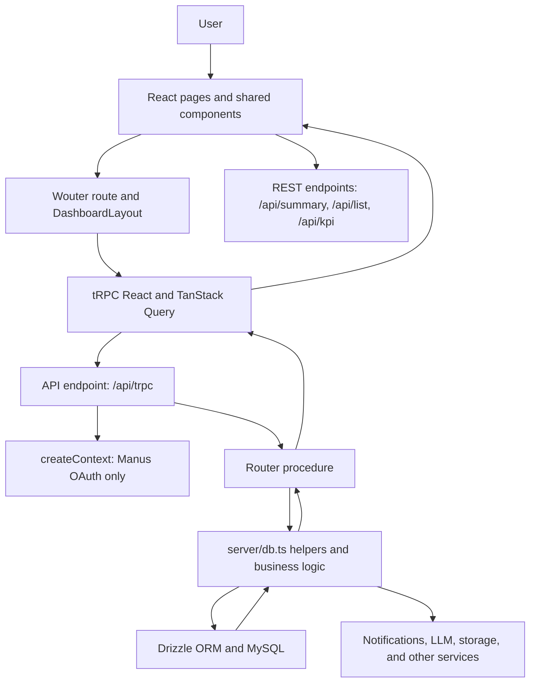
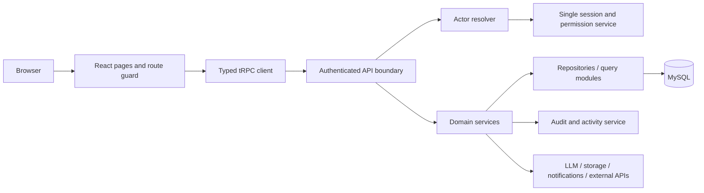
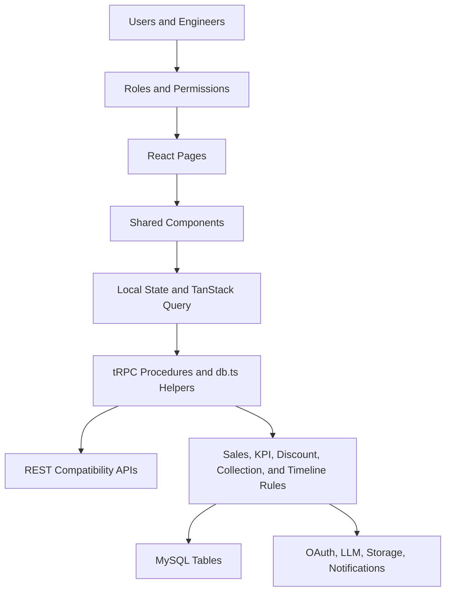

# PROJECT EXECUTIVE SUMMARY

## Executive conclusion

I reviewed the `sales-team-platform` repository together with the supplied reverse-engineering specification. The repository is a substantial sales-operations control panel rather than a small dashboard. It contains modules for daily tasks, leads, visits, deals and closing, sales performance, KPI and commissions, collections, planning, playbook-based sales execution, promotions, permissions, and project-timeline execution. The broad feature set is present in both the React frontend and the tRPC/Drizzle backend, and the codebase has meaningful automated-test coverage.

However, **the project should not receive another business feature before a production-readiness and security-hardening pass**. The most serious issue is that the application has several authentication models, while many operational and administrative procedures remain `publicProcedure`. The frontend route guard is explicitly disabled, and the framework-level protected procedure understands only Manus OAuth—not the local engineer session or the internal app-user token. In practice, a user can often see or mutate operational data without the authorization model advertised by the UI. [4] [5] [6]

The repository is also not currently self-validating from a clean environment. TypeScript and the production build pass, but the test suite reports **370 passing tests and 9 failures** because `DATABASE_URL` is absent and database-dependent tests silently receive empty results or “Database not available.” This is an environment and test-infrastructure problem, but it must be fixed before treating the project as complete. [11]

> **Recommendation:** Freeze new feature development, establish one canonical authentication and authorization model, make the database-backed test environment reproducible, then repair schema/migration/data-consistency risks. Only after those steps should the requested full technical documentation become the baseline for future feature work.

## What you should do first

| Priority | Action | Why it comes first | Definition of done |
|---|---|---|---|
| P0 | Protect every operational and administrative API | Current authorization is bypassable or inconsistent | All sensitive procedures require a server-side actor and permission check; destructive reset/seed endpoints are disabled outside development |
| P0 | Consolidate authentication | OAuth, local engineer JWT, and app-user JWT currently behave differently | One normalized `ctx.actor` is available to every procedure, with active-account and role checks |
| P0 | Make tests run against a real disposable database | Nine tests fail because the suite is not self-contained | CI creates schema from migrations, seeds fixtures, runs all tests, and fails on database unavailability |
| P0 | Remove insecure JWT fallback and rotate secrets | `fallback-secret` makes token security dependent on deployment discipline | Missing secrets stop startup; tokens have controlled lifetime and revocation/account-status checks |
| P1 | Repair migration and relational integrity | The schema has cross-table IDs but no declared foreign keys, and two `0002` migrations exist | Clean-database migration test passes; foreign keys, indexes, and uniqueness rules are explicit |
| P1 | Centralize period and financial calculations | Accounting-month, closing-month, `closedAt`, gross, net, and collection calculations can disagree | One period-attribution service and one money-calculation policy are used by KPI, reports, discounts, and collections |
| P1 | Split the monolithic backend | `server/db.ts` is 13,611 lines and `server/routers.ts` is 2,642 lines | Domain services and routers are separated with clear boundaries and targeted tests |
| P2 | Produce and maintain the requested reverse-engineering documentation | Documentation is valuable only after current behavior is stable and security boundaries are explicit | Documentation is generated from the stabilized code, migrations, route map, and verified deployment configuration |

# 1. REVIEW BASIS AND VALIDATION RESULTS

The supplied file requests a complete reverse-engineering and technical-documentation package, including architecture, routes, pages, components, data flow, database model, APIs, authentication, roles, business rules, integrations, security, performance, current state, recommended architecture, a master system map, and a new-developer guide. I treated the file as the documentation acceptance criterion, but I did not assume that a checked item in `todo.md` proves that the implementation is complete. [1] [12]

The repository was reviewed from the current `main` branch. The following checks were run locally:

| Check | Result | Interpretation |
|---|---:|---|
| `pnpm check` | Passed | TypeScript currently compiles without reported type errors |
| `pnpm build` | Passed with warnings | Production bundles build, but configuration and bundle-size warnings remain |
| `pnpm test` | 370 passed / 9 failed | Most tests pass; database-dependent tests fail without `DATABASE_URL` |
| Migration inspection | Needs repair | Two files use the `0002` prefix, while the migration journal contains one `0002` entry |
| DDL integrity inspection | Needs repair | Checked-in SQL contains no `FOREIGN KEY` declarations and no explicit index-creation statements |

The production build warns that the analytics placeholders are undefined, the analytics script is not bundled as a module, the CSS font `@import` appears after other rules, and the main JavaScript chunk is approximately 2.45 MB before gzip. These are not the first blockers, but they should be handled during release hardening. [10]

The nine test failures are concentrated in `server/app-users.test.ts`, `server/sales.test.ts`, and `server/control-panel.test.ts`. The app-user failures begin with `Database not available`; the sales trend failures return an empty array because `getMonthlySalesTrend()` returns `[]` when the database is unavailable. The correct response is not to weaken the assertions. The test environment needs a disposable MySQL-compatible database or a deliberate repository-layer test double. [7] [11]

# 2. CURRENT PROJECT OVERVIEW

## Business view

The system is an internal sales-team operating platform. Its implemented business surface covers the sales funnel from leads and visits through deals, closing, collections, KPI calculation, commissions, coaching, promotions, and project execution after a deal is won. It also includes administrative workflows for task distribution, user accounts, permissions, meeting review, activity logging, discount allocation, targets, and project-delay tracking. This description is **inferred from the route composition, pages, schema, and backend functions**, not from a single formal product document. [2] [3] [8]

## Technical view

The frontend is a React application using Vite, TypeScript, Tailwind CSS, Radix/shadcn-style UI components, Wouter routing, TanStack Query, and tRPC. The backend is an Express server hosting the tRPC API, OAuth routes, static assets, and three compatibility REST endpoints. Drizzle ORM targets MySQL through `mysql2`. Business logic and data-access helpers are concentrated in `server/db.ts`, while `server/routers.ts` exposes the application contract. [4] [10]

## Current navigation map

| Path | Page | Main purpose | Current access behavior |
|---|---|---|---|
| `/` | `Home` | Entry page | Public route |
| `/login` | `LoginPage` | Username/password login and forced password change | Public route |
| `/overview` | `Overview` | Management overview and alerts | Wrapped in dashboard layout; guard disabled |
| `/tasks` | `TasksModule` | Daily tasks, calendars, recordings, and work distribution | Wrapped in dashboard layout; server procedures are mostly public |
| `/leads` | `LeadsModule` | Lead records and daily lead statistics | Wrapped in dashboard layout |
| `/visits` | `VisitsModule` | Booking, confirmation, execution, upload, quality, and financial tracking | Wrapped in dashboard layout |
| `/closing` | `ClosingModule` | Deal pipeline, discount, lost-deal analysis, and deal timeline | Wrapped in dashboard layout |
| `/sales-module` | `SalesModule` | Sales totals, targets, tiers, and performance | Wrapped in dashboard layout |
| `/kpi` | `KPIModule` | KPI, commissions, incentives, rankings, and role-specific performance | Wrapped in dashboard layout |
| `/collections` | `CollectionsModule` | Contracts, payments, promises, follow-up, and commissions | Wrapped in dashboard layout |
| `/planning` | `PlanningModule` | Company, engineer, operational, and personal goals | Wrapped in dashboard layout |
| `/reports` | `ReportsModule` | Weekly, monthly, and quarterly reports | Wrapped in dashboard layout |
| `/sales-execution` | `SalesExecutionSystem` | Playbook, meeting sessions, reviews, funnel, and coaching | Wrapped in dashboard layout |
| `/promotion-system` | `PromotionSystem` | A/B/C evaluation and career progression | Wrapped in dashboard layout |
| `/project-timeline` | `ProjectTimelineModule` | Post-sale project stages, SLA, delays, holds, and closure | Wrapped in dashboard layout |
| `/user-management` | `UserManagement` | Internal accounts, passwords, status, and permissions | Menu visibility only; backend checks are ad hoc |
| `/permissions` | `PermissionsPanel` | Role and section permission matrix | Menu visibility only; backend checks are ad hoc |
| `/dashboard` | `Overview` | Legacy alias | Wrapped in dashboard layout |

The routes are registered in `client/src/App.tsx`. The dashboard layout filters menu items through role access, but this is a presentation concern and must not be treated as API authorization. [2] [13]

# 3. TECHNOLOGY STACK AND ARCHITECTURE

| Layer | Technology | Evidence and role |
|---|---|---|
| Frontend | React 19, TypeScript, Vite | Component-based UI and production bundling |
| Routing | Wouter | Route registration in `App.tsx` |
| UI | Tailwind CSS, Radix/shadcn-style components, Lucide | Shared dashboard and form components |
| Client data | tRPC React, TanStack Query, SuperJSON | Typed queries/mutations and cache invalidation |
| Backend | Express 4 and tRPC 11 | HTTP server, OAuth callback, REST compatibility, and RPC contract |
| Persistence | MySQL-compatible database, Drizzle ORM, `mysql2` | Schema in `drizzle/schema.ts`, helpers in `server/db.ts` |
| Authentication | Manus OAuth, local engineer JWT, internal app-user JWT | Three concurrent identity paths are present |
| Passwords | `bcryptjs` | Password hashing and verification |
| Tokens | `jose` | Local and app-user JWT signing/verification |
| Reporting | Recharts, `xlsx`, `jspdf`, `html2canvas` | Charts, spreadsheet import/export, and print/PDF behavior |
| Interaction | `@dnd-kit/*`, Framer Motion | Calendar drag-and-drop and UI motion |
| AI | Built-in `invokeLLM` helper with `gemini-2.5-flash` model reference | The helper exists, but a clearly composed top-level `ai` procedure was not found during this review; verify whether any AI feature is actually wired |
| External data/storage | Built-in Manus helpers and S3-related dependencies | Available framework integrations; usage must be verified per feature |

The effective request path is:



The key architectural problem is that the request context only populates `ctx.user` through Manus OAuth. It does not normalize the local engineer session or `app_user_token`. Consequently, `protectedProcedure` and `adminProcedure` do not protect the identity model used by the main login page. [4] [5] [6]

# 4. DATA MODEL AND BUSINESS DOMAINS

The schema contains a wide, evolving domain model. The major domains are listed below.

| Domain | Main entities | Important state or calculation concerns |
|---|---|---|
| Identity | `users`, `engineers`, `app_users` | Three identity stores with overlapping roles and session paths |
| Daily operations | `daily_tasks`, `work_logs`, `admin_sales_tasks` | Task status, delay, type, time allocation, and department enforcement |
| CRM/funnel | `leads`, `visits`, `deals`, `deal_tasks`, `deal_timeline` | Lead-to-visit-to-deal progression, ownership, next steps, and stage transitions |
| Financials | `collections`, `payments`, `payment_promises`, `commission_payments` | Collected amount, due dates, promises, two-stage commission payment |
| Targets/KPI | `monthly_targets`, `engineer_targets`, `company_goals`, `engineer_personal_goals` | Financial, operational, personal, and composite scores |
| Discounts | `discount_tiers`, `deal_discount_allocations`, `discount_bonus_caps` | Pipeline/closed allocation, used discount, bonus, cap, and approval |
| Execution/coaching | `playbook_items`, `playbook_quotations`, `meeting_sessions`, `session_actions`, `meeting_reviews` | Playbook usage, recordings, session actions, reviews, and coaching |
| People development | `engineer_evaluations`, `engineer_career_levels` | A/B/C performance, promotion readiness, firing-risk flags |
| Permissions/audit | `user_permissions`, `role_permissions`, `section_permissions`, `activity_logs`, `audit_logs` | CRUD access, data scope, section visibility, and audit history |
| Project execution | `project_stages`, `projects`, `project_movements`, `project_delay_ledger`, `project_updates`, `project_audit_logs`, `project_delay_reasons` | SLA, handover, delay categories, holds, historical snapshots, and closure |
| Legacy sales | `customers`, `products`, `sales`, `sale_items` | Separate catalog/invoice model that appears only partially connected to the newer deal/collection flow |

The schema uses many integer IDs to represent relationships, but the declared `drizzle/relations.ts` is empty and the checked-in migration SQL contains no foreign-key declarations. Therefore, a value such as `daily_tasks.engineerId`, `deals.visitId`, or `payments.collectionId` is not protected by database-level referential integrity in the checked-in DDL. The application must currently enforce these relationships itself, which increases orphan-record and deletion risk. [8] [9]

The role model is duplicated across `engineers.role`, `engineers.department`, `app_users.role`, the legacy `users.role`, and frontend role unions. Some values overlap semantically while others do not—for example, department contains `site`, while role contains `site_engineer`. This should be normalized into a canonical role/department model with explicit mapping rules. [8] [13]

# 5. PRIORITIZED CODE-REVIEW FINDINGS

## Critical findings

| ID | Severity | Finding | Evidence | Impact | Required action |
|---|---|---|---|---|---|
| SEC-01 | Critical | Many sensitive procedures are unauthenticated at the router boundary | The router exposes seed, task, lead, visit, deal, financial, KPI, promotion, user-management, and permission operations through `publicProcedure`; `seed.reset` is a destructive public mutation | An unauthenticated caller may read or modify operational data, change configuration, or reset seeded data | Introduce centralized actor-aware procedures. Make all reads/writes default-deny and explicitly mark only truly public endpoints as public |
| SEC-02 | Critical | Frontend authentication guard is disabled | `DashboardLayout` contains a commented-out redirect and states “open access mode” | Hiding menu items does not stop direct navigation or direct API calls; the UI can appear role-aware while the backend is not | Re-enable a route guard only as a UX measure, but enforce authorization on the server for every query and mutation |
| SEC-03 | Critical | Three authentication models are not unified | `createContext` authenticates only Manus OAuth; local sessions are parsed manually; app-user JWTs are parsed separately | Local users may fail framework-protected procedures, OAuth users may be treated as admin, and role checks differ between endpoints | Normalize identity into `ctx.actor = { id, source, role, engineerId, permissions, status }` before procedure dispatch |
| SEC-04 | Critical | OAuth fallback grants admin semantics | `localAuth.me` returns an admin-shaped local session for any `ctx.user`, and `localAuth.myPermissions` retrieves admin permissions for any OAuth user | A non-admin OAuth identity can receive administrative navigation and permission behavior | Remove the fallback. Map OAuth users to an explicit role from a trusted server-side policy or deny access to the internal dashboard |
| SEC-05 | Critical | JWT fallback secret is hardcoded | App-user login and verification use `process.env.JWT_SECRET ?? "fallback-secret"` | If deployment configuration is missing, attackers who know the fallback can forge app-user tokens | Require `JWT_SECRET` at startup; rotate it; use short-lived access tokens plus revocation/account-status checks |
| SEC-06 | Critical | Public REST endpoints expose sales data and use wildcard CORS | `/api/summary`, `/api/list`, and `/api/kpi` are public GET endpoints and set `Access-Control-Allow-Origin: *` | Deal values, customer names, engineer names, and KPI data can be queried by any origin | Put REST behind authentication/API keys or remove it; use an explicit origin allowlist and rate limiting |
| SEC-07 | Critical | Token verification does not re-check current account status | `verifyAppUserToken` validates signature and expiration but does not load the user from the database; local session verification similarly trusts signed claims | Disabled users and users whose roles changed can remain authorized until token expiry; role claims can become stale | Verify the account on each request or use short-lived tokens with server-side session/version revocation |

## High-priority correctness and reliability findings

| ID | Severity | Finding | Evidence | Impact | Required action |
|---|---|---|---|---|---|
| COR-01 | High | Test suite is database-dependent but has no reproducible DB setup | App-user tests fail with `Database not available`; trend tests receive `[]` from the no-DB branch | Green results from the remaining tests can create a false sense of completeness | Add CI/local database provisioning, run migrations from empty state, seed deterministic fixtures, and fail fast when the DB is missing |
| COR-02 | High | Period attribution is not fully centralized | `getDealsStats`, `getDealsList`, and KPI logic use accounting month → closing month → `closedAt`; `getMonthlySalesStats` still filters only by `closedAt` | Sales, KPI, reports, discounts, and targets can disagree for the same deal | Create one `getDealPeriodPredicate()` or domain service and use it everywhere |
| COR-03 | High | Migration history contains two `0002` files but one journal entry | Both `0002_cute_the_hood.sql` and `0002_new_modules.sql` are tracked; `_journal.json` contains one `0002` tag | Fresh installs and migration tooling can produce ambiguous or incomplete schema state | Rename the extra migration with a new sequential identifier through an approved migration procedure; test migration from an empty database and against a production clone |
| COR-04 | High | Database relationships are not enforced by foreign keys | The schema has many cross-table IDs; DDL inspection found zero `FOREIGN KEY` declarations; `relations.ts` is empty | Deletes, updates, and imports can create orphaned tasks, deals, payments, reviews, and projects | Add foreign keys where safe, define indexes, decide explicit `ON DELETE` behavior, and write integrity checks for existing data |
| COR-05 | High | Multi-step financial and workflow writes need transactions | Deal closure can update a deal and create a project; payment and commission operations update multiple tables; permission replacement deletes then inserts rows | Partial failure can leave financially inconsistent or historically incomplete records | Wrap atomic workflows in database transactions, add idempotency keys, and make audit records part of the same transaction |
| COR-06 | High | Missing-database branches silently return empty data or no-op writes | `getDb()` returns `null`; many helpers return `[]`, `undefined`, or success-like objects when the database is absent | The UI can display empty dashboards, while a write can appear to succeed without persistence | Separate development mocks from production services; return explicit `SERVICE_UNAVAILABLE` for writes and add health/readiness checks |
| COR-07 | High | Authorization is not equivalent to the stored permission matrix | `useRoleAccess` filters navigation, but many routers do not query `user_permissions`, `role_permissions`, or data scope before reading/writing | A user can bypass UI restrictions by calling a procedure directly or using a different route | Implement server-side `requirePermission(module, action, scope)` and apply it to every query/mutation |

## Medium-priority maintainability and release findings

| ID | Severity | Finding | Evidence | Impact | Required action |
|---|---|---|---|---|---|
| MAINT-01 | Medium | Backend boundaries are too broad | `server/db.ts` is 13,611 lines and `server/routers.ts` is 2,642 lines | Business rules, persistence, and transport concerns are difficult to review and easy to couple accidentally | Split by domain: auth, tasks, CRM, deals, finance, KPI, permissions, playbook, and project timeline |
| MAINT-02 | Medium | Role and module definitions are duplicated | Role unions, menu access keys, default permissions, system roles, and schema enums are maintained in separate places | A role or module can be added in one layer but omitted in another | Generate shared contracts from one canonical domain definition or validate all definitions in tests |
| MAINT-03 | Medium | Financial values are represented in several columns and flows | Deals have `value`, `grossValue`, `netValue`, discount fields, and separate collection amounts | It is easy for one report to use gross value while another uses net or `closedAt` | Define a money policy, use decimal-safe calculations, and document each column’s invariant |
| MAINT-04 | Medium | Release build warnings are unresolved | Analytics placeholders are undefined, CSS import ordering is invalid for optimization, and the main JS chunk is large | Analytics may not load and initial page load may be unnecessarily heavy | Supply optional analytics variables safely, move font imports to the top, and code-split heavy reporting/PDF features |
| MAINT-05 | Medium | The TODO document contains contradictory completion states | Earlier sections mark authentication, date range, discount, and role work as incomplete while later sections mark related work complete | The team cannot reliably distinguish current requirements from historical backlog | Replace the long chronological TODO with a versioned product backlog and a current acceptance matrix |

# 6. BUSINESS-LOGIC REVIEW

The repository contains real business logic rather than a purely visual prototype. Examples include task scoring, department-specific task types, closing-rate incentives, progressive commission, discount caps and allocations, meeting-review scores, A/B/C evaluation, project SLA and delay categories, payment promises, and accounting-month attribution. These rules are spread across `server/db.ts`, routers, schema comments, and UI calculations. [3] [7] [8]

The main business risk is **rule duplication and inconsistent period selection**. A deal can carry `closedAt`, `closingMonth`, `accountingMonth`, gross value, net value, discount value, and collection records. The code explicitly documents accounting-month priority in several functions, but monthly sales statistics still use a direct `closedAt` range. Before relying on reports or payouts, create a single, tested policy for:

1. Which period owns a pipeline deal.
2. Which period owns a closed-won or closed-lost deal.
3. Whether accounting-month overrides are allowed after payout.
4. Whether KPI, commission, discount, and reports use the same period.
5. Whether reopening a deal reverses prior contract, collection, commission, and project effects.
6. Which value—gross, discounted net, collected cash, or recognized revenue—each metric uses.

The existing code also performs some workflow automation without an explicit transaction boundary. For example, a deal-stage update can trigger project creation, and payment workflows can affect follow-up and commission records. These flows need transaction tests covering failure halfway through the operation, retries, duplicate requests, and concurrent updates.

# 7. CURRENT STATE AGAINST THE SUPPLIED SPECIFICATION

## Broadly implemented

The repository has a real route map, multiple React pages, a tRPC API, a large MySQL/Drizzle schema, local password login, app-user management, dynamic role/section permission storage, task/calendar workflows, CRM/closing flows, KPI and commission calculations, collections, playbook and meeting-session tracking, promotion/evaluation, and a project-timeline system. The project-timeline implementation includes stages, movements, delay ledger, holds, pre-execution handling, historical snapshots, analytics, import support, and closure behavior. [2] [3] [8]

## Partially implemented or needs verification

| Area | Observed state | What remains |
|---|---|---|
| Authentication | Login and token helpers exist | Identity sources are not unified; server-side enforcement is incomplete |
| Permissions | Role, user, and section tables plus UI panels exist | Stored CRUD/data-scope permissions are not consistently enforced in backend queries |
| Accounting month | Deal fields and setter exist | All KPI, commission, reports, and discount paths must be verified against one canonical policy |
| Discount engine | Several tier, composite-score, allocation, and bonus functions exist | The TODO contains a later “dynamic performance-based discount engine” backlog; confirm which formula is authoritative |
| Admin Sales KPI | Dedicated procedures and task structures exist | The stated 40% execution + 30% team impact + 30% quality dashboard remains marked incomplete in the backlog |
| Next-step timeline | `deal_tasks` and follow-up KPIs exist | The TODO still marks logging next steps into activity timeline as incomplete |
| Project timeline import | Generic Excel/CSV import exists | The actual business Time Line file still needs to be uploaded, mapped, imported, deduplicated, and reconciled |
| AI/Gemini | Built-in LLM helper references `gemini-2.5-flash` | Verify the actual production caller, prompt ownership, output validation, fallback, and data-governance policy |
| REST integration | Three public compatibility endpoints exist | Consumers, authentication expectations, versioning, and data exposure must be confirmed |
| Legacy sales model | `customers`, `products`, `sales`, and `sale_items` exist | Confirm whether this is still used or should be retired from the main architecture |

## Missing or not safe to claim as complete

It is not safe to claim that the requested system is fully production-ready merely because `todo.md` has many checked boxes. The current implementation still has unresolved security boundaries, an environment-dependent test suite, migration ambiguity, absent database referential constraints, and inconsistent auth semantics. Documentation should label these as **Implemented but not production-verified**, rather than simply “Fully Implemented.”

# 8. RECOMMENDED ARCHITECTURE

## Recommended target architecture



The target should have the following boundaries:

| Boundary | Recommendation |
|---|---|
| Identity | Choose internal app users as the business identity, optionally linked to `engineers`; keep OAuth separate for platform administration if required |
| Session | Use one short-lived access-token/session mechanism with secure, HttpOnly cookies and server-side revocation/version checks |
| Authorization | Resolve an actor once per request; enforce role, module action, and data scope on the server |
| Domain logic | Move business rules into domain services such as `dealService`, `collectionService`, `kpiService`, and `projectTimelineService` |
| Persistence | Use repositories or focused query modules; keep raw database operations out of UI code and minimize direct cross-domain writes |
| Transactions | Make close-deal, payment, commission, discount approval, permission update, and project-transition workflows transactional |
| Audit | Store actor ID, source, action, entity, before/after values, request ID, and timestamp in a consistent audit model |
| Observability | Add structured logs, error IDs, readiness checks, and metrics for failed mutations, authorization denials, and integration failures |
| API | Version or formally document the REST compatibility layer; do not expose internal sales data anonymously |
| Testing | Run unit tests for pure calculations, integration tests against a disposable MySQL database, authorization tests per role, and end-to-end tests for critical journeys |

# 9. IMPLEMENTATION PLAN

## Phase 1: Security freeze and access-control repair

First, create an authorization matrix containing every route/procedure, action, role, and data scope. Then change the default from `publicProcedure` to an authenticated procedure for all operational APIs. Add explicit procedures for public health or metadata endpoints only. Disable `seed.run` and `seed.reset` outside a development-only feature flag, and protect REST endpoints with an authentication mechanism appropriate for their consumers.

Next, introduce a single actor resolver. It should check the chosen session, load the current account, verify active status, normalize role and linked engineer ID, and attach permissions to the request context. All sensitive procedures should call a reusable permission helper rather than reimplementing arrays such as `['manager', 'admin_sales', 'admin']` in individual handlers.

## Phase 2: Runtime and test reliability

Add a documented local database setup and CI service. The test lifecycle should create or migrate a clean schema, insert deterministic fixtures, run all tests, and clean up. Tests must cover authentication and authorization with local sessions, app-user tokens, and any retained OAuth path. A missing database should cause an explicit failure, not an empty success-like response.

Add a startup configuration validator. Required values such as the database URL and JWT secret should fail startup when absent. Optional analytics configuration should be handled without leaving invalid placeholders in the generated HTML.

## Phase 3: Database and migration repair

Resolve the duplicate `0002` migration through a new sequential migration and an approved migration-history correction. Do not simply delete a migration that may already have been applied in another environment. Test from an empty database and compare the resulting schema with the Drizzle model.

Add foreign keys and indexes after checking existing data for orphan references. At minimum, review relationships for tasks-to-engineers, leads-to-engineers, visits-to-leads/engineers, deals-to-visits/leads/engineers, collections-to-deals, payments-to-collections, reviews-to-tasks, sessions-to-quotations/deals, and projects-to-deals. Define deletion behavior intentionally because the system uses soft delete and audit history.

## Phase 4: Domain refactor and financial consistency

Split `server/db.ts` and `server/routers.ts` by domain. Extract pure calculations into small modules with table-driven tests. Create one period-attribution service and one money policy. Use transactions for all multi-table workflows and add idempotency protection for imports, payment submissions, stage transitions, and auto-created projects.

## Phase 5: Documentation and onboarding

After the preceding work, generate the requested documentation from the actual code and migration state. The final document should include an “Implemented,” “Partially Implemented,” “Missing,” and “Unknown / Needs Verification” classification for every major module. It should be versioned with the repository and updated whenever a route, role, table, or business rule changes.

# 10. NEW-DEVELOPER GUIDE

## Read these files first

1. `client/src/App.tsx` for the route map.
2. `client/src/components/DashboardLayout.tsx` for navigation and UI-level role filtering.
3. `server/routers.ts` for the tRPC contract and procedure boundaries.
4. `server/_core/context.ts` and `server/_core/trpc.ts` for framework-level request identity and guards.
5. `server/localAuth.ts` and the internal-user sections of `server/db.ts` for the two non-OAuth identity paths.
6. `drizzle/schema.ts` and `drizzle/meta/_journal.json` for the data model and migration history.
7. `todo.md`, but treat it as historical backlog until it is reconciled into a current acceptance matrix.

## Main business flow

The dominant inferred flow is:

```text
Lead or daily lead statistics
    → Visit booking and execution
    → Deal pipeline and next action
    → Closed-won / closed-lost decision
    → Discount and accounting attribution
    → Collection contract and payments
    → Commission and KPI calculation
    → Coaching, evaluation, promotion, and project timeline
```

## Dangerous areas to modify

The most dangerous areas are authentication and permissions, deal-stage transitions, discount and commission calculations, accounting-month attribution, payment/commission writes, project creation from closed deals, migration files, and soft-delete behavior. A change in any one of these areas can affect reports, payouts, access control, and historical auditability.

## Things that must not be broken

Do not allow anonymous mutations, do not trust frontend visibility as authorization, do not change financial-period rules without regression tests, do not remove audit history, do not delete migration files that may already be deployed, do not allow inactive accounts to keep access, and do not permit a failed multi-table workflow to report success.

# 11. MASTER SYSTEM MAP



## Who calls who

| Caller | Calls | Main responsibility |
|---|---|---|
| `App.tsx` | Wouter routes and `DashboardLayout` | Selects page and shared shell |
| `DashboardLayout` | `useLocalAuth`, `useRoleAccess`, `trpc.localAuth.*` | Loads session, filters navigation, logs out |
| Login page | `trpc.localAuth.login`, `trpc.appUsers.changePassword` | Creates local session and changes password |
| Feature pages | `trpc.*` procedures | Fetches data and submits user actions |
| `server/_core/index.ts` | Express, OAuth routes, tRPC middleware, REST handlers | Receives HTTP requests |
| `createContext` | Manus OAuth SDK | Populates only the OAuth user field today |
| `server/routers.ts` | `server/db.ts` helpers and manual auth checks | Exposes typed API and coordinates operations |
| `server/db.ts` | Drizzle/MySQL and external helpers | Executes queries and business calculations |
| Project timeline procedures | Timeline helpers | Enforces some caller checks and maintains movement, delay, update, and audit records |
| App-user procedures | JWT helpers, permission helpers, activity logs | Manages internal accounts, but currently through inconsistent procedure boundaries |

# 12. UNKNOWN / NEEDS VERIFICATION

The following items must be verified before declaring the system complete:

1. The actual production database schema must be compared with `drizzle/schema.ts` and all migrations; local inspection cannot prove production parity.
2. The production environment must be checked for `DATABASE_URL`, `JWT_SECRET`, OAuth settings, analytics settings, and any storage or notification credentials without exposing secret values.
3. The intended source of truth for internal identity must be confirmed: `engineers`, `app_users`, or a deliberate combination.
4. The actual role-to-permission matrix must be approved by the business owner, especially for manager, admin sales, system user, site engineer, tele-sales, and sales specialist.
5. Consumers and security requirements for `/api/summary`, `/api/list`, and `/api/kpi` must be identified before changing their authentication or CORS behavior.
6. The actual Time Line file referenced in the backlog must be supplied and imported through a tested mapping and reconciliation process.
7. The production behavior of AI/Gemini, prompts, data sent to the model, structured-output validation, and fallback behavior must be confirmed.
8. The legacy customer/product/invoice model must be classified as active, transitional, or removable.
9. The intended business policy for reopening won deals, reversing contracts, reversing commissions, and restoring project state must be documented.
10. Authorization must be tested with direct API calls, not only by clicking the frontend, for every role and every mutation.

# FINAL RECOMMENDATION

**Do not start another feature yet.** The immediate deliverable should be a short stabilization sprint focused on access control, authentication unification, database-backed CI, migration integrity, and financial-period consistency. Once those are complete, use the supplied 36-section specification as a living architecture document rather than a one-time summary. The current codebase is feature-rich and salvageable, but it needs a clear security boundary and a reproducible data layer before it is safe to extend.

# References

[1]: file:///home/ubuntu/upload/pasted_content.txt "Supplied reverse-engineering and technical-documentation specification"
[2]: https://github.com/ProGroup1040/sales-team-platform/blob/main/client/src/App.tsx "Application route registration"
[3]: https://github.com/ProGroup1040/sales-team-platform/blob/main/server/routers.ts "Main tRPC router and procedure surface"
[4]: https://github.com/ProGroup1040/sales-team-platform/blob/main/server/_core/trpc.ts "tRPC procedure guards"
[5]: https://github.com/ProGroup1040/sales-team-platform/blob/main/server/_core/context.ts "Request context and OAuth authentication"
[6]: https://github.com/ProGroup1040/sales-team-platform/blob/main/server/localAuth.ts "Local engineer session authentication"
[7]: https://github.com/ProGroup1040/sales-team-platform/blob/main/server/db.ts "Database helpers and business logic"
[8]: https://github.com/ProGroup1040/sales-team-platform/blob/main/drizzle/schema.ts "Drizzle database schema"
[9]: https://github.com/ProGroup1040/sales-team-platform/blob/main/drizzle/relations.ts "Declared Drizzle relations"
[10]: https://github.com/ProGroup1040/sales-team-platform/blob/main/server/_core/index.ts "Express server, REST endpoints, and tRPC mounting"
[11]: file:///home/ubuntu/sales-team-platform/review_artifacts/tests.log "Local validation test output"
[12]: https://github.com/ProGroup1040/sales-team-platform/blob/main/todo.md "Project backlog and historical completion checklist"
[13]: https://github.com/ProGroup1040/sales-team-platform/blob/main/client/src/hooks/useRoleAccess.ts "Frontend role-access mapping"
